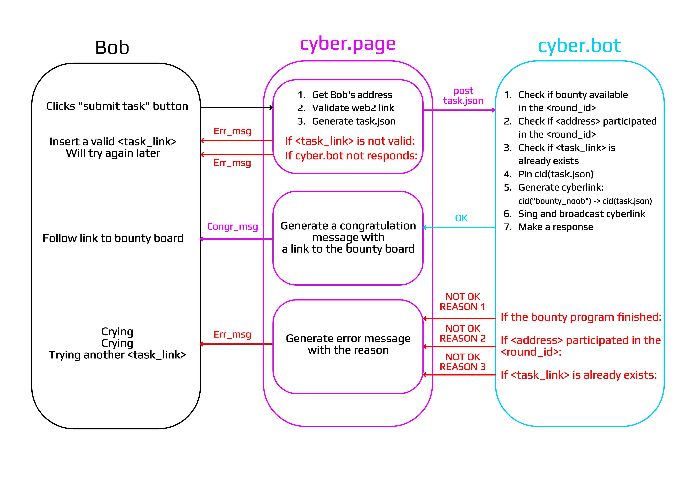
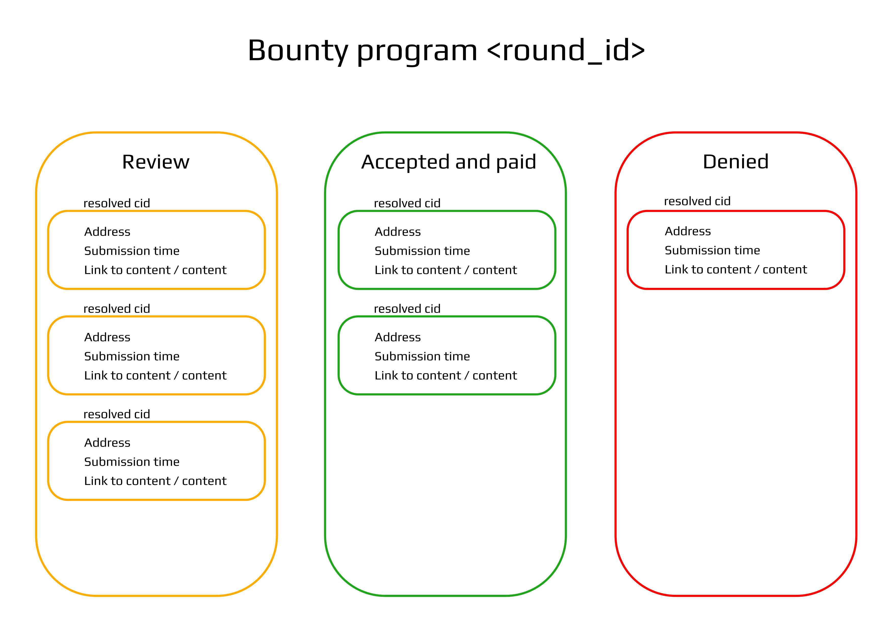
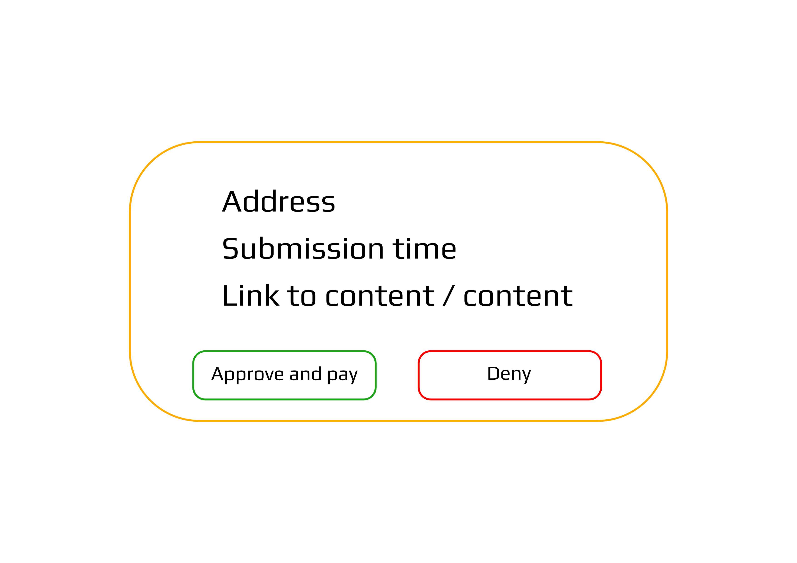

# Bounty

@serejandmyself @savetheales

## Intro & Motivation
We propose to create an ongoing, gamified bounty process for an everlasting distribution of tokens (as long as the network agrees to do so) to those who create value for the network on its various stages of existence.

Initial token allocation plays a major role in the success of any project. Further, the initial allocation of standalone chains is a big challenge to the future success of an interplanetary, ecosystem of connected blockchains.

Bounties are a great way to constantly be allocating tokens to the long tail of different types of actors that join the network at different stages of its life. A big plus of such allocation, is its ability to be (a) ongoing and always attract new hands, (b) eliminate weak hands. Bounty allocations tend to be small and selling bounty tokens on the open market, rarely influences the token price itself, hence, only those with interest in the project will keep those tokens, hence, create strong hands. And, (c) helps to attract an ongoing, native marketing noise, while arousing interest by creating an incentive to do something.

There are many other pluses, but also minuses, that exist with bounties. Minuses, mostly, revolve around manual distributions, altered judgment, lack of ongoing interest and difficulty in joining the bounty.

Our proposition attempts to solve all these problems by gamifying and automatizing the bounty process.

## Description
- Concept:
An ongoing bounty, that utilizes cyber.page, automatizes the rewards, enriches the core with cyberlinks and helps the distribution.

- Provision:
A) Working Keplr with cyber.page
B) Bounty tasks
C) Gift

- Description with a user story:
Bob finds a description of the bounty on Twitter or any bounty forum. He proceeds to cyber.page and sees our search box. Underneath it, Bob sees 1 single button, `bounty`.

Bob clicks the button, this opens a new page with a black screen and a message (an example message):

`You have found Cyber's top secret bounty mission to save the planet from centralization. To unlock and receive your gift of the Gods, please select your skill level`

Underneath there are 3 options: noobs, masters, god mode

Bob can select any of these options. The first option is the easiest. This is the primary bounty.

When Bob selects this option a new screen opens. There should be some type of welcoming message (We suggest to play on secrecy and easiness). Underneath that message there is a `scroll` with the mission (in the future these scrolls can be collected NFTs).  The scroll contains points:

1. To begin your mission, please install Keplr (link) / link to guide
2. Make a cyber address. Link to guide
3. Make a Twit / post / other easy tasks that do not require having tokens or understanding how the network works
4. Submission. A box where Bob has to input a web2 link to his twit / post / video / whatever
5. Click submit and wait for judgment from gods little helper: the superintendent computer  (on the initial stage, this will be done manually)

Behind the scenes: When Bob opens cyber.page, keplr and inputs the link and click submit, the work is submitted, uploaded to IPFS and a cyberlink with the tag `bounty - noob` is created. For this trick to work, we need to deploy a help bot. When the user submits a task, the bot with address and a fixed balance, creates a cyberlink:

```bash
cid("bounty_noob") -> cid(task.json)
```

where task.json is

```
{
   "round": "0",
   "submitting_timestamp": "2020-20-20:00:00:00",
   "level": "0",
   "address": "cyberaddress",
   "task_link": "https://tasklink.xyz"
}
```

And, a further pin the CIDs on a cluster for easy availability of the content.

After Bob submits this, a congratulation message appears and a link to his personal bounty cabinet.

All submissions are submitted to a table. Which is monitored by any existing Cyber user, which can vote if he likes the submission.

Behind the scenes: it is pretty easy to implement with an LCD query:
We need to get all cyberlinks from the help bot address, where cid_from is cid("bounty_noob"). And sort them by timestamps weekly for weekly rewards. A user poll should be implemented to vote on the best content by adding cyberlinks:

```bash
cid(task.json) -> cid("true")
```

It would be great to implement a button for easy-voting.

The rest is future design. Top 10/20/50 liked submissions can receive an automated payout end of each week.

As for the user story for masters and god mode:

This can include more progressive quests, with  ETH/Urbit gifts. More complicated tasks where a submission of a cyberlink is required. The option to include quests with gitcoin, etc

## Roadmap
We understand the difficulty in creating such a proposition, as it requires attention from the most busy engineering part of the core team of any project. We think that breaking our idea into gradual stages can help to oversee these challenges.

1) Concept
2) Design
3) Distribution dependency
4) Voting capabilities
5) TG notification bot
6) New levels and tasks (Gitcoin quests, on chain quests)
7) NFTs

## Reward
In the future such initiatives can be supported by cyberFund~Classic, alas, it doesn't exist as yet. Hence, we propose to support this by using the community pool.

## Design.

> TODO. Definition of done. Automatically. Limited tokens. Limited submissions. Limited time. The intersection of two.

### Noob bounty, phase 0, MVP. Subjective judgment by community advocate

Let start from the moment when Bob gets his account in `cyber` network and puts it in the pocket. He prepared `web2` link for submitting (aka completed task) and want to submit a task for judgment. The workflow should be:



where task.json is

```
{
   "round_id": "<round_id>",                          // changeable round number according to the bounty program iteration
   "submitting_timestamp": "<submitting_timestamp>",  // get_time method on client side
   "level_id_": "<level_id>",                         // means noob if "0". For future development
   "address": "<cyberaddress>",                       // user's cyberaddress from the pocket
   "task_link": "<task_link>"                         // web2 link with completed task
}
```

Requirements for *cyber.page* on the current stage:

- page-form with intro
- task.json generate method
- additional endpoint for POST method
- the set of error messages
- congratulation message.

Requirements for *cyber.bot* on the current stage:

- Validation methods
- Lite SQL for <task_link> validation
- Signing and broadcasting methods
- Response standard

After the submission, Bob can go to the `bounty board` page for checking the status of the submission. The submission can be in `Review`, `Accepted and paid`, or in `Denied` statuses:



Tasks on a `Review` can get from simple LCD query, filter by `subject` (address of cyber.bot account) and `objectFrom` (cid("bounty_noob")). For separating rounds and task levels according to query mechanics we can extend the keyword "bounty_noob" to desirable in future implementation. To avoid spam in reviewed it also possible to use `minheight` and `maxheight` filters. Height possible get by timestamp from the `cyberindex`.

The `resolved cid` snippet in the `Review` section:



All buttons muted except the state then the judge's address active in the pocket. A judge can research the completed task and make the decision to approve or deny the task. If a judge clicks the approve button cyber.page should generate a transaction with two messages: 

```
{
   "msg": [
      {
         "type": "cosmos-sdk/MsgSend",                // send msg with rewards
         "value": {
            "from_address": "<judge's_address>",
            "to_address": "<Bob's_address>",
            "amount": [
               {
                  "denom": "eul",
                  "amount": "<amount>"
               }
            ]
         }
      },
      {
         "type": "cyber/Link",                     // link msg to write decision to blockchain
         "value": {
            "address": "<judge's_address>",
            "links": [
               {
                  "from": "cid(task.json)",
                  "to": "cid(approve)/cid(deny)"   // cid("approve") or cid("deny") accordingly to judge's decision
               }
            ]
         }
      }
   ]
}
   
```

Thus it possible to get CID from `Accepted and paid` and 'Denied' sections by simple LCD queries with filters `subject` = <judge's_address> and 'objectTo' = cid("decision").

That's design implies frequently judge's participation to avoid tasks accumulation. And a lot of mechanics with every task linking. Probably it would be nice to accumulate all decisions of judges and generate one transaction per session. In the next phases, task judgment should be from the community by voting. 
