# euler\~Foundation Aragon Ceremony

## TL;DR
The guide will walk you through the setup process of an Aragon-based DAO, by an existing Aragon DAO, using the setup process of (the testing version of) cyber\~Foundation, the community governing DAO behind [cyber](https://cyber.page/). As a result, you will setup a community-governed DAO, that can distribute shares to its holders via the use of 2 apps, the cyber~Vesting and the cyber~Auction app. The euler~Foundation DAO also has a third app, cyber\~Evangelism, for project ambassadors. 

### Content
- [Introduction](https://github.com/cyber-foundation/tree/master/euler-foundation/euler-foundation.md#introduction)
  * [For whom and for what is this guide?](https://github.com/cyber-foundation/tree/master/euler-foundation/euler-foundation.md#what-for-and-for-whom-is-this-guide)
  * [About {euler,cyber}\~Foundation(s)](https://github.com/cyber-foundation/tree/master/euler-foundation/euler-foundation.md#about-eulercyberfoundations)
  * [Process flow](https://github.com/cyber-foundation/tree/master/euler-foundation/euler-foundation.md#process-flow)
  * [The process in numbers](https://github.com/cyber-foundation/tree/master/euler-foundation/euler-foundation.md#the-process-in-numbers)
  * [Prepare your setup background](https://github.com/cyber-foundation/tree/master/euler-foundation/euler-foundation.md#prepare-your-setup-background)
-------------------------------------------------------
- [cyber\~Congress DAO](https://github.com/cyber-foundation/tree/master/euler-foundation/euler-foundation.md#cybercongress-dao)
  * [Configuration](https://github.com/cyber-foundation/tree/master/euler-foundation/euler-foundation.md#configuration)
  * [The process](https://github.com/cyber-foundation/tree/master/euler-foundation/euler-foundation.md#the-process)
  * [The Agent](https://github.com/cyber-foundation/tree/master/euler-foundation/euler-foundation.md#agent)
  * [Grant permissions to Agent](https://github.com/cyber-foundation/tree/master/euler-foundation/euler-foundation.md#grant-permission-to-agent-to-transfer-their-own-tokens)
---------------------------
- [Deploy Aragon Company Template](https://github.com/cyber-foundation/tree/master/euler-foundation/euler-foundation.md#deploy-aragon-company-template)
  * [Changes](https://github.com/cyber-foundation/tree/master/euler-foundation/euler-foundation.md#changes)
  * [Deploy](https://github.com/cyber-foundation/tree/master/euler-foundation/euler-foundation.md#deploy)
  * [Verify on Etherscan](https://github.com/cyber-foundation/tree/master/euler-foundation/euler-foundation.md#verify-on-etherscan)
---------------------------------- 
- [cyber\~{Evangelism,Vesting,Auction} Aragon applications](https://github.com/cyber-foundation/tree/master/euler-foundation/euler-foundation.md#vesting--auction-aragon-applications)
  * [cyber\~Evangelism application](https://github.com/cyber-foundation/tree/master/euler-foundation/euler-foundation.md#evangelism-application)
  * [cyber\~Vesting application](https://github.com/cyber-foundation/tree/master/euler-foundation/euler-foundation.md#vesting-application)
  * [cyber\~Auction application](https://github.com/cyber-foundation/tree/master/euler-foundation/euler-foundation.md#auction-application)
  * [Deploy to Aragon Package Manager (APM)](https://github.com/cyber-foundation/tree/master/euler-foundation/euler-foundation.md#deploy-to-aragon-package-manager-apm)
  * [Propagate application to IPFS](https://github.com/cyber-foundation/tree/master/euler-foundation/euler-foundation.md#propagate-application-to-ipfs)
------------------------------------- 
- [euler~Foundation DAO](https://github.com/cyber-foundation/tree/master/euler-foundation/euler-foundation.md#cyber-foundation-dao)
  * [Create a proposal to deploy a token by the cyber\~Congress DAO Agent](https://github.com/cyber-foundation/tree/master/euler-foundation/euler-foundation.md#create-a-proposal-to-deploy-a-token-by-the-congress-agent)
  * [Create a proposal to deploy the DAO by the cyber\~Congress DAO Agent](https://github.com/cyber-foundation/tree/master/euler-foundation/euler-foundation.md#create-a-proposal-to-deploy-the-dao-by-the-congress-agent)
  * [Vote for token and DAO deployment cyber\~Congressmen](https://github.com/cyber-foundation/tree/master/euler-foundation/euler-foundation.md#vote-for-token-and-dao-deployment-by-cyber-congressmen)
  * [Votes for euler\~Foundation DAO deployment](https://github.com/cyber-foundation/tree/master/euler-foundation/euler-foundation.md#votes-for-foundation-deployemnt)
  * [Check the euler\~Foundation DAO](https://github.com/cyber-foundation/tree/master/euler-foundation/euler-foundation.md#check-the-foundation-dao)
  * [Voting by the cyber\~Congress DAO Agent in the euler\~Foundation](https://github.com/cyber-foundation/tree/master/euler-foundation/euler-foundation.md#voting-by-the-congress-agent-in-the-foundation)
----------------------------------------- 
- [Install the cyber~Vesting application for the euler\~Foundation DAO](https://github.com/cyber-foundation/tree/master/euler-foundation/euler-foundation.md#install-the-vesting-application-for-the-foundation-dao)
  * [Parameters](https://github.com/cyber-foundation/tree/master/euler-foundation/euler-foundation.md#parameters)
  * [Install the application](https://github.com/cyber-foundation/tree/master/euler-foundation/euler-foundation.md#install-the-application)
  * [Initialize Proof/Pause Roles](https://github.com/cyber-foundation/tree/master/euler-foundation/euler-foundation.md#initialize-proofpause-roles)
  * [Grant permission to Issue/Assign/Burn as Token Manager](https://github.com/cyber-foundation/tree/master/euler-foundation/euler-foundation.md#grant-permission-to-issueassignburn-as-token-manager)
-------------------------------------------- 
- [Installing the cyber~Auction application for the euler\~Foundation DAO](https://github.com/cyber-foundation/tree/master/euler-foundation/euler-foundation.md#installing-the-auction-application-for-the-foundation-dao)
  * [Parameters](https://github.com/cyber-foundation/tree/master/euler-foundation/euler-foundation.md#parameters-1)
  * [Install](https://github.com/cyber-foundation/tree/master/euler-foundation/euler-foundation.md#install)
  * [Initialize the Creator Role](https://github.com/cyber-foundation/tree/master/euler-foundation/euler-foundation.md#initialize-the-creator-role)
  * [Grant permission for Burn rights as Token Manager](https://github.com/cyber-foundation/tree/master/euler-foundation/euler-foundation.md#grant-permission-for-burn-rights-as-token-manager)
  * [Set the congress agent as app manager in the euler\~Foundation DAO](https://github.com/cyber-foundation/tree/master/euler-foundation/euler-foundation.md#set-the-congress-agent-as-app-manager-in-the-foundation-dao)
  * [Burn service account token in the euler\~Foundation DAO](https://github.com/cyber-foundation/tree/master/euler-foundation/euler-foundation.md#burn-service-account-token-in-the-foundation-dao)
  * [Transfer tokens from the cyber\~Congress Agent to the cyber\~Auction contract](https://github.com/cyber-foundation/tree/master/euler-foundation/euler-foundation.md#transfer-tokens-from-the-congress-agent-to-the-auction-contract)
  * [Load the Auction](https://github.com/cyber-foundation/tree/master/euler-foundation/euler-foundation.md#load-the-auction)
  * [Deploy and verify `AuctionUtils`](https://github.com/cyber-foundation/tree/master/euler-foundation/euler-foundation.md#deploy-and-verify-auction-utils)
  * [Add `AuctionUtils` address to the Auction](https://github.com/cyber-foundation/tree/master/euler-foundation/euler-foundation.md#add-auctionutils-address-to-the-auction)
--------------------------- 
- [Distribute tokens](https://github.com/cyber-foundation/tree/master/euler-foundation/euler-foundation.md#distribute-tokens)
  * [Inventors](https://github.com/cyber-foundation/tree/master/euler-foundation/euler-foundation.md#inventors)
  * [Initial donors](https://github.com/litvintech/foundation-ceremony/blob/bcd079909c1e6a739cc8dec0b51b56802e1c1735/README.md#initial-donors)
------------------------------- 
- [Final state](https://github.com/cyber-foundation/tree/master/euler-foundation/euler-foundation.md#final-state)
  * [euler\~Foundation DAO](https://github.com/cyber-foundation/tree/master/euler-foundation/euler-foundation.md#foundation-dao)
  * [cyber\~Evangelism application](https://github.com/cyber-foundation/tree/master/euler-foundation/euler-foundation.md#vesting-application-1)
  * [cyber\~Vesting application](https://github.com/cyber-foundation/tree/master/euler-foundation/euler-foundation.md#vesting-application-1)
  * [cyber\~Auction application](https://github.com/cyber-foundation/tree/master/euler-foundation/euler-foundation.md#auction-application-1)
  * [Final thoughts](https://github.com/cyber-foundation/tree/master/euler-foundation/euler-foundation.md#final-thoughts)
--------------------------------

### Introduction
Cyber is a decentralized Google. Cybers mission is to decentralize the services and the infrastructure of the internet via the use of blockchain technology and cyberlinks. Cyber is an innovative search protocol. Such a protocol should not be owed by one company, but rather be governed by its stakeholders, that can decide on its development via the use of governance mechanisms. This guide covers the particular case of setting up euler\~Foundation, the testing of cyber\~Foundation. You may substitute the word `euler` to use it as a workflow guide for your own setup.

We are concerned about following the principles of decentralization and believe that DAOs are a vital ingredient in achieving it. We use Aragon-bred DAOs for governance within our project.  

If we think about DAO from a technical perspective, we see smart contracts and accounts as technical tools that shape the DAO. The account that creates the DAO gets extra power and is not fully compliant with trustless principles. 
 
Currently, only a limited number of people can start a DAO but put into consideration, decentralization is the main principle of our project and this situation should be changed. Another important point is the take-off of the project. It’s not a moment, it is a time-consuming process. Both points bring us to the realization of the `point zero` problem.
 
To overcome this restriction we create the community foundation DAO via a two-level setup. The `zero-step` here is the cyber\~Congress DAO and the second step is the cyber\~Foundation DAO. The Foundation DAO is an entity created to manage and develop the Cyber project. The cyber~Congress DAO is an organization with one simple aim, to launch the project itself and to work on it as one of the shareholders, including the setup of the Foundation DAO. 

detailed information about the tasks of both DAOs can be found in either our [WP](https://ipfs.io/ipfs/QmceNpj6HfS81PcCaQXrFMQf7LR5FTLkdG9sbSRNy3UXoZ) or our [homestead documentation](https://github.com/cybercongress/congress/blob/master/ecosystem/Cyber%20Homestead%20doc.md).

#### For whom and for what is this guide?
1. For Cyber community, for whom we provide a fully transparent workflow 
2. As part of the documentation of the work of cyber\~Congress 
3. For open-source Aragon developers that are trying to find answers to their questions about DAO setup
4. For Aragon community members that wish to discover the endless possibilities of the Aragon project
5. For anyone wishing to set up a DAO in a decentralized manner
6. For project evangelists (ambassadors)

#### About {euler,cyber}\~Foundation(s)
- euler\~Foundation: is the testing of the Foundation DAO. It is deployed to ETH's mainnet during GoL (gamified part of cybers distribution process). Its main purpose is to test everything, that can be tested, before the launch of the mainnet and provide the initialization for the security audit on the initial stage, plus obtain feedback from the cyber community
- cyber\~Foundation: is the community governing DAO behind cyber. It will consist of stakeholders that wish to be part of the governing process. The Foundation, apart from everything, will be in charge of the ETH pot donated to it during cyber\~Auction (part of cybers distribution process). Making it is a true Decentralized Autonomous Organisation in charge of its own funds and decisions via reaching consensus 

#### Process flow
0. Prepare your setup
1. Cyber cyber~Congress DAO
    1. Configuration
    2. Agent
    3. Grant Permission to transfer Agent their own tokens
2. Deploy Aragon Company Template
    1. Changes
    2. Deployment
    3. Verification
3. Evangelism, Vesting & Auction Aragon applications
    1. About Evangelism application
    2. About Vesting application
    3. About Auction application
    4. Deploy to Aragon Package Manager (APM)
    5. Grant permissions to update packages to additional accounts
    6. Propagate applications to IPFS
4. Foundation DAO
    1. Create a proposal to deploy a token by the Congress Agent
    2. Create a proposal to deploy DAO by the Congress Agent
    3. Vote for token and DAO deployment by Cyber Congress
    4. Check Foundation DAO
    5. Voting by the Congress Agent in Foundation DAO
5. Install Evangelism application to Foundation DAO
    1. Parameters
    2. Install application
    3. Initialize Founder Role
6. Install Vesting application to Foundation DAO
    1. Parameters
    2. Install application
    3. Initialize Proof and Pause Roles
    4. Grant permissions to Issue, Assign and Burn as Token Manager
7. Install the Auction application to Foundation DAO
    1. Parameters
    2. Install
    3. Initialize Creator Role
    4. Initialize Burner Role
    5. Grant permission to Burn as Token Manager
    6. Set the cyber~Congress Agent as an apps manager on Kernel in the Foundation
    7. Burn the service account token in the Foundation DAO
    8. Transfer tokens from the Congress Agent to the Auction contract
    9. Load Auction
    10. Deploy and verify AuctionUtils
    11. Add AuctionUtils address to the Auction
8. Distribute tokens
    1. Inventors
    2. Initial investors
9. Final State
    1. cyber\~Foundation DAO
    2. cyber\~Evangelism application
    3. cyber\~Vesting application
    4. cyber\~Auction application
    5. Statistics
    6. Final thoughts
    7. Transaction list

#### Prepare your setup background
- NodeJS v.10.18.0 is recommended 
- Aragon CLI v 7.1.3/7.0.3/6.4.4 is recommended 
- A local IPFS node and a dedicated IPFS cluster (for propagating the content of the application)
- A local or a dedicated Ethereum node (for faster operations)
- We recommend using [Frame](https://frame.sh/) for operations (for a smoother process)
- Check the [troubleshooting and FAQ](https://hack.aragon.org/docs/guides-faq) guide

_________

### [cyber\~Congress DAO](https://rinkeby.aragon.org/#/cc16)

#### Configuration
The cyber\~Congress DAO is an Aragon-based DAO, bootstrapped using the official [membership Aragon template](https://github.com/aragon/dao-templates/tree/master/templates/membership) with an installed Agent. It uses a non-transferable token to represent membership. Decisions are made, based on one-member-one-vote governance principle.

*Signers:*
- 0x97975Ed1aAb49b8C5d30E6856DdFE20b4896490f
- 0xD0Db9E03fDE19cb4C3ad1cF0f1faF86caf911058
- 0x49337f144B2C901801A53DB347aa2b76a2ffd5f1

*Voting parameters:*
- Support: 51%
- Approval: 51%
- Voting duration period: 7 days

*Token:*
cyber\~Congressman (CC)

*Offical Documentation:*
- [The official user guide for new membership organizations](help.aragon.org/article/34-create-a-new-membership-organization)
- [Source code on GitHub](https://github.com/aragon/dao-templates/tree/templates-membership-v1.0.0/templates/membership)

#### The process
The whole process of the setup is fairly simple and can be outlined by the following:
- Setup a DAO and an agent
- Set correct permissions and rights
- Install the required apps and rights
- Distribute tokens to addresses 

This requires a step-by-step setup with explanations and guidance, described in this document.

#### Agent
The Agent app (or the Aragon Agent) is an Aragon app that can be installed in any Aragon DAO. Its main feature is its ability to perform arbitrary calls to contracts. This means it can be thought of as the external interface of a DAO. In other words, it is a multi-signature ETH account owed by the DAO that represents the will of its shareholders. It allows the DAO to interact with contracts, manage names, buy digital land, make transactions, etc. All, without having to implement a custom application for each, separate, use case. 

We strongly recommend to read the Aragons Agent guide: [How to use an Aragon Agent](https://hack.aragon.org/docs/guides-use-agent)

#### Grant Permission to the Agent to transfer their own tokens
We need to grant access to the Agent to transfer tokens from their own account. During the setup of the Foundation DAO, we will issue the initial supply to the DAO. Essentially, this means that the actors behind the initiation of the cyber~Congress DAO will govern the setup process of the Foundation DAO. 

Following the bootstrap process, the tokens from the Agent will be transferred to the auction and then, will be distributed to donors and inventors. The donors that vest and participate in the auction need to be able to transfer these tokens onwards. This means, that the Agent needs permission for transfers, which is not `on` by default. Some donors will just continue to hold the tokens following the distribution process. 

This requires us to create a new proposal from the permisisons tab of the cyber~Congress DAO and vote on it. After the voting is over, we will go to the permissions tab and makes sure that in the Agents permisisons tab, under `Transfer Agent’s tokens` a new entity (the Agent) appears:


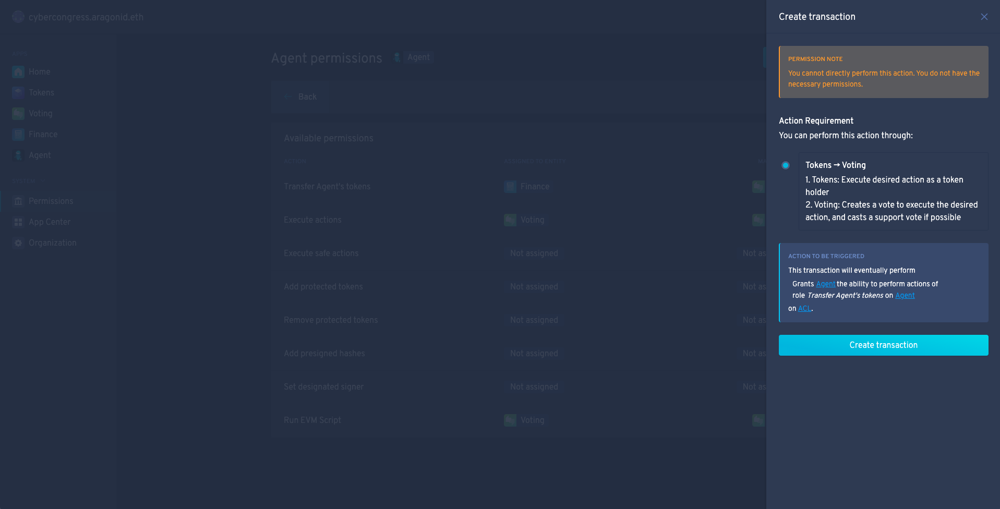
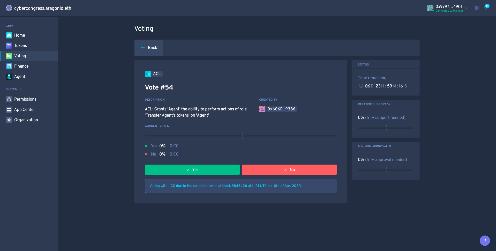
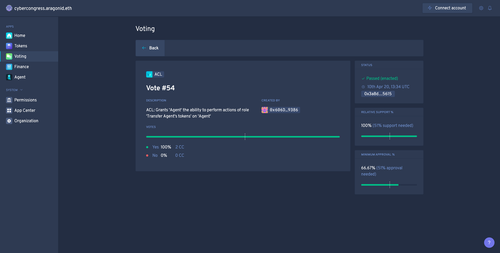
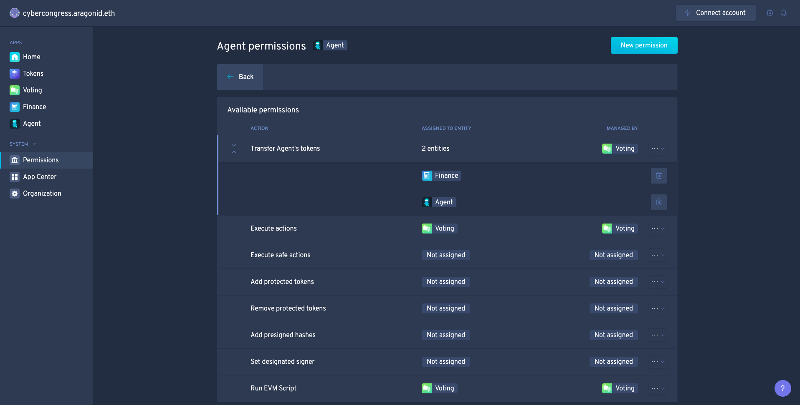

Note: Tokens transfer on Agent available for Finance application by default and Finance application may be used for this operations.

_________

### Deploy Aragon Company Template
{euler, cyber}\~Foundation will be a DAO, which is based on the [Company Aragon DAO Template](https://github.com/aragon/dao-templates/tree/master/templates/company). It will use transferable tokens to represent stake ownership in the DAO. Decisions are made based on stake-weighted voting.

We are going to deploy a custom template because cybers native tokens don't have decimals. During the vesting and claim processes, between the Foundation DAO and the Cyber blockchain (euler or cyber), we need to operate with zero decimals tokens. By default, organisations come with a token that is divisible by 18 decimal points (like most ERC-20 tokens). 

We strongly recommend reading this guide from Aragon on [using company templates for DAO setup](https://help.aragon.org/article/30-create-a-new-company-organization).

#### Changes
Because we need a token with __zero decimals__. We are going to take a typical template and modify the necessary lines in it:

1. Clone the official Aragon DAO-Template [repository](https://github.com/aragon/dao-templates/):

```
git clone https://github.com/aragon/dao-templates
cd dao-templates/templates/company
```

2. Change [one line](https://github.com/aragon/dao-templates/blob/master/templates/company/contracts/CompanyTemplate.sol#L14) and set `TOKEN_DECIMALS` to 0:

```
uint8 constant private TOKEN_DECIMALS = uint8(0);
```

Diff of CompanyTemplate.sol:

```
--- a/templates/company/contracts/CompanyTemplate.sol
+++ b/templates/company/contracts/CompanyTemplate.sol
@@ -11,7 +11,7 @@ contract CompanyTemplate is BaseTemplate, TokenCache {
     string constant private ERROR_BAD_PAYROLL_SETTINGS = "COMPANY_BAD_PAYROLL_SETTINGS";

     bool constant private TOKEN_TRANSFERABLE = true;
-    uint8 constant private TOKEN_DECIMALS = uint8(18);
+    uint8 constant private TOKEN_DECIMALS = uint8(0);
     uint256 constant private TOKEN_MAX_PER_ACCOUNT = uint256(0);
     uint64 constant private DEFAULT_FINANCE_PERIOD = uint64(30 days);

@@ -30,7 +30,7 @@ contract CompanyTemplate is BaseTemplate, TokenCache {
     * @param _tokenSymbol String with the symbol for the token used by share holders in the organization
     * @param _id String with the name for org, will assign `[id].aragonid.eth`
     * @param _holders Array of token holder addresses
-    * @param _stakes Array of token stakes for holders (token has 18 decimals, multiply token amount `* 10^18`)
+    * @param _stakes Array of token stakes for holders (token has 0 decimals)
     * @param _votingSettings Array of [supportRequired, minAcceptanceQuorum, voteDuration] to set up the voting app of the organization
     * @param _financePeriod Initial duration for accounting periods, it can be set to zero in order to use the default of 30 days.
     * @param _useAgentAsVault Boolean to tell whether to use an Agent app as a more advanced form of Vault app
@@ -66,7 +66,7 @@ contract CompanyTemplate is BaseTemplate, TokenCache {
     * @dev Deploy a Company DAO using a previously cached MiniMe token
     * @param _id String with the name for org, will assign `[id].aragonid.eth`
     * @param _holders Array of token holder addresses
-    * @param _stakes Array of token stakes for holders (token has 18 decimals, multiply token amount `* 10^18`)
+    * @param _stakes Array of token stakes for holders (token has 0 decimals)
     * @param _votingSettings Array of [supportRequired, minAcceptanceQuorum, voteDuration] to set up the voting app of the organization
     * @param _financePeriod Initial duration for accounting periods, it can be set to zero in order to use the default of 30 days.
     * @param _useAgentAsVault Boolean to tell whether to use an Agent app as a more advanced form of Vault app
@@ -95,7 +95,7 @@ contract CompanyTemplate is BaseTemplate, TokenCache {
     * @dev Deploy a Company DAO using a previously cached MiniMe token
     * @param _id String with the name for org, will assign `[id].aragonid.eth`
     * @param _holders Array of token holder addresses
-    * @param _stakes Array of token stakes for holders (token has 18 decimals, multiply token amount `* 10^18`)
+    * @param _stakes Array of token stakes for holders (token has 0 decimals)
     * @param _votingSettings Array of [supportRequired, minAcceptanceQuorum, voteDuration] to set up the voting app of the organization
     * @param _financePeriod Initial duration for accounting periods, it can be set to zero in order to use the default of 30 days.
     * @param _useAgentAsVault Boolean to tell whether to use an Agent app as a more advanced form of Vault app
```

Before deploy:
Adjust Truffle deployment gas limit and gas price settings:

```
# dao-templates/shared/truffle.js

const gasLimit = 4e6 - 1
const gasPrice = 10e9

config.networks.rpc.mainnet = gasLimit
config.networks.rpc.mainnet = gasPrice
```

#### Deploy
Command (cast tx):

```
npm run deploy:mainnet
```

Output:

```
=========
# CompanyTemplate:
Address: 0xfab68585ee1e31cd2b936c71b1868c9eb00b3477
Transaction hash: 0x1f701d4c549c1f93b3498549d60d0db4852fee13fde9dd0bedb0c08a87ea3204
Compiler: solc@0.4.24+commit.e67f0147.Emscripten.clang (Optimizer: 10000 runs)
Compiled at: 2020-04-10T09:46:24.047Z
=========
```

Transaction [details](https://etherscan.io/tx/0x1f701d4c549c1f93b3498549d60d0db4852fee13fde9dd0bedb0c08a87ea3204) of the deployment of the Company Template.

#### Verify on Etherscan
Using [etherscan](https://etherscan.io/), make sure that your code is good to go. Prepare a single file with the required code for verification:

```
truffle-flattener CompanyTemplate.sol > CompanyTemplateFull.sol
```

And then, use the Etherscan Verification service to verify the contract. Set optimization to `enabled`, with __10000 runs__.

Link to a verified Company Template [contract](https://etherscan.io/address/0xfab68585ee1e31cd2b936c71b1868c9eb00b3477#code) on Etherscan.

__________

### cyber~{Evangelism,Vesting,Auction} Aragon applications
The Evangelism, Vesting and the Auction applications are created and used by Cyber as part of its distribution process. You are welcome to clone the repositories and use the applications for your own needs:

Repositories:
- [cyber~Evangelism](https://github.com/cybercongress/aragon-evangelism-app)  application repository
- [cyber~Vesting](https://github.com/cybercongress/aragon-vesting-app)  application repository
- [cyber~Auction](https://github.com/cybercongress/aragon-auction-app)  application repository

#### cyber~Evangelism application
An application for cyber\~Evangelists. This app lets anyone apply to be blessed to become an evangelist and make the web great again! 

The evangelists in Cyber are the ambassadors of the project. They spread the love about Cyber to the masses and get rewarded for it.

Acknowledged takeoff Evangelists will be eligible to 10% of all donations in ATOMs, which they have generated during the Game of Links and Game of Thrones, and other perks, such as CYB rewards for certain provable actions. 

The perks in CYB tokens are rewarded to participants from the community pool of the project which is governed by cyber\~Foundation. 

Please note, the initial decision to reward up to 1 TCYB from the community pool to evangelists, was made by the cyber\~Congress DAO, as part of the projects initial distribution. 

The Evangelist will empower the project and involve some bright minds into the bootstrap of the Superintelligence. 

Read more information [here](https://github.com/cybercongress/congress/blob/master/ecosystem/donations/obep.md)

Features:
- Ability to apply for the program
- Ability to accept/reject applications

The process under the hood:
- A person applies to become evangelist (clicks on `believe`)
- Fills in form 
- cyber\~Congess DAO members "bless" (approve) the application or reject it with a 2/3 threshold
- Applicants become ambassadors with personal cabinet on cyber.page and can start fulfiling tasks

#### cyber~Vesting application
The Vesting app is used to vest your cyber\~Foundation tokens (GOL, THC)  until the end of cyber\~Auction. It is also used to claim an equivalent, 1-to-1, amount of tokens in the Cyber blockchain (if the Foundation tokens are vested).

GOL tokens are the testing equivalent of THC. THC is the main governing token of Cyber. THC is an ERC-20 token and lives in the Ehereum mainnet. 

Your tokens will be locked for transfer, if and when vested(!), for the duration of the auction + for a set amount of days after its end (for euler~Foundation this is set to 10 days after the end of the auction). But, are available to be used for participating in the governance of the DAO. The auction is part of Cybers distribution process, where for a period of a certain time, donors that wish to become stakeholders in the governance of Cyber, donate ETH to cyber\~Fundation, the community governed DAO. You are welcome to read and explore more information about cyber\~Autcion [here](https://github.com/cybercongress/congress/blob/master/ecosystem/Cyber%20Homestead%20doc.md#cyberauction-or-auction).

After the end of the auction and the finalization of the distribution, the tokens will be unlocked for transfer. From this point onwards, cyber\~Congress will no longer be responsible for their transfer.

If you don't vest your tokens during the auction, they will become available for transfers, and for example, for trading on Uniswap or OTC. In both cases, the value of the Foundation tokens is determined by market demand and comes from the ability to participate in the governance of the Foundation and from their ability to claim CYB tokens (Cybers mainnet tokens) on 1-1 basis (if vested!). If you transfer non-vested tokens to another account, you are also transferring vesting rights. Each token can only be vested once! 

It should be noted that the vesting companion will be turned off for everyone at the same time, which is determined by the end time of the vesting, that is determined by the end time of the auction + 10 days. This will also impose the burning of the unclaimed CYB tokens. Users who participate at the end of the auction will face a larger inflation washdown of their share, as there will be more tokens available on the market for the same price.  

The vesting can be stopped by the cyber~Congress DAO Agent at any time due to activation of a crisis protocol (for example, a hack of the hot wallet).

Features:
- Vest and lock user tokens for transfers, until a set date
- Claim creation
- Process user claims state

Under the hood, we need proof that the tokens go to the desired destination. The flow is fairly simple:
- The companion is a program that knows for which events to look out for (listens to the vesting contract)
- It has a cyber key and an ETH key that can add proofs 
- when a claim event arrives, it looks for the address that sent the tokens
- Receives the transaction
- Adds proof
- Send the transaction, along with the proof, to the vesting contract 
- You can see the hash of a successful transfer in the app

#### Auction application
By using the Auction application, users may acquire tokens that are allocated for distribution within the Foundation.

Please note, that for the set of euler~Foundation we use GOL tokens, which are the equivalent of THC tokens for cyber ~Foundation, which will be deployed to cybers mainnet. The lasting times of the rounds will also vary from euler to cyber Foundation.

The auction consists of rounds. A so-called `zero` window, which is longer than the other windows and with more tokens for distribution. The subsequent rounds (windows) have equal length and an equal amount of tokens for distribution. This is done purely for traction and allows certain economic mechanisms to work to their full efficiency.

Donors may send ETH to the auction and choose the round or the rounds they want to participate in beforehand. The actioned tokens will become available for transfer after a given round has passed. I.E. if I send ETH to window 5 of the auction, my THC will become available for transfer (and hence, vesting) after window 5 is over. 

Each round a certain amount of GOL (THC) tokens is auctioned. The amount of GOL (THC) the donors receive is proportional to the donated amount in that round. I.E. if 10 tokens are available for auction at round 5, and 10 ETH from 10 people were donated, each person will receive 1 token after the end of the round. 

Window 0 is a 10-day round (during euler testing). Subsequent rounds of the auction, in both testnets and mainnet, will last for 23 hours + 1 second. Overall, there are 479 rounds in the mainnet (and 49 fo the testing). Which totals to just over\~480 days of the auction with round 0 in the mainnet (roughly 47 days for euler testing). We strongly recommend reading more information about the auction and the distribution games [here](https://github.com/cybercongress/congress/blob/master/ecosystem/Cyber%20Homestead%20doc.md#the-distribution-games-in-details).

The accumulated ETH is available for transfer at any time to the Foundations DAO agent by any participant of the auction. Of course, from this point onwards, those ETH’s are controlled via the governance mechanisms of cyber\~Foundation.

Features:
- Buy tokens
- Claim tokens
- Collect ETH for foundation

If someone acquired THC tokens during the auction but didn't claim them after some time had passed (7 days), those THC tokens will be burned from the auction balance.

Under the hood the process is also fairly simple:
- The auction has a start time and
- An open time. What happens in between is called round 0
- There are 2 actions, that allow users to either acquire on a certain round for a certain amount of ETH
- And claim after a certain round has finished and the price has been calculated
- After the claim, the user may use the vesting app to vest the received THC until the end of the auction and receive CYB. They may also transfer their THC and use them

The app needs permissions to interact with other apps.

#### Deploy to Aragon Package Manager (APM)
APM is a DAO that can deploy packets. It has different rights, for example, it lets you configure who can start, update or use the application.
 
In our example: Bob has deployed the application from his own account. The cyber~Congress DAO decides to use it. It is important that in the settings of the application, there is an option to add agents to update the app and have rights to release new versions of the app. This might be needed if, Bob, for example, lost access to the account he deployed the app from.

In other words, APM allows setting rights to certain people to manage the packets. As described by Aragon, it is a decentralized package manager based on aragonOS that handles upgradeability of smart contracts and arbitrary data blobs, such as webapps.

*Note:* deployer to APM and owner of deployed repositories in APM is done from account [0x97975Ed1aAb49b8C5d30E6856DdFE20b4896490f](https://etherscan.io/address/0x97975Ed1aAb49b8C5d30E6856DdFE20b4896490f)

#### cyber~Evangelism deploy
This is done from the projects root directory and will publish packages to APM:

```
aragon apm publish major --environment aragon:mainnet --files dist --use-frame

  ↓ Start IPFS [skipped]
  ✔ Applying version bump (major)
  ✔ Building frontend
  ✔ Deploy contract
  ✔ Determine contract address for version
  ✔ Prepare files for publishing
  ↓ Generate application artifact [skipped]
    → Using existing artifact
  ✔ Publish intent

 The following information will be published: 
 Contract address: 0x983dEa8751424De1cD9482e1012eAd2821525E73 
 Content (ipfs): QmPWQ9akBrcMJUD8XFvkeDh7UzayC6cSdKUCtwbMdmoC1s 

? Publish to cyberevangelism.open.aragonpm.eth repo Yes

  ✔ Publish cyberevangelism.open.aragonpm.eth

 Successfully published cyberevangelism.open.aragonpm.eth v1.0.0 : 

Transaction hash: 0x03377a1d10df315f75de20215c3a981be4cc8cad21b0cdbe67ff5bc77d536458 

? Propagate content No
```

Transaction [detailss](https://etherscan.io/tx/0x673b7317d2b6b1ddf449bb72ef91c5caee711fa865d6d7c53fa779e3402690a8) of deploying the cyber\~Evangelism application contract

Transaction [details](https://etherscan.io/tx/0x03377a1d10df315f75de20215c3a981be4cc8cad21b0cdbe67ff5bc77d536458) of publishing the cyber\~Evangelism application to cyberevangelism.open.aragonpm.eth

#### cyber~Vesting deploy
```
aragon apm publish major --environment aragon:mainnet --files dist --use-frame
  ↓ Start IPFS [skipped]
  ✔ Applying version bump (major)
  ✔ Building frontend
  ✔ Deploy contract
  ✔ Determine contract address for version
  ✔ Prepare files for publishing
  ↓ Generate application artifact [skipped]
    → Using existing artifact
  ✔ Publish intent

 The following information will be published: 
 Contract address: 0xEF324F84F6bC310E40f75E8bC8E1a0f4627FC720 
 Content (ipfs): QmaDRwwdvPnntWtvJJ6YCrcL4dwic8NJYArcP1Lp4r5xzx 

? Publish to cybervesting.open.aragonpm.eth repo Yes

  ✔ Publish cybervesting.open.aragonpm.eth

 Successfully published cybervesting.open.aragonpm.eth v1.0.0 : 

Transaction hash: 0x6603fb53ca663af3c47e623dba9c45ce03cb3b4f4bd60dbd392de21e47112e6a 

? Propagate content No
```

Transaction [details](https://etherscan.io/tx/0xafea462de0b094022ed2a58428a46ad6a3b9a1c498d196b70c6e0c8ba078a2d7) of deploying the cyber\~Vesting application contract

Transaction [details](https://etherscan.io/tx/0x6603fb53ca663af3c47e623dba9c45ce03cb3b4f4bd60dbd392de21e47112e6a) of publishing the cyber\~Vesting application to cybervesting.open.aragonpm.eth

Note: after ceremony cyber~Vesting was patched to v1.0.1 with front-end aragon application improvments. Patch upgrade for cybervesting.open.aragonpm.eth@v1.0.1 and [transaction](https://etherscan.io/tx/0x4fa0af51739f0f66424ebd2dc5e9e6c066d3b047ed941f833d9bde3bc1ad9a6b) detailss. 


#### cyber\~Auction deploy

```
aragon apm publish major --environment aragon:mainnet --files dist --use-frame
  ↓ Start IPFS [skipped]
  ✔ Applying version bump (major)
  ✔ Building frontend
  ✔ Deploy contract
  ✔ Determine contract address for version
  ✔ Prepare files for publishing
  ✔ Generate application artifact
  ✔ Publish intent

 The following information will be published: 
 Contract address: 0x72E939335D38048a61cd7DcE5e957B16B7EC7a74 
 Content (ipfs): QmZ2pdpBzzLiYXB9cktW6FnUaQUHLAcXkenMnX5nYAPJuo 

? Publish to cyberauction.open.aragonpm.eth repo Yes

  ✔ Publish cyberauction.open.aragonpm.eth

 Successfully published cyberauction.open.aragonpm.eth v1.0.0 : 

Transaction hash: 0x70d065d834117e871b15b4e27504989d7e090178202f7e62176fdade5622cc98 

? Propagate content No
```

Transaction [detailss](https://etherscan.io/tx/0xa1057efb6c78c0fff0a5d20aac9eb779ec70528f9f16c0819105fb781e1479bd) of deploying the cyber\~Auction application contract

Transaction [detailss](https://etherscan.io/tx/0x70d065d834117e871b15b4e27504989d7e090178202f7e62176fdade5622cc98) of publishing the cyber\~Auction application to cyberauction.open.aragonpm.eth

#### Deployment Information
Evangelism Deployment Information:

```
commitHash: af620af248288f2a7e5e3dcd312026042896ba8e
contractAddress: 0x983dEa8751424De1cD9482e1012eAd2821525E73
date: Apr-10-2020 11:04:50 AM +UTC
ipfsHash: QmPWQ9akBrcMJUD8XFvkeDh7UzayC6cSdKUCtwbMdmoC1s
txHash: 0x03377a1d10df315f75de20215c3a981be4cc8cad21b0cdbe67ff5bc77d536458
```

Vesting Deployment Information:

```
commitHash: 601560b054f32bafc393b19067f8c8324e7466e3
contractAddress: 0xEF324F84F6bC310E40f75E8bC8E1a0f4627FC720
date: Apr-10-2020 11:19:52 AM +UTC
ipfsHash: QmaDRwwdvPnntWtvJJ6YCrcL4dwic8NJYArcP1Lp4r5xzx
txHash: 0x6603fb53ca663af3c47e623dba9c45ce03cb3b4f4bd60dbd392de21e47112e6a
```

Auction Deployment Information:

```
commitHash: 95a393f91546ecfd20df4265dda4080e6d588ce1
contractAddress: 0x72E939335D38048a61cd7DcE5e957B16B7EC7a74
date: Apr-10-2020 11:08:55 AM +UTC
ipfsHash: QmZ2pdpBzzLiYXB9cktW6FnUaQUHLAcXkenMnX5nYAPJuo
txHash: 0x70d065d834117e871b15b4e27504989d7e090178202f7e62176fdade5622cc98
```

#### Grant permissions to update packages to additional accounts
Due to security concerns, we grant permission to an additional account to update package versions:

```
aragon apm grant "<account>" --environment aragon:mainnet --use-frame
```

Transaction [details](https://etherscan.io/tx/0xec39a35413ee766e626ac930f5311c260490b8a06e5e0c3aefa971fdb3504f99) of granting access to 0xD0Db9E03fDE19cb4C3ad1cF0f1faF86caf911058 to update the Evangelism package

Transaction [details](https://etherscan.io/tx/0xc21d6151459fb9440693813e43b6681fcbe14775791d944f96166c1360828354) of granting access to 0xD0Db9E03fDE19cb4C3ad1cF0f1faF86caf911058 to update the Vesting package

Transaction [details](https://etherscan.io/tx/0xe70e6b3a084ec3d0ba9d4602df9ec2cd701ddee3366aa5820d8a81befec6d03f) of granting access to 0xD0Db9E03fDE19cb4C3ad1cF0f1faF86caf911058 to update the Auction package

#### Propagate applications to IPFS

```
aragon ipfs propagate <CID>
```

It is best to repeat the propagation procedure a couple of times.

##### Propagate Evangelism

```
aragon ipfs propagate QmPWQ9akBrcMJUD8XFvkeDh7UzayC6cSdKUCtwbMdmoC1s
  ✔ Check IPFS
  ✔ Connect to IPFS
  ✔ Fetch the links
  ✔ Query gateways

 Queried 32 CIDs at 7 gateways 
 Requests succeeded: 146 
 Requests failed: 78 
```

##### Propagate Vesting
```
aragon ipfs propagate QmaDRwwdvPnntWtvJJ6YCrcL4dwic8NJYArcP1Lp4r5xzx
  ✔ Check IPFS
  ✔ Connect to IPFS
  ✔ Fetch the links
  ✔ Query gateways

 Queried 42 CIDs at 7 gateways 
 Requests succeeded: 185 
 Requests failed: 109
```

##### Propagate Auction
```
aragon ipfs propagate QmZ2pdpBzzLiYXB9cktW6FnUaQUHLAcXkenMnX5nYAPJuo
  ✔ Check IPFS
  ✔ Connect to IPFS
  ✔ Fetch the links
  ✔ Query gateways

 Queried 36 CIDs at 7 gateways 
 Requests succeeded: 150 
 Requests failed: 102
```

```
aragon ipfs propagate Qme7yuXPU8ev3kx7jaH32ph4V9bTWm46V27bJju4QEviBa
 
  ✔ Check IPFS
  ✔ Connect to IPFS
  ✔ Fetch the links
  ✔ Query gateways

 Queried 29 CIDs at 7 gateways
 Requests succeeded: 129
 Requests failed: 74
```

To provide flawless service of the apps, you need to pin the application's frontend to as many IPFS nodes, as available. It is better to have your own distributed IPFS cluster.

We recommend to add this peer to your node swarm:

```
ipfs swarm connect /ip4/134.209.179.153/tcp/4001/ipfs/QmU7j23HQx6Z3kYTnGv3YUxftVLUrtdt35nTdK5uKVajVu
```

After this, the Vesting application will be available to install from:

__cybervesting.open.aragonpm.eth__ 

The Auction will be avaliable from:

 __cyberauction.open.aragonpm.eth__

The Evangelism will be avaliable from:

__cyberevangelism.open.aragonpm.eth__

*Note:* If you fail on this step, then try using Aragon / CLI v7.0.2 for publishing, and v6.4.4 for propagation.

Check the package information using this command:

```
aragon apm info <package>.open.aragonpm.eth --environment aragon:mainnet
```

You may also pin content for better discovery throughout IPFS with this command:

```
ipfs pin add <CID>
```

or via your own IPFS cluster:

```
ipfs-cluster-ctl pin add <CID>
```
_________

### Cyber Foundation DAO
We are finally prepared to launch the Foundation DAO!

We will deploy the Foundation DAO using the Congress Agent. The deploy of the DAO consists of two steps: deployment of the token and the DAO itself. 

The deploy requires a lot of gas. There will be two transactions: newToken and newInstance, which we will call from a prepared template. During the deploy of the token, the address of the newly created token contract instance will be cached to the caller and then this cache will be used to initialize the DAO in the next step.

The awesome thing here is that the DAO will be created by an extra actor, the Agent of the Congress, which will actualise our intent of creating a decentralized autonomous organisation.

#### Create a proposal to deploy a token by the Congress Agent
Command template:

```
dao act <agentCongressAddress> <companyTemplateAddress> "newToken(string,string)" "<name>" "<ticker>" --environment aragon:<network>
```

Command (cast tx):

```
dao act 0x3a1f860046249646e508c417a840755571bc4680 0xfab68585ee1e31cd2b936c71b1868c9eb00b3477 "newToken(string,string)" "GOL" "GOL" --environment aragon:mainnet --use-frame
```

Output:

```
  ⠋ Executing execute on 0x117d1F8CB4Bf6e74Bc5D667f15af7b810baCCCD6
  ✔ Executing execute on 0x117d1F8CB4Bf6e74Bc5D667f15af7b810baCCCD6

✔ Successfully executed: "Execute desired action as a token holder"
```

Transaction [details](https://etherscan.io/tx/0xb2708c8ce9050081ab2303d660fac4b9b7ce961eb2a73a56f309e0158881a5ba) of Euler Foundations Token Deployment proposal in the cyber\~Congress DAO

#### Create a proposal to deploy the DAO by the Congress Agent
*Notes:*
- Use holders addresses in params without 0x
- Use ```"[\"<value>\", \"<value>\"]"``` for arrays
- For support and approval ```X%``` is ```X0000000000000000``` (ex: 500000000000000000 is 50%)
- For vote duration time use seconds (ex: 1200 is 20 minutes)
- Finance period is set by default to 0
- Install Agent with true

The template of the transaction:

```
dao act <agentCongressAddress> <companyTemplateAddress> "newInstance(string,address[],uint256[],uint64[3],uint64,bool)" "<nameDAO>"  "[\"<holder1>\"]" "[\"<balance1>\"]" "[\"<support>\",\"<approval>\",\"<timeToVote>\"]" <financePeriod> <installAgent> --environment aragon:<network>
```

*Note* on Voting params values: this is a test of the cyber\~Foundation DAO. For euler\~Foundation we provide the approval to 20% of GOLs and support of 51% for smoother governance processes. In cyber\~Foundation we will propose to increase these numbers to 51% approval and 51% support.


Proposed parameters:
- Supply: 15TGOL + 1 GOL (for proposals of the service account, will be burned later)
- Support: 51% (500000000000000000)
- Approval: 20% (200000000000000000)
- Voting time: 2 weeks (1209600)

*Note* on service (extra) account:
We have issued the required supply to the agent of the Congress + 1 extra token for the service account. This is needed because, although it is possible to do, it is very difficult to construct a set of transactions that allow the agent of one DAO, as a token holder in another DAO, to guide the agent of this DAO (call to commit actions). 

Our solution is to not over complicate the setup and use a service account for each proposal. We will issue 1 extra token (which will be burned after the service account completes his mission), which will allow it to create transactions and proposals in the Foundation DAO. At the same time, the low weight will not allow influencing any proposal.

Command (cast tx):

```
dao act 0x3a1f860046249646e508c417a840755571bc4680 0xfab68585ee1e31cd2b936c71b1868c9eb00b3477 "newInstance(string,address[],uint256[],uint64[3],uint64,bool)" "eulerfoundation" "[\"58f252FE80D37cC3Ae1D60BFDD684d6a313CF600\",\"3a1f860046249646e508c417a840755571bc4680\"]" "[\"1\",\"15000000000000\"]" "[\"500000000000000000\",\"200000000000000000\",\"1209600\"]" 0 true --environment aragon:mainnet --use-frame
```

Output:

```
  ⠼ Executing execute on 0x117d1F8CB4Bf6e74Bc5D667f15af7b810baCCCD6
  ✔ Executing execute on 0x117d1F8CB4Bf6e74Bc5D667f15af7b810baCCCD6

✔ Successfully executed: "Execute desired action as a token holder"
```

Transaction [details](https://etherscan.io/tx/0x10a71dbd401008e5da1eb71ae19b3d496731ffc592222c3df332682b29fb0b3c) of the deployment of the euler\~Foundation DAO proposal in the cyber\~Congress DAO

#### Vote for token and DAO deployment by Cyber Congressmen
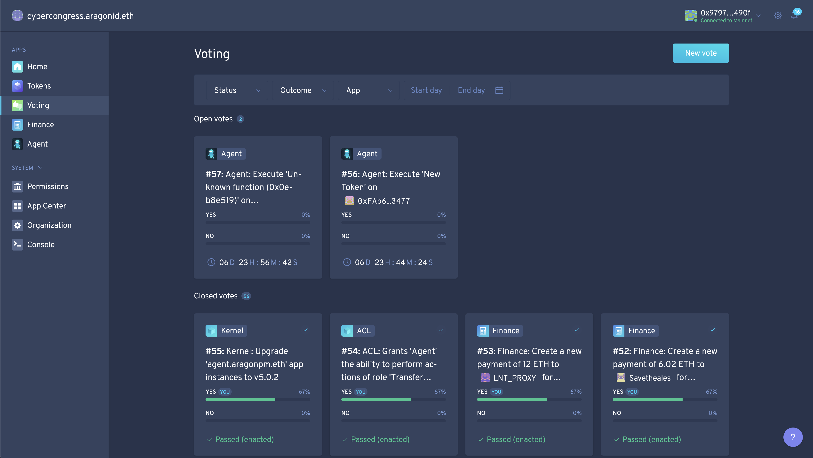

#### Votes for token deployment
Vote #1 transaction [detailss](https://etherscan.io/tx/0xe97866d789f9fd37807d6e015c685dda67be14de7a58b7319149bacca655213e) and Vote #2 transaction [detailss](https://etherscan.io/tx/0x5e990fa43ea5d4e82fcf6f3445abb3efcc3903a3700e894d6a2edad51b9c15ce)

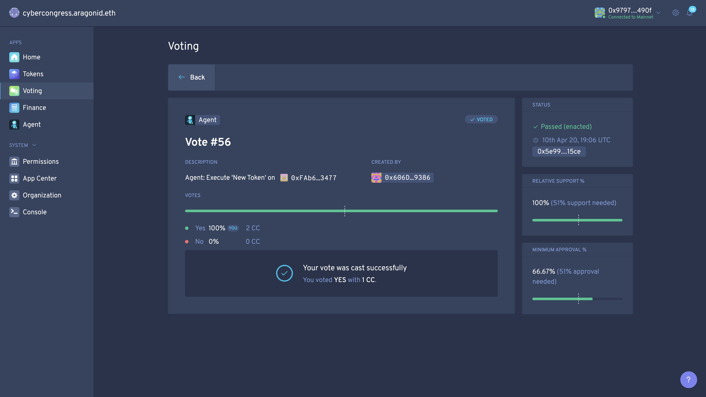

#### Votes for foundation deployemnt
Vote #1 transaction [detailss](https://rinkeby.etherscan.io/tx/0xd2b8b5ecc123fd5c01fba0ca9d6c70c8db096d60cf84d79092fca77828d51064) and Vote #2 transaction [detailss](https://rinkeby.etherscan.io/tx/0x46351e06a03b33f257b2f01592e5b9ff67ccd457e8720fd6261c3ffab086f618)

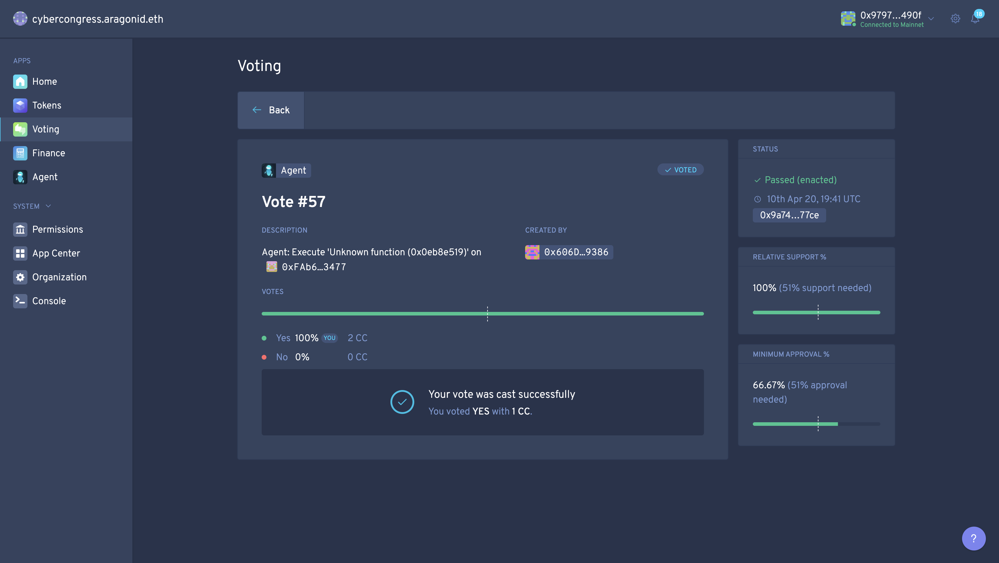
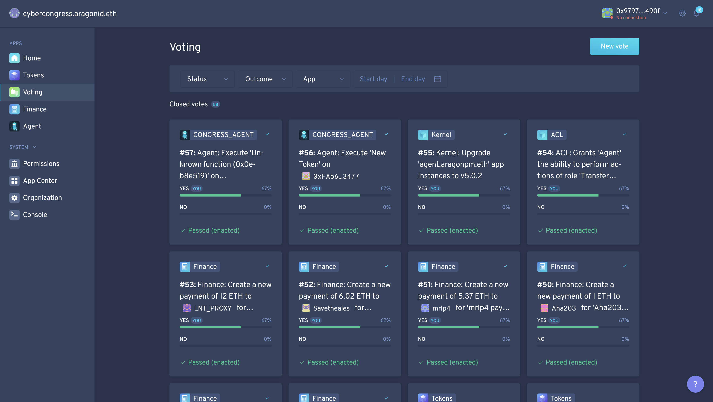

After the proposal has passed the new DAO becomes [available](https://mainnet.aragon.org/#/eulerfoundation/organization/)
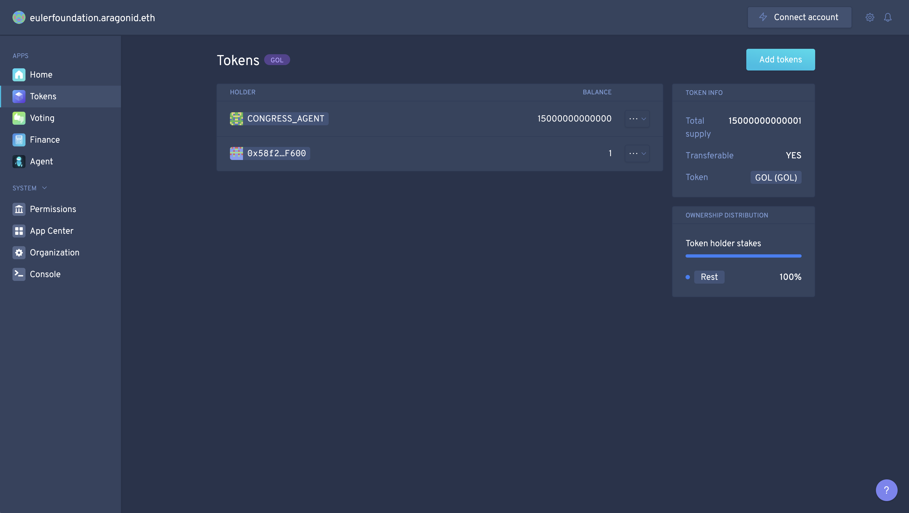

The initial and the major token holder right now is the Congress Agent and the second one is a service account which was described previously.

#### Check the Foundation DAO
This command allows you to check the installed applications and the addresses of their instances, and check for permissionless applications (an app which is installed and initialized, but still needs to have permissions set, so it can start their operations).

Template of the command:

```
dao apps <kernelFoundationAddress> --all --environment aragon:<network>
```

Command (no tx cast):

```
dao apps 0xC45417092c7ba66052c92A4AD871fC60bdbC7009  --all --environment aragon:mainnet
```

Output:

```
  ⠹ Inspecting DAO
  ✔ Inspecting DAO
  ✔ Fetching permissionless apps

✔ Successfully fetched DAO apps for 0xC45417092c7ba66052c92A4AD871fC60bdbC7009
┌──────────────────────┬────────────────────────────────────────────┬─────────────────────────────────────────────────────┐
│ App                  │ Proxy address                              │ Content                                             │
├──────────────────────┼────────────────────────────────────────────┼─────────────────────────────────────────────────────┤
│ kernel               │ 0xC45417092c7ba66052c92A4AD871fC60bdbC7009 │ (No UI available)                                   │
├──────────────────────┼────────────────────────────────────────────┼─────────────────────────────────────────────────────┤
│ acl                  │ 0xf2c7820014ac0041d179c692089d828ba0848cfd │ (No UI available)                                   │
├──────────────────────┼────────────────────────────────────────────┼─────────────────────────────────────────────────────┤
│ evmreg               │ 0xec79beef13966c5f240678ff23701cc6e99889fd │ (No UI available)                                   │
├──────────────────────┼────────────────────────────────────────────┼─────────────────────────────────────────────────────┤
│ token-manager@v2.1.7 │ 0x0b14bcfdf5e162e734cbf01d020ca49bc060efd5 │ ipfs:Qmev9Q7g4DEDHjqWt4QSdFy3dpzZmeF5AnPozhtjdboZG3 │
├──────────────────────┼────────────────────────────────────────────┼─────────────────────────────────────────────────────┤
│ agent@v5.0.2         │ 0x34291feae53ad4e155a20de02585eb115ef5d373 │ ipfs:QmX3wpYcYF7W8YDJgUBfvDu95mxRAYoaG4cZVir9yTuq4C │
├──────────────────────┼────────────────────────────────────────────┼─────────────────────────────────────────────────────┤
│ finance@v2.1.8       │ 0x6ea838ca600e05164b7e7c053b4cf570cda9d352 │ ipfs:QmeVsMqxYfnSShsC5KKob43KxfE95vtDzc4WRMx1DqBnm3 │
├──────────────────────┼────────────────────────────────────────────┼─────────────────────────────────────────────────────┤
│ voting@v2.1.7        │ 0x47cab484d85ff17c7849d0c198b5313db672f4ce │ ipfs:QmWjc1HgaZ9PvE1W52DvHTyqwYf3GEAZmnV7ABptwToEhE │
└──────────────────────┴────────────────────────────────────────────┴─────────────────────────────────────────────────────┘
```

#### Voting by the Congress Agent in the Foundation
Create a proposal to vote `yes/no` for, as a proposal in another DAO:

```
dao act <agentCongressAddress> <foundationVotingAppAddress>  "vote(uint256,bool,bool)" <id> <vote> <enact>  --environment aragon:<network>
```

*Note:* to forward the intent of the cyber~Congress DAO to another DAO, we will be using the Agent of the Congress. When anyone from the cyber~Congress DAO will create a proposal to vote yes or no for, it will create a proposal in the other DAO (Foundation in this case) and call the Congress Agent to cast a vote. 

Creating in the congresses voting application an instance of another DAO and a proposal ID with a decision which needs to be applied (be voted on). After the proposal, the passing agent will forward the vote to the given proposal in another DAO.

It is also worth noting, that until we reach the burning stage of the balance of the service account, we will be applying the same process to every stage. 
____________

### Install the Evangelism application to the Foundation DAO

#### Parameters

``` 
address _foundation
```

Parameters:
- Foundation: 0x34291feae53ad4e155a20de02585eb115ef5d373

A small fee is collected on each `believe` effort, which is accumulated on the Evangelist contract and any moment can be transferred by any account to the balance of euler\~Foundation. This is a simple spam protection mechanism.

#### Install the application
*Note:* this action is done by the service account (at this stage the Congress personal accounts cannot vote for the proposal anymore, so it is done using the agent)

Command template:

```
dao install <kernelFoundationAddress> cyberevangelism.open.aragonpm.eth latest --app-init-args <agentFoundationAddress> --environment aragon:mainnet --use-frame 
```

Command (cast tx):

```
dao install 0xC45417092c7ba66052c92A4AD871fC60bdbC7009 cyberevangelism.open.aragonpm.eth latest --app-init-args 0x34291feae53ad4e155a20de02585eb115ef5d373 --environment aragon:mainnet --use-frame
```

Output:

```
  ✔ Fetching cyberevangelism.open.aragonpm.eth@latest
  ✔ Fetching cyberevangelism.open.aragonpm.eth@latest
  ↓ Checking installed version [skipped]
    → Installing the first instance of cyberevangelism.open.aragonpm.eth in DAO
  ✔ Deploying app instance
  ↓ Fetching deployed app [skipped]
    → App wasn't deployed in transaction.

ℹ Successfully executed: "Execute desired action as a token holder"

⚠ After the app instance is created, you will need to assign permissions to it for it appear as an app in the DAO
```
Transaction [detailss](https://etherscan.io/tx/0x38d8f7528df483df272b51f8165c2a5d4f712af6613437080ada9d84d6f4b55c) of the proposal to install the Evangelism application to euler\~Foundation.

Proposal to install the Evangelism application, created in the euler\~Foundation DAO:
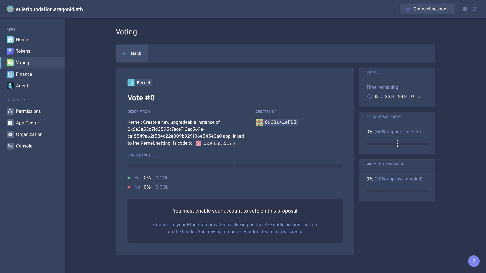

We need to vote on this proposal using the Agent of the Congress. Anyone from the Cogress DAO creates a proposal and votes `yes` on this proposal in the cyber~Congress DAO.

Command template:

```
dao act <agentCongressAddress> <foundationVotingAddress>  "vote(uint256,bool,bool)" <id> <vote> <enact>  --environment aragon:<network>
```

Command (cast tx):

```
dao act 0x3A1F860046249646E508C417a840755571bC4680 0x47cab484d85ff17c7849d0c198b5313db672f4ce "vote(uint256,bool,bool)" 0 true true  --environment aragon:mainnet --use-frame
```

Output:

```
  ⠦ Executing execute on 0x117d1F8CB4Bf6e74Bc5D667f15af7b810baCCCD6
  ✔ Executing execute on 0x117d1F8CB4Bf6e74Bc5D667f15af7b810baCCCD6

✔ Successfully executed: "Execute desired action as a token holder"
```

Transaction [details](https://etherscan.io/tx/0xb3a1a31e0deee3202b62f620d4caf4366a59fff3bf7afc71937644c7dbc2f662) of creating the proposal in the cyber\~Congress DAO to install the Evangelism application in the Foundation DAO.

The created proposal in the cyber\~Congress DAO:


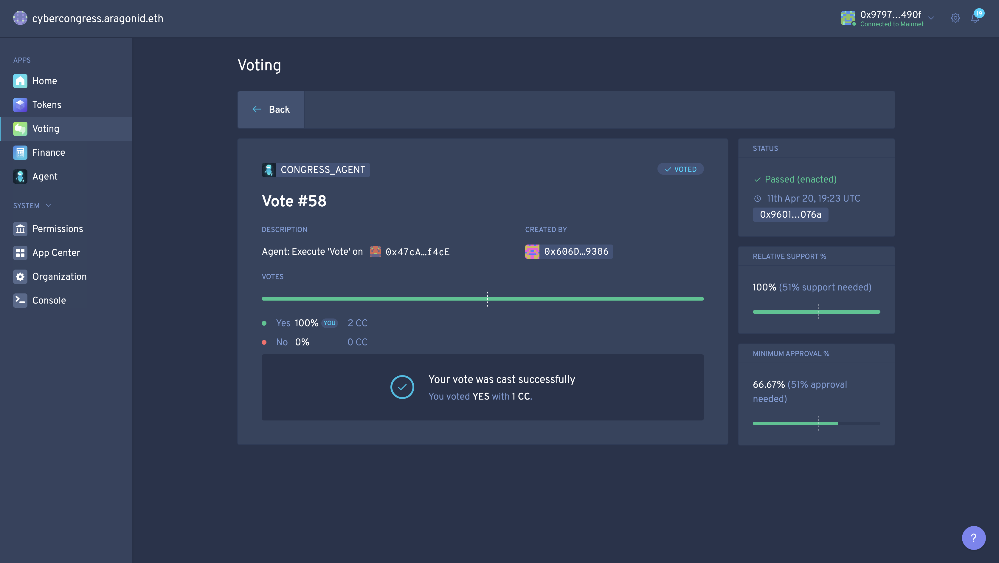

Vote #1 transaction [details](https://etherscan.io/tx/0xac3001eaf48be6706394a46ebb945b123fe49f5c30eb6d15c36bcd52ec3c0750) and Vote #2 transaction [details](https://etherscan.io/tx/0x9601b7970f8f2bf24e3243a5661eeca7744bb56c00424cf7ff602739b97c076a).

The passed proposal in the euler\~Foundation DAO:
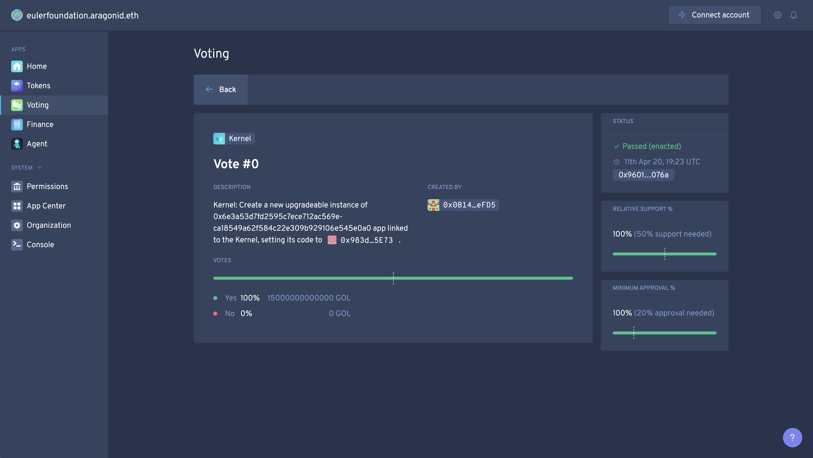

*Note:* The Evangelism application is still permissionless at this stage. To complete the installation process, we need to assign permissions for the Evangelism application.

```
  ⠏ Inspecting DAO
  ✔ Inspecting DAO
  ✔ Fetching permissionless apps

✔ Successfully fetched DAO apps for 0xC45417092c7ba66052c92A4AD871fC60bdbC7009
┌──────────────────────┬────────────────────────────────────────────┬─────────────────────────────────────────────────────┐
│ App                  │ Proxy address                              │ Content                                             │
├──────────────────────┼────────────────────────────────────────────┼─────────────────────────────────────────────────────┤
│ kernel               │ 0xC45417092c7ba66052c92A4AD871fC60bdbC7009 │ (No UI available)                                   │
├──────────────────────┼────────────────────────────────────────────┼─────────────────────────────────────────────────────┤
│ acl                  │ 0xf2c7820014ac0041d179c692089d828ba0848cfd │ (No UI available)                                   │
├──────────────────────┼────────────────────────────────────────────┼─────────────────────────────────────────────────────┤
│ evmreg               │ 0xec79beef13966c5f240678ff23701cc6e99889fd │ (No UI available)                                   │
├──────────────────────┼────────────────────────────────────────────┼─────────────────────────────────────────────────────┤
│ token-manager@v2.1.7 │ 0x0b14bcfdf5e162e734cbf01d020ca49bc060efd5 │ ipfs:Qmev9Q7g4DEDHjqWt4QSdFy3dpzZmeF5AnPozhtjdboZG3 │
├──────────────────────┼────────────────────────────────────────────┼─────────────────────────────────────────────────────┤
│ agent@v5.0.2         │ 0x34291feae53ad4e155a20de02585eb115ef5d373 │ ipfs:QmX3wpYcYF7W8YDJgUBfvDu95mxRAYoaG4cZVir9yTuq4C │
├──────────────────────┼────────────────────────────────────────────┼─────────────────────────────────────────────────────┤
│ finance@v2.1.8       │ 0x6ea838ca600e05164b7e7c053b4cf570cda9d352 │ ipfs:QmeVsMqxYfnSShsC5KKob43KxfE95vtDzc4WRMx1DqBnm3 │
├──────────────────────┼────────────────────────────────────────────┼─────────────────────────────────────────────────────┤
│ voting@v2.1.7        │ 0x47cab484d85ff17c7849d0c198b5313db672f4ce │ ipfs:QmWjc1HgaZ9PvE1W52DvHTyqwYf3GEAZmnV7ABptwToEhE │
└──────────────────────┴────────────────────────────────────────────┴─────────────────────────────────────────────────────┘
┌──────────────────────┬────────────────────────────────────────────┐
│ Permissionless app   │ Proxy address                              │
├──────────────────────┼────────────────────────────────────────────┤
│ cyberevangelism.open │ 0xfc3849b9711f69ddb677FAcfF0CD6755A981a1F0 │
└──────────────────────┴────────────────────────────────────────────┘
```

#### Initialize Founder Role

__FOUNDER_ROLE__: Founder bless and unbless believers of cyber.

Command template:

```
dao acl create <kernelFoundationAddress> <evangelismApplicationAddress> FOUNDER_ROLE <agentCongressAddress> <agentCongressAddress> --environment aragon:<network>
```

Command (cast tx):

```
dao acl create 0xC45417092c7ba66052c92A4AD871fC60bdbC7009 0xfc3849b9711f69ddb677FAcfF0CD6755A981a1F0 FOUNDER_ROLE 0x3a1f860046249646e508c417a840755571bc4680 0x3a1f860046249646e508c417a840755571bc4680 --environment aragon:mainnet --use-frame
```

Output:

```
  ⠇ Executing createPermission on 0xC45417092c7ba66052c92A4AD871fC60bdbC7009
  ✔ Executing createPermission on 0xC45417092c7ba66052c92A4AD871fC60bdbC7009

✔ Successfully executed: "Execute desired action as a token holder"
```

Transaction [details](https://etherscan.io/tx/0x8081014ed5c7c3b2cc76b532017a38a812b7f34bb0f227c441c68fd478418ce0) of the proposal in euler\~Foundation to install the `FOUNDER_ROLE` for the Evangelism application

The created proposal in euler\~Foundation:
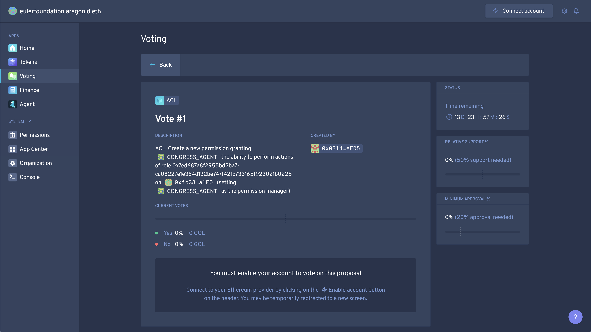

Create a proposal in the cyber\~Congress DAO to vote on:

Command (cast tx):

```
dao act 0x3A1F860046249646E508C417a840755571bC4680 0x47cab484d85ff17c7849d0c198b5313db672f4ce "vote(uint256,bool,bool)" 1 true true  --environment aragon:mainnet --use-frame
```

Output:

```
  ⠦ Executing execute on 0x117d1F8CB4Bf6e74Bc5D667f15af7b810baCCCD6
  ✔ Executing execute on 0x117d1F8CB4Bf6e74Bc5D667f15af7b810baCCCD6

✔ Successfully executed: "Execute desired action as a token holder"
```

Transaction [details](https://etherscan.io/tx/0x625b579bc657cdc232fd079dbcec632d3b92eace67514f3744a20cecdbf32cb1) of creating a proposal to vote for in the cyber~Congress DAO, on the proposal to assign the `FOUNDER_ROLE` to the Congress Agent for the Evangelism application in the Foundation DAO

The created proposal:
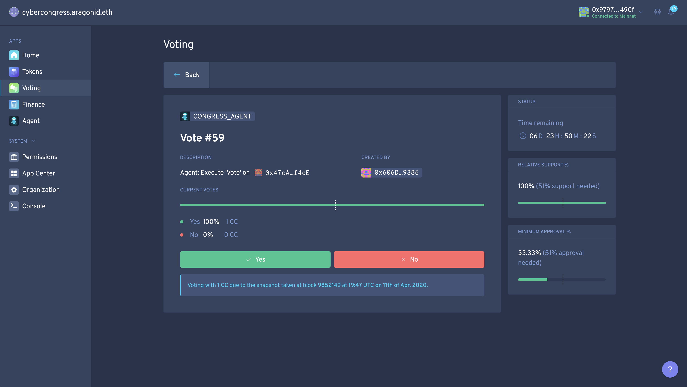

Vote #1 transaction [details](https://etherscan.io/tx/0x542d57a72c24c54b663ceff66045d8d87eb6db1ae4fe926628e42946bba21880) and Vote #2 transaction [details](https://etherscan.io/tx/0x53adfe0acddbe7745d592dec121a837681906860888bfa19c8ae4adb5526362f).

The passed proposal in cyber\~Congress:


The passed proposal in euler\~Foundation DAO:
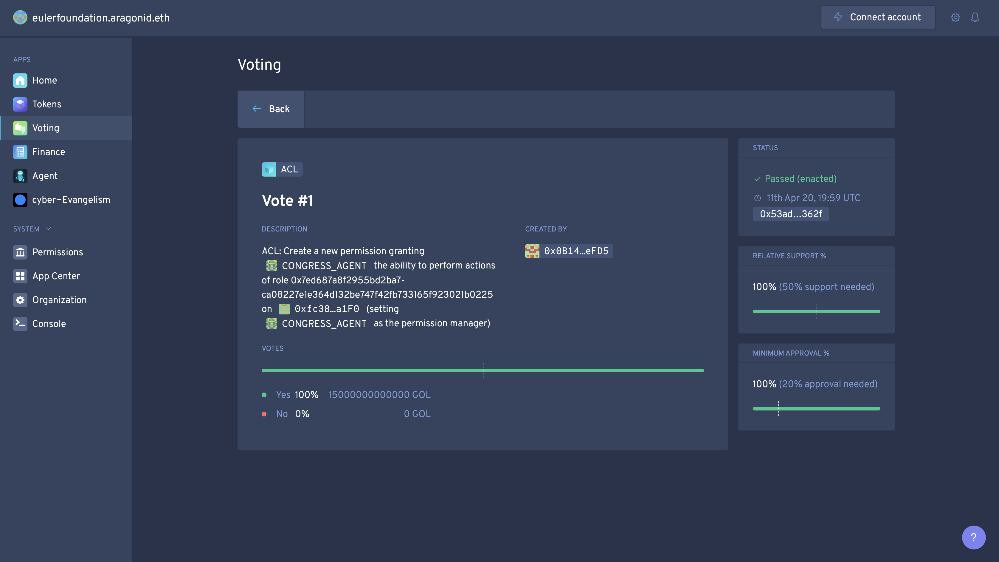

-----------------------

### Install the Vesting application for the Foundation DAO

#### Parameters

```
address _tokenManager,
uint64 _vestingEnd
```

Parameters:

- Token Manager: 0x0b14bcfdf5e162e734cbf01d020ca49bc060efd5
- Vesting End: 1592650849 - Saturday, June 20, 2020 11:00:49 AM

*Note:* The Vesting application needs the token managers' address of the Foundation DAO because it creates vesting (which is the token managers' functionality) and calls on issue, assing and burn operations as the token manager (we can see which accounts are set as managers, and other rights, when we click on the proposal itself).

The Vesting end time is the time when tokens that are vested will be allowed for transfer. This set up follows a distribution agreement (the need for the auction to be completed) plus an extra period (a window for holders to make vesting after the auction ends) and then the dust from the auction is provably burned by the Congress (in theory, you may pass the dust to the balance of the Foundation, but this is up to you). 

After the vesting is over the Congress will stop its commitment to provide claims for CYB tokens in the Cyber chain.

We strongly recommend reading Aragon's guide [about custom deploy](https://hack.aragon.org/docs/guides-custom-deploy).

#### Install the application
*Note:* this action is done by the service account (at this stage the Congress personal accounts cannot vote for the proposal anymore).

Command template:

```
dao install <kernelFoundationAddress> cyberclaim.open.aragonpm.eth latest --app-init-args <tokenManagerFoundationAddress> <vestingEnd> --environment aragon:<network>
```

Command (cast tx):

```
dao install 0xC45417092c7ba66052c92A4AD871fC60bdbC7009 cybervesting.open.aragonpm.eth latest --app-init-args 0x0b14bcfdf5e162e734cbf01d020ca49bc060efd5 1592650849 --environment aragon:mainnet --use-frame
```

Output:

```
  ✔ Fetching cybervesting.open.aragonpm.eth@latest
  ✔ Fetching cybervesting.open.aragonpm.eth@latest
  ↓ Checking installed version [skipped]
    → Installing the first instance of cybervesting.open.aragonpm.eth in DAO
  ✔ Deploying app instance
  ↓ Fetching deployed app [skipped]
    → App wasn't deployed in transaction.

ℹ Successfully executed: "Execute desired action as a token holder"

⚠ After the app instance is created, you will need to assign permissions to it for it appear as an app in the DAO
```

Transaction [details](https://etherscan.io/tx/0xbe5a64296d7a3b8f1f039a0809df8263b51b8a7c62e5f2001e9e8553428ca7a7) of the proposal to install the Vesting application in the Foundation.

The proposal to install the Vesting application, created in the Foundation DAO:
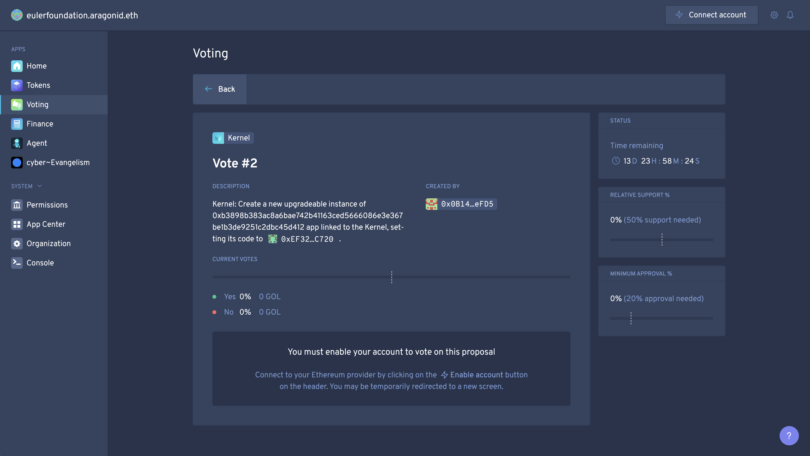

We may vote for this proposal using the Agent of the Congress. Anyone from the Cogress DAO creates a proposal and votes `yes` for this proposal, of the Foundation DAO, in the cyber~Congress DAO.

Command template:

```
dao act <agentCongressAddress> <foundationVotingAddress>  "vote(uint256,bool,bool)" <id> <vote> <enact>  --environment aragon:<network>
```

Command (cast tx):

```
dao act 0x3A1F860046249646E508C417a840755571bC4680 0x47cab484d85ff17c7849d0c198b5313db672f4ce "vote(uint256,bool,bool)" 2 true true  --environment aragon:mainnet --use-frame
```

Output:

```
  ⠏ Executing execute on 0x117d1F8CB4Bf6e74Bc5D667f15af7b810baCCCD6
  ✔ Executing execute on 0x117d1F8CB4Bf6e74Bc5D667f15af7b810baCCCD6

✔ Successfully executed: "Execute desired action as a token holder"
```

Transaction [details](https://etherscan.io/tx/0xb357de4d61514bf0e1a22c077b321bb2dfd7d6948e9f68948a67cd4cbdde2cb0) of creating the proposal in the cyber\~Congress DAO, to vote on installing the Vesting application for the Foundation DAO.

Any of the congressmen votes `yes` to the proposal in the cyber\~Congress DAO for the vesting app to be installed within the Foundation DAO:
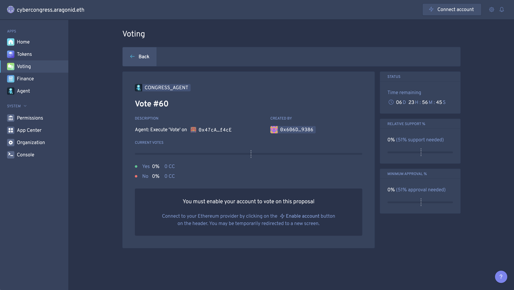

Vote #1 transaction [details](https://etherscan.io/tx/0x3cf2bd68d0d1a2e79ba2ad464b258a095a81eb9f11c2199d0ab591161ca1057e) and Vote #2 transaction [details](https://etherscan.io/tx/0x5533c392491c9bc0ed2d7ecc90b9104f89f6059b9e8b3bfeebd49d23f89d599f).

The passed proposal in the cyber~Congress DAO:
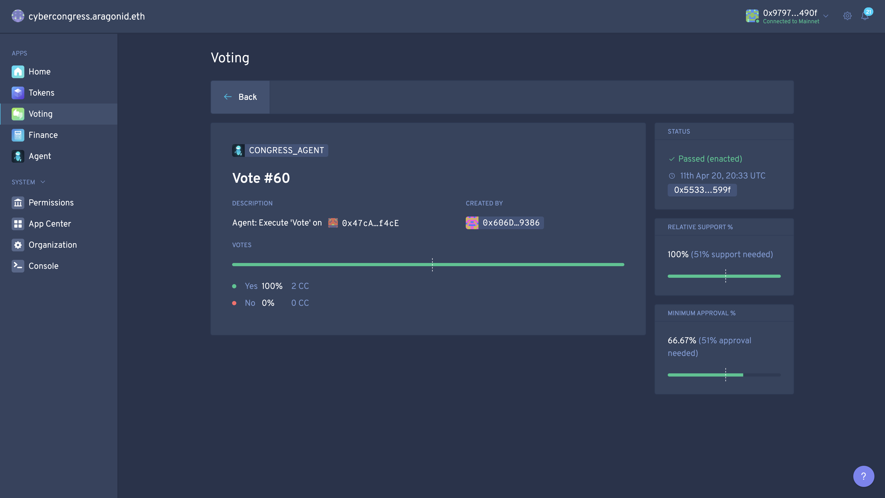

The passed proposal in the Foundation DAO:
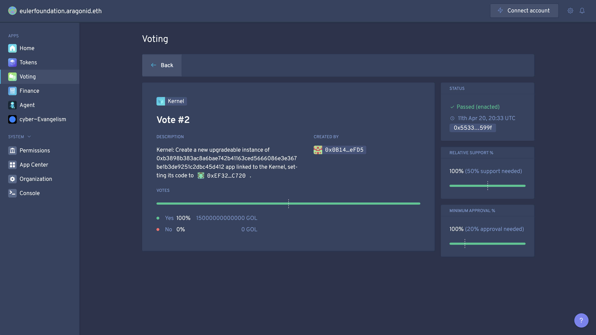

*Note:* The Vesting application is still permissionless at this stage. To complete the installation process we need to assign permissions to the Vesting application.

```
  ⠋ Inspecting DAO
  ✔ Inspecting DAO
  ✔ Fetching permissionless apps

✔ Successfully fetched DAO apps for 0xC45417092c7ba66052c92A4AD871fC60bdbC7009
┌─────────────────────────────┬────────────────────────────────────────────┬─────────────────────────────────────────────────────┐
│ App                         │ Proxy address                              │ Content                                             │
├─────────────────────────────┼────────────────────────────────────────────┼─────────────────────────────────────────────────────┤
│ kernel                      │ 0xC45417092c7ba66052c92A4AD871fC60bdbC7009 │ (No UI available)                                   │
├─────────────────────────────┼────────────────────────────────────────────┼─────────────────────────────────────────────────────┤
│ acl                         │ 0xf2c7820014ac0041d179c692089d828ba0848cfd │ (No UI available)                                   │
├─────────────────────────────┼────────────────────────────────────────────┼─────────────────────────────────────────────────────┤
│ evmreg                      │ 0xec79beef13966c5f240678ff23701cc6e99889fd │ (No UI available)                                   │
├─────────────────────────────┼────────────────────────────────────────────┼─────────────────────────────────────────────────────┤
│ token-manager@v2.1.7        │ 0x0b14bcfdf5e162e734cbf01d020ca49bc060efd5 │ ipfs:Qmev9Q7g4DEDHjqWt4QSdFy3dpzZmeF5AnPozhtjdboZG3 │
├─────────────────────────────┼────────────────────────────────────────────┼─────────────────────────────────────────────────────┤
│ agent@v5.0.2                │ 0x34291feae53ad4e155a20de02585eb115ef5d373 │ ipfs:QmX3wpYcYF7W8YDJgUBfvDu95mxRAYoaG4cZVir9yTuq4C │
├─────────────────────────────┼────────────────────────────────────────────┼─────────────────────────────────────────────────────┤
│ finance@v2.1.8              │ 0x6ea838ca600e05164b7e7c053b4cf570cda9d352 │ ipfs:QmeVsMqxYfnSShsC5KKob43KxfE95vtDzc4WRMx1DqBnm3 │
├─────────────────────────────┼────────────────────────────────────────────┼─────────────────────────────────────────────────────┤
│ voting@v2.1.7               │ 0x47cab484d85ff17c7849d0c198b5313db672f4ce │ ipfs:QmWjc1HgaZ9PvE1W52DvHTyqwYf3GEAZmnV7ABptwToEhE │
├─────────────────────────────┼────────────────────────────────────────────┼─────────────────────────────────────────────────────┤
│ cyberevangelism.open@v1.0.0 │ 0xfc3849b9711f69ddb677facff0cd6755a981a1f0 │ ipfs:QmPWQ9akBrcMJUD8XFvkeDh7UzayC6cSdKUCtwbMdmoC1s │
└─────────────────────────────┴────────────────────────────────────────────┴─────────────────────────────────────────────────────┘
┌────────────────────────────────────────────────────────────────────┬────────────────────────────────────────────┐
│ Permissionless app                                                 │ Proxy address                              │
├────────────────────────────────────────────────────────────────────┼────────────────────────────────────────────┤
│ 0xb3898b383ac8a6bae742b41163ced5666086e3e367be1b3de9251c2dbc45d412 │ 0xd84469eCd96825C956d7Ae8B072209cA89AE37E2 │
└────────────────────────────────────────────────────────────────────┴────────────────────────────────────────────┘
```

#### Initialize Proof/Pause Roles
We need to give the app different permissions to interact with other apps. You can see them in /permissions/tokens.

There are different token roles that Aragon lets you use by default, such as: issue, assign, burn, etc. Apart from these roles, our newly created application will need two extra roles that we have created:

__Pause Role__ : assigning this to the Congress Agent will allow the Congress to stop vesting and claiming operations of CYB tokens following an activation of the crisis protocol

__Proof Role__ : assigning this to the Congress driven external address, will allow the Congress to send tokens and then write transactions as proofs to any given vesting operations created by users

We are also setting manager rights for these roles to the Congress Agent. This is done to prevent byzantine changes from malicious actors for the period of the auction.

Command template:

```
dao acl create <kernelFoundationAddress> <vestingApplicationAddress> PAUSE_ROLE <agentCongressAddress> <agentCongressAddress> --environment aragon:<network>
```

Command (cast tx):

```
dao acl create 0xC45417092c7ba66052c92A4AD871fC60bdbC7009 0xd84469eCd96825C956d7Ae8B072209cA89AE37E2 PAUSE_ROLE 0x3a1f860046249646e508c417a840755571bc4680 0x3a1f860046249646e508c417a840755571bc4680 --environment aragon:mainnet --use-frame
```

Output:

```
  ⠇ Executing createPermission on 0xC45417092c7ba66052c92A4AD871fC60bdbC7009
  ✔ Executing createPermission on 0xC45417092c7ba66052c92A4AD871fC60bdbC7009

✔ Successfully executed: "Execute desired action as a token holder"
```

Transaction [details](https://etherscan.io/tx/0xef5aa27d0e1249eaaf555292df35c6a1697bff7a6d66a9b14bfe1c303fe4b085) of creating the proposal to install the `PAUSE_ROLE` for the Vesting application in euler\~Foundation. 

Command template:

```
dao acl create <kernelFoundationAddress> <claimAppAddress> PROOF_ROLE <prooferAddress> <agentCongressAddress> --environment aragon:<network>
```

Command (cast tx):

```
dao acl create 0xC45417092c7ba66052c92A4AD871fC60bdbC7009 0xd84469eCd96825C956d7Ae8B072209cA89AE37E2 PROOF_ROLE 0x31c3F97575B7515a7e967f73Cb26c5BFD7898951 0x3a1f860046249646e508c417a840755571bc4680 --environment aragon:mainnet --use-frame
```

Output:

```
  ⠇ Executing createPermission on 0xC45417092c7ba66052c92A4AD871fC60bdbC7009
  ✔ Executing createPermission on 0xC45417092c7ba66052c92A4AD871fC60bdbC7009

✔ Successfully executed: "Execute desired action as a token holder"
```

Transaction [details](https://etherscan.io/tx/0xf14543dbb21ebad7680caea0146188cdcf7f58301c46e86b5533b7589c74c63b) of creating the proposal to install the `PROOF_ROLE` for the Vesting application in euler\~Foundation. 

The created proposals in the Foundation DAO:
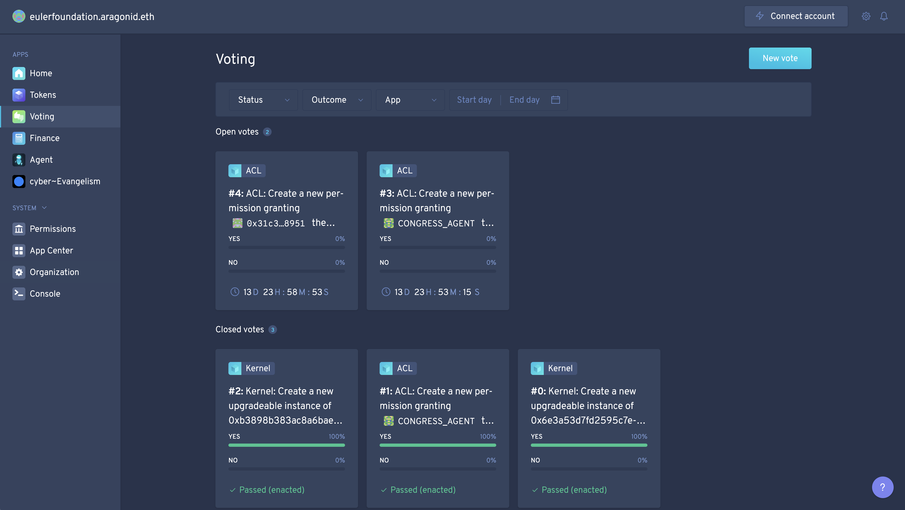

Create a proposal to vote on:

```
dao act 0x3A1F860046249646E508C417a840755571bC4680 0x47cab484d85ff17c7849d0c198b5313db672f4ce "vote(uint256,bool,bool)" 3 true true  --environment aragon:mainnet --use-frame
```

```
  ⠧ Executing execute on 0x117d1F8CB4Bf6e74Bc5D667f15af7b810baCCCD6
  ✔ Executing execute on 0x117d1F8CB4Bf6e74Bc5D667f15af7b810baCCCD6

✔ Successfully executed: "Execute desired action as a token holder"
```

Transaction [details](https://etherscan.io/tx/0xd9187609f1c56fb432752665e1a0ffc70499582fcbd7aab6490f60e6816e7ad0) of creating the proposal in the cyber~Congress DAO to vote on, setting the `PAUSE_ROLE` for the Vesting application in the euler\~Foundation DAO.

Create a proposal to vote on:

```
dao act 0x3A1F860046249646E508C417a840755571bC4680 0x47cab484d85ff17c7849d0c198b5313db672f4ce "vote(uint256,bool,bool)" 4 true true  --environment aragon:mainnet --use-frame
```

```
  ⠧ Executing execute on 0x117d1F8CB4Bf6e74Bc5D667f15af7b810baCCCD6
  ✔ Executing execute on 0x117d1F8CB4Bf6e74Bc5D667f15af7b810baCCCD6

✔ Successfully executed: "Execute desired action as a token holder"
```

Transaction [details](https://etherscan.io/tx/0x7bc1e658dd4810ee2eef8349363a9853d23fe5c9db091573a0e2d9beb20fc3c2) of creating the proposal in the cyber~Congress DAO to vote on, setting the `PROOF_ROLE` for the Vesting application in the euler\~Foundation DAO.

The created proposals in the cyber~Congress DAO:
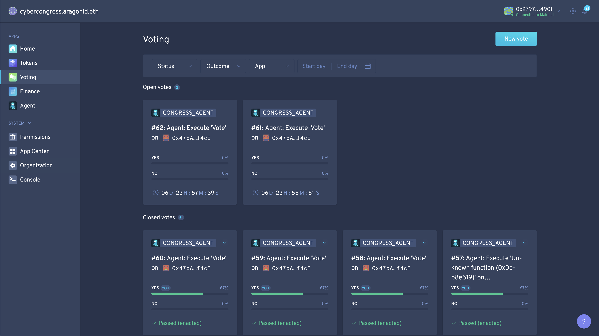

The passed proposals, which forward the `yes` votes to the Fondation DAO:


Vote #1 transaction [details](https://etherscan.io/tx/0xe9d2443154523200643f33ed2744eff8097c2f8a082a318e64141e8fe484f52d) and Vote #2 transaction [details](https://etherscan.io/tx/0x7bd934f94876c93ba24b733daaaa8cef6df226eb219c47be495543e12747ab9a).

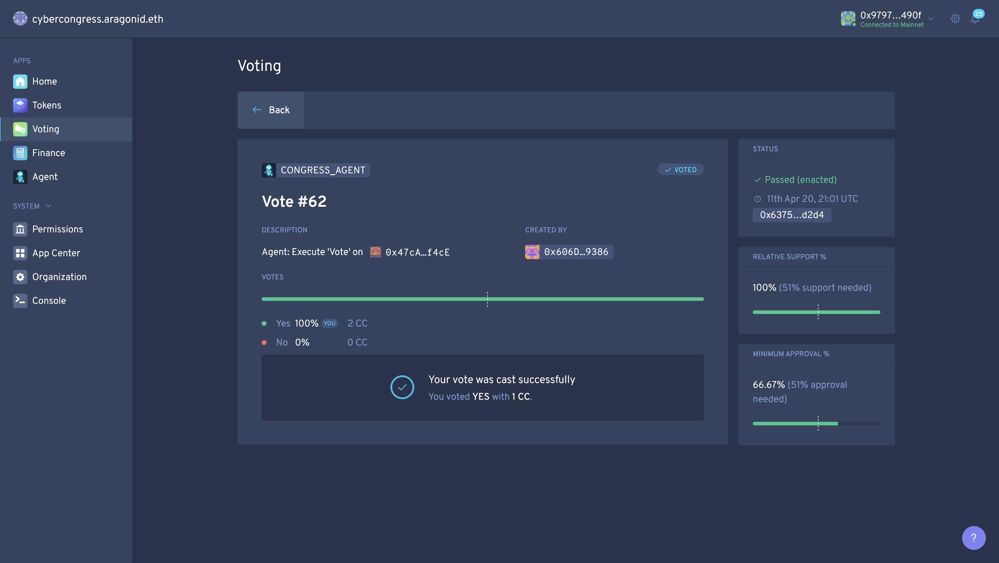

Vote #1 transaction [details](https://etherscan.io/tx/0x4682c60699a5eb6129ce326bf58f78286fd2d9e105deb7669d9c1516f2908244) and Vote #2 transaction [details](https://etherscan.io/tx/0x63751a5ebb5feab2d125e6ccb1b352206a48e7343405bd39d3105f27f8edd2d4).

The passed proposals in the Foundation DAO:
(we can see that the cyber\~Vesting application is available)

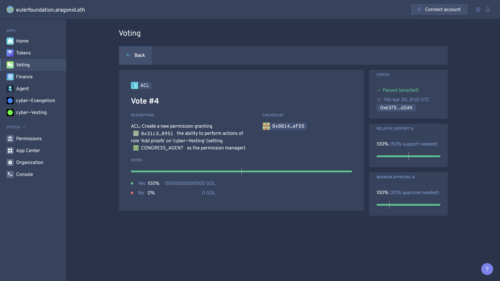

Permissions for the Auction in the Foundation DAO are now installed:
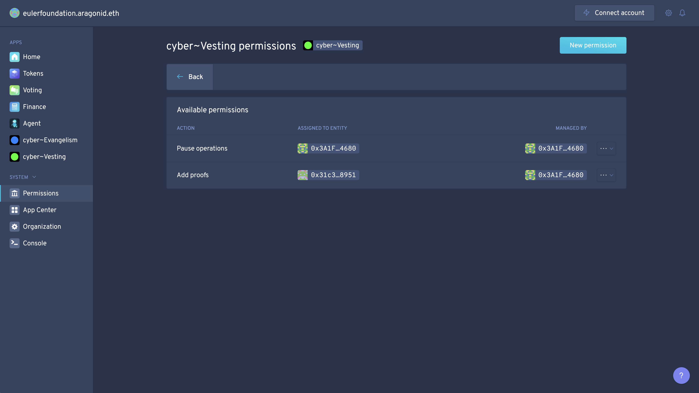

#### Grant the app permissions to Issue/Assign/Burn as Token Manager
We need to grant the needed permissions to the Vesting application so it can perform the needed functions as Token Manager in the Foundation DAO (you may view different roles in `token permissions`).

*Note:* This action is done from the frontend of the application

1. Issue: initialize the Vesting Application and the Voting application entities as manager
2. Assing: initialize the Vesting Application as an entity and the Voting application as a manager
3. Burn: grant permission to the Vesting Application entity

*Why is this required?*

When someone wants to lock the tokens (vest them), under the hood, we must first burn thee tokens and then release the same amount in the token manager. And only then, give him those tokens with a vesting key. 

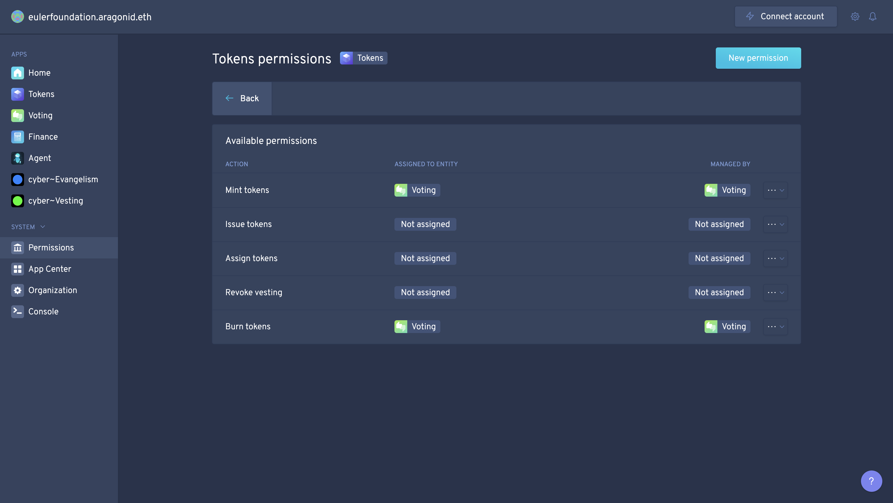

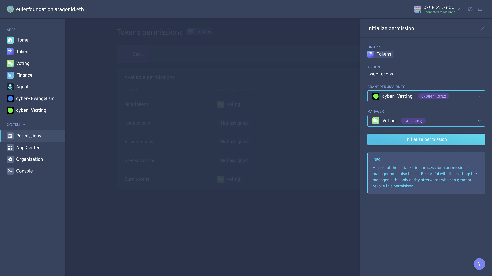
- Transaction [detailss](https://etherscan.io/tx/0xe6f56461c3a18f456242db3a4d8bb29ba4b732183c0c7617d97f2bacd703437a) on creating proposal in euler\~Foundation to grant Issue Tokens to Vesting application

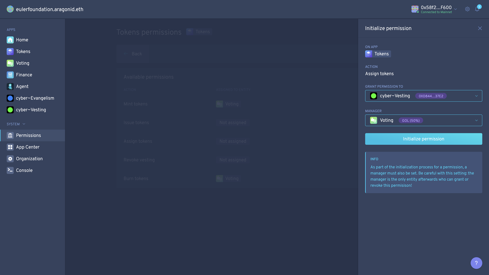
- Transaction [detailss](https://etherscan.io/tx/0x5c821278156b41a55029fc95896db7670b31d7f92c2386338394c7ff92e7b1c5) on creating proposal in euler\~Foundation to grant Assig Tokens to Vesting application

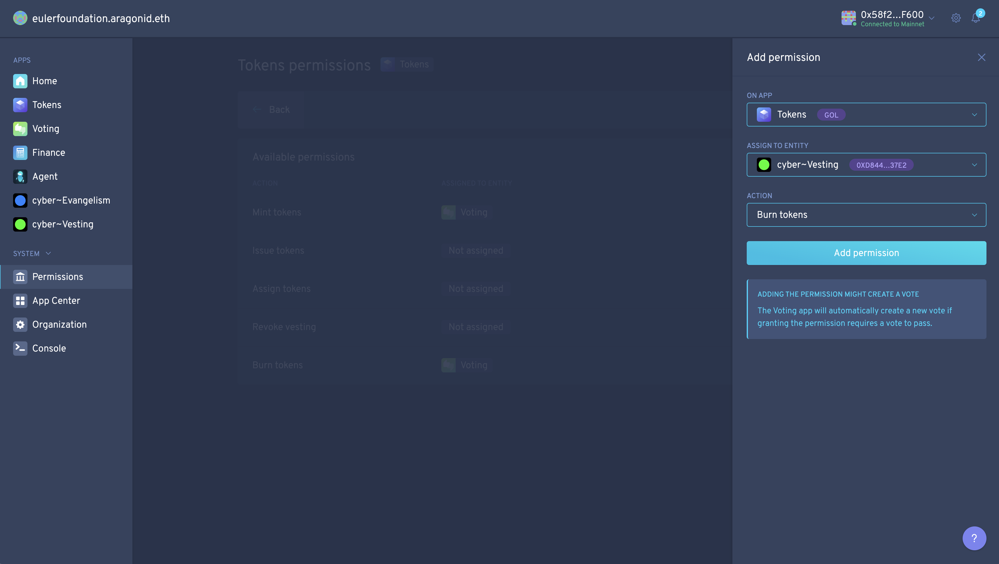
- Transaction [detailss](https://etherscan.io/tx/0x2ca183cb9413c5cffee40d10005243c92d197dc2d0cd1f0da63e4e18ed00f99e) on creating proposal in euler\~Foundation to grant Burn Tokens to Vesting application

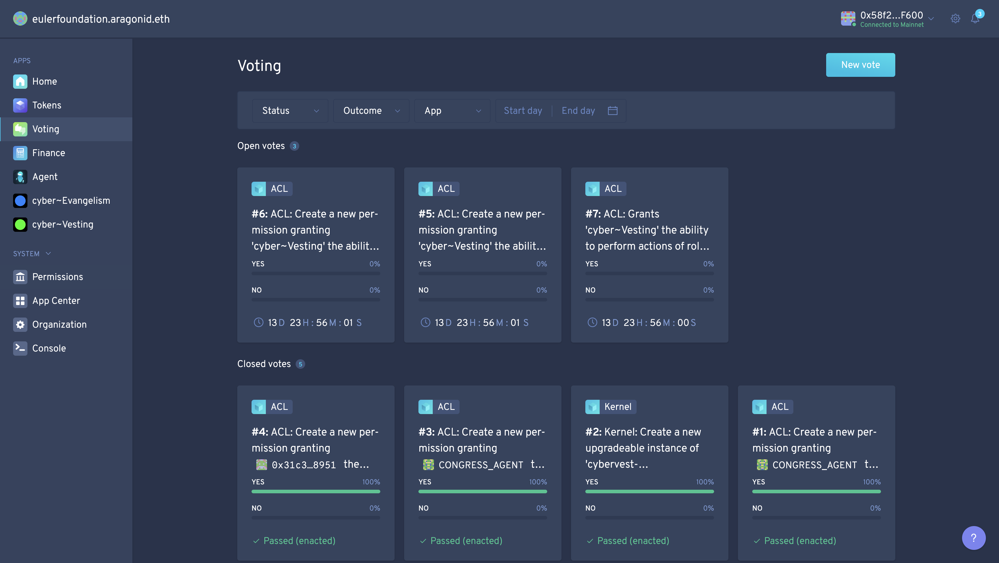

After this, create 3 votes:

```
dao act <agentCongressAddress> <foundationVotingAddress>  "vote(uint256,bool,bool)" <id> <vote> <enact>  --environment aragon:<network>
```

```
dao act 0x3A1F860046249646E508C417a840755571bC4680 0x47cab484d85ff17c7849d0c198b5313db672f4ce "vote(uint256,bool,bool)" 5 true true  --environment aragon:mainnet --use-frame
```

- Transaction [details](https://etherscan.io/tx/0x96e7866d1380694a48a820e14f0c9774ba9913d9e44389d7fd5126137dc32a97) of creating the proposal in the cyber~Congress DAO to vote on the proposal to grant Issue permissions as Token Manager to the Vesting application in the euler\~Foundation DAO.

```
dao act 0x3A1F860046249646E508C417a840755571bC4680 0x47cab484d85ff17c7849d0c198b5313db672f4ce "vote(uint256,bool,bool)" 6 true true  --environment aragon:mainnet --use-frame
```

- Transaction [details](https://etherscan.io/tx/0x7a722efe4710ee953f7868774166a4aaf631194f48e1bc1266c6d5530c311da1) of creating the proposal in cyber~Congress DAO to vote on the proposal to grant Assign permissions as Token Manager to the Vesting application in the euler\~Foundation DAO.

```
dao act 0x3A1F860046249646E508C417a840755571bC4680 0x47cab484d85ff17c7849d0c198b5313db672f4ce "vote(uint256,bool,bool)" 6 true true  --environment aragon:mainnet --use-frame
```
- Transaction [details](https://etherscan.io/tx/0x55969023e3914d8c9a715a5fd51ca3bc58c740ef9eadbcc39d91f4d940389518) of creating the proposal in cyber~Congress DAO to vote on the proposal to grant Burn permissions as Token Manager to the Vesting application in the euler\~Foundation DAO.

Output:

```
  ⠇ Executing execute on 0x117d1F8CB4Bf6e74Bc5D667f15af7b810baCCCD6
  ✔ Executing execute on 0x117d1F8CB4Bf6e74Bc5D667f15af7b810baCCCD6

✔ Successfully executed: "Execute desired action as a token holder"
```

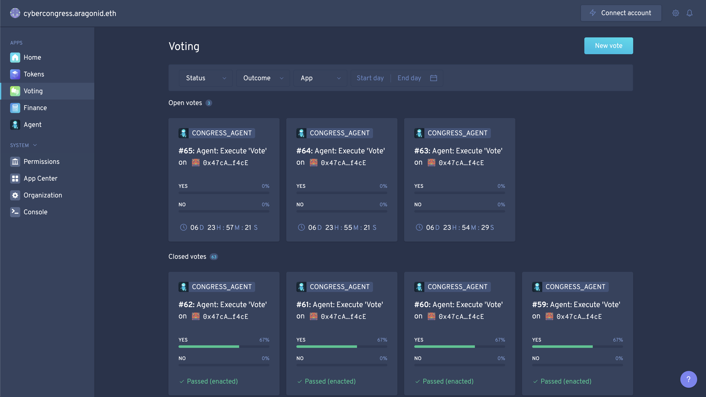

Members of the cyber~Congress DAO vote for these proposals and this forwards the `yes` votes, which then, set permissions as Token Manager in the Foundation DAO, granting the required permissions for the Vesting application.


Vote #1 transaction [detailss](https://etherscan.io/tx/0x480a235cca844530cb8ef6cc34dfc51266f2e52026a6b04f3491214dce2be829) and Vote #2 transaction [details](https://etherscan.io/tx/0x3a815c4f0cb91dc6b59943fa78d0b7b8c4750cbef2c6166097c5e836b3f72706).


Vote #1 transaction [detailss](https://etherscan.io/tx/0x223cbe7c0d75d061e88dff5ce8f0ae9747e59ed3922d3c7eda23111c31e71917s) and Vote #2 transaction [detailss](https://etherscan.io/tx/0xeb057716a14216a642cba588d333e1fb72e5730f1255367ca0d1021d753ff25d)

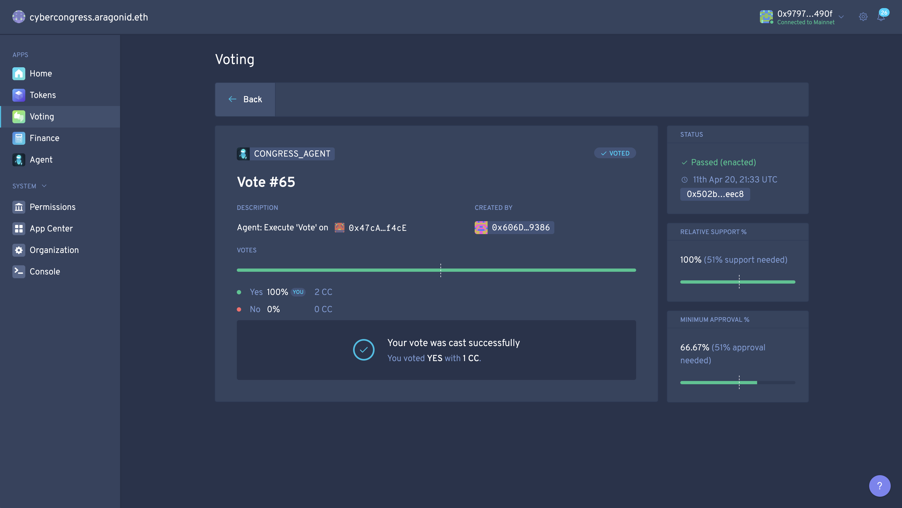

Vote #1 transaction [details](https://etherscan.io/tx/0xfed3cf6adc11b0d6e525b5d0fcda9628cd46c8326f311a0f4c841d39ccd84ec5) and Vote #2 transaction [details](https://etherscan.io/tx/0x502b67642c8e173a5649bc0108bba8cbccfb6de935143bc60a5d3b8b629ceec8).

The passed proposals in the Foundation DAO:
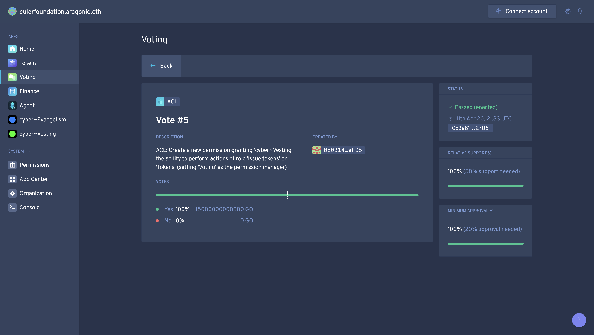


New permissions as Token Manager in the Foundation DAO:
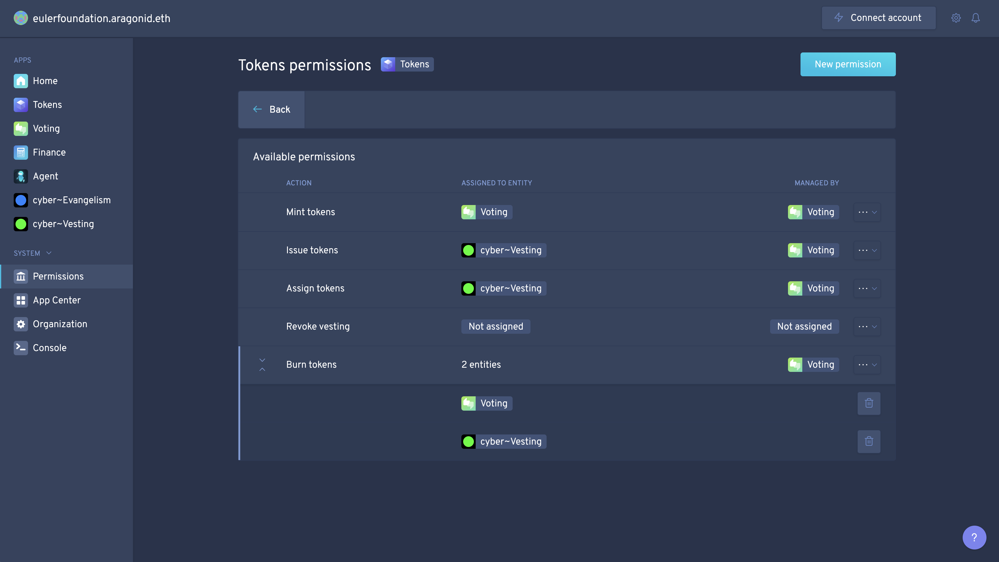

Well done! The installation of the Vesting application for the Foundation DAO is completed! This application is now fully operational.

____________

### Installing the Auction application for the Foundation DAO

#### Parameters

```
uint256 _numberOfDays,
uint256 _openTime,
uint256 _startTime,
MiniMeToken _token,
address _foundation,
address _tokenManager
```

- The number of days is the amount of windows/rounds of any given time (23 hours + 1 second in our case). The auction will continue after the initial (zero) window
- Open time is the time when round zero will begin 
- The start time is the time when round zero will be finished and a following amount of rounds, equal to each other in terms of time, occurs
- The foundation address is the address to which the donated ETH will be transferred (Foundations DAO agent)

```
- numberOfDays - 49
- openTime -  1586865600 Tuesday, April 14, 2020 12:00:00 PM GMT
- startTime - 1587729600 Friday, April 24, 2020 12:00:00 PM
- token - 0xF4ecdBa8ba4144Ff3a2d8792Cad9051431Aa4F64 (GOL)
- foundation - 0x34291feae53ad4e155a20de02585eb115ef5d373 (Agent of euler\~Foundation)
```

#### Install
We use the service account to create the proposal to install the app

Command template:

```
dao install <kernelFoundation> cyberauction.open.aragonpm.eth latest --app-init-args <windows> <openTime> <startTime> <tokenFoundationAddress> <agentFoundationAddress> <tokenManagerFoundationAddress> --environment aragon:<network>
```

Command (cast tx):

```
dao install 0xC45417092c7ba66052c92A4AD871fC60bdbC7009 cyberauction.open.aragonpm.eth latest --app-init-args 49 1586865600 1587729600 0xF4ecdBa8ba4144Ff3a2d8792Cad9051431Aa4F64 0x34291feae53ad4e155a20de02585eb115ef5d373 0x0b14bcfdf5e162e734cbf01d020ca49bc060efd5 --environment aragon:mainnet --use-frame
```

Output:

```
  ✔ Fetching cyberauction.open.aragonpm.eth@latest
  ✔ Fetching cyberauction.open.aragonpm.eth@latest
  ↓ Checking installed version [skipped]
    → Installing the first instance of cyberauction.open.aragonpm.eth in DAO
  ✔ Deploying app instance
  ↓ Fetching deployed app [skipped]
    → App wasn't deployed in transaction.

ℹ Successfully executed: "Execute desired action as a token holder"

⚠ After the app instance is created, you will need to assign permissions to it for it appear as an app in the DAO
```

Transaction [details](https://etherscan.io/tx/0xc53ffb4d42aee02f4554c01888fe1d18d390970e9d02937e6d4713b2ce407d1b) of creating the proposal in the euler\~Foundation DAO for installing the Auction application.

The proposal to install the Auction app is created in the Foundation DAO:
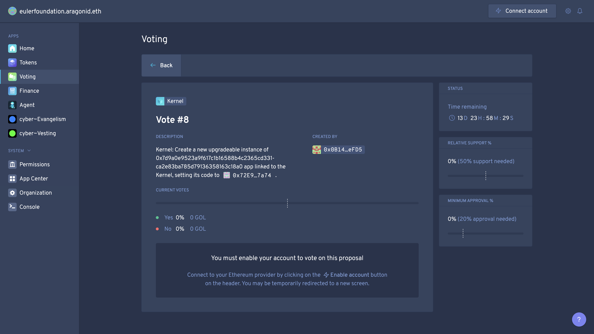

Now, we can create the voting with the agent of the Congress and vote `yes` in the cyber~Congress DAO:

Command (cast tx):

```
dao act 0x3A1F860046249646E508C417a840755571bC4680 0x47cab484d85ff17c7849d0c198b5313db672f4ce "vote(uint256,bool,bool)" 8 true true  --environment aragon:mainnet --use-frame
```

```
⠸ Executing execute on 0xaAe1456bDEDaa40E2ecf20777Fab7Ec2f676477f
  ✔ Executing execute on 0xaAe1456bDEDaa40E2ecf20777Fab7Ec2f676477f

✔ Successfully executed: "Execute desired action as a token holder"
```

Transaction [details](https://etherscan.io/tx/0xbe859e2d33fa2eda6cf60e98f876d6e5daf62471fbf363d8f0307c71f752462b) of creating the proposal in the Congress to vote on the proposal in the Foundation, for installing the Auction application.

The created proposal in the cyber~Congress DAO:
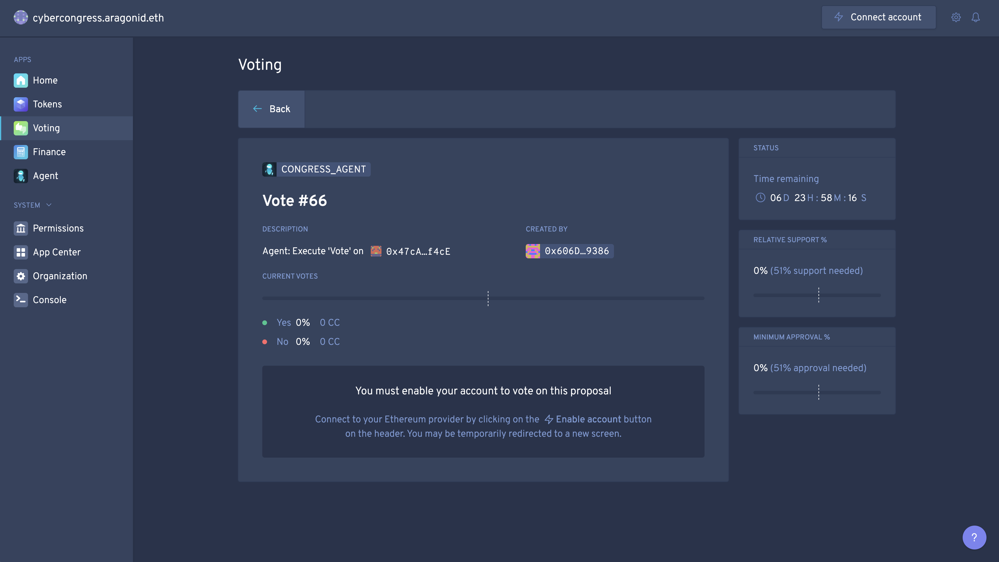

The passed proposal in the cyber~Congress DAO:
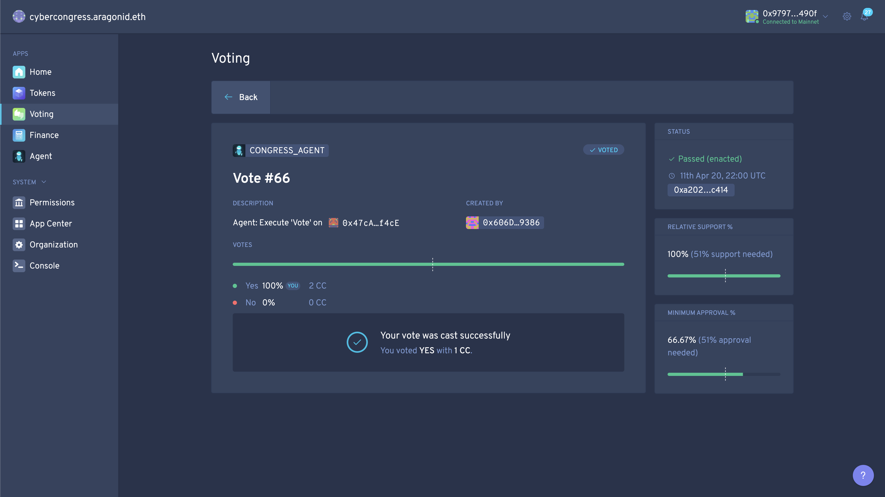

Vote #1 transaction [details](https://etherscan.io/tx/0x38267871ebb764534458a2247be66390722c30604fad8a8ecd0744e6c5645409) and Vote #2 transaction [details](https://etherscan.io/tx/0xa202e891b2dac5418a76604cc8af52745651c15867def1b76672f6008db3c414).

The passed proposal in the Foundation DAO to install the Auction application:
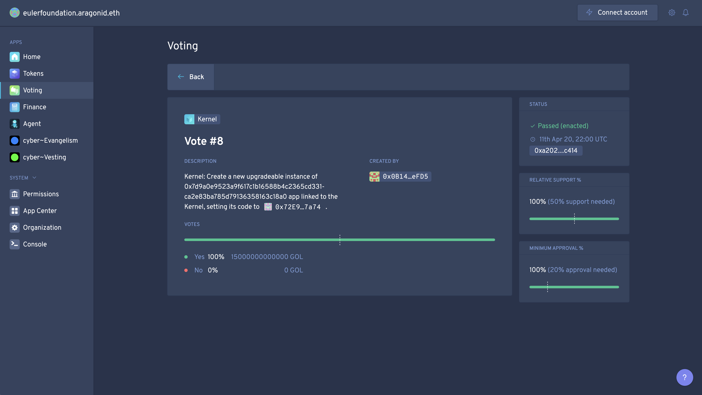

```
➜ \~ dao apps 0x7eFA8E568a5fE91741f72A39b96f42EEdB67C419 --all --environment aragon:rinkeby
  ⠋ Inspecting DAO  ✔ Inspecting DAO
  ✔ Fetching permissionless apps

✔ Successfully fetched DAO apps for 0xC45417092c7ba66052c92A4AD871fC60bdbC7009
┌─────────────────────────────┬────────────────────────────────────────────┬─────────────────────────────────────────────────────┐
│ App                         │ Proxy address                              │ Content                                             │
├─────────────────────────────┼────────────────────────────────────────────┼─────────────────────────────────────────────────────┤
│ kernel                      │ 0xC45417092c7ba66052c92A4AD871fC60bdbC7009 │ (No UI available)                                   │
├─────────────────────────────┼────────────────────────────────────────────┼─────────────────────────────────────────────────────┤
│ acl                         │ 0xf2c7820014ac0041d179c692089d828ba0848cfd │ (No UI available)                                   │
├─────────────────────────────┼────────────────────────────────────────────┼─────────────────────────────────────────────────────┤
│ evmreg                      │ 0xec79beef13966c5f240678ff23701cc6e99889fd │ (No UI available)                                   │
├─────────────────────────────┼────────────────────────────────────────────┼─────────────────────────────────────────────────────┤
│ token-manager@v2.1.7        │ 0x0b14bcfdf5e162e734cbf01d020ca49bc060efd5 │ ipfs:Qmev9Q7g4DEDHjqWt4QSdFy3dpzZmeF5AnPozhtjdboZG3 │
├─────────────────────────────┼────────────────────────────────────────────┼─────────────────────────────────────────────────────┤
│ agent@v5.0.2                │ 0x34291feae53ad4e155a20de02585eb115ef5d373 │ ipfs:QmX3wpYcYF7W8YDJgUBfvDu95mxRAYoaG4cZVir9yTuq4C │
├─────────────────────────────┼────────────────────────────────────────────┼─────────────────────────────────────────────────────┤
│ finance@v2.1.8              │ 0x6ea838ca600e05164b7e7c053b4cf570cda9d352 │ ipfs:QmeVsMqxYfnSShsC5KKob43KxfE95vtDzc4WRMx1DqBnm3 │
├─────────────────────────────┼────────────────────────────────────────────┼─────────────────────────────────────────────────────┤
│ voting@v2.1.7               │ 0x47cab484d85ff17c7849d0c198b5313db672f4ce │ ipfs:QmWjc1HgaZ9PvE1W52DvHTyqwYf3GEAZmnV7ABptwToEhE │
├─────────────────────────────┼────────────────────────────────────────────┼─────────────────────────────────────────────────────┤
│ cyberevangelism.open@v1.0.0 │ 0xfc3849b9711f69ddb677facff0cd6755a981a1f0 │ ipfs:QmPWQ9akBrcMJUD8XFvkeDh7UzayC6cSdKUCtwbMdmoC1s │
├─────────────────────────────┼────────────────────────────────────────────┼─────────────────────────────────────────────────────┤
│ cybervesting.open@v1.0.0    │ 0xd84469ecd96825c956d7ae8b072209ca89ae37e2 │ ipfs:QmaDRwwdvPnntWtvJJ6YCrcL4dwic8NJYArcP1Lp4r5xzx │
└─────────────────────────────┴────────────────────────────────────────────┴─────────────────────────────────────────────────────┘
┌────────────────────────────────────────────────────────────────────┬────────────────────────────────────────────┐
│ Permissionless app                                                 │ Proxy address                              │
├────────────────────────────────────────────────────────────────────┼────────────────────────────────────────────┤
│ 0x7d9a0e9523a9f617c1b16588b4c2365cd331ca2e83ba785d79136358163c18a0 │ 0x0b1f54Be915E77D9BF14268F94F8A26AfaB11296 │
└────────────────────────────────────────────────────────────────────┴────────────────────────────────────────────┘
```

We need to initialize permissions for the Auction application and grant the needed permissions as Token Manager.

#### Initialize the Creator Role
We assign the Creator Role, which sets up the auction, to the Congress Agent. 

Command template:

```
dao acl create <kernelFoundationAddress> <auctionApplicationAddress> CREATOR_ROLE <agentCongress> <agentCongress> --environment aragon:<network>
```

Command (cast tx):

```
dao acl create 0xC45417092c7ba66052c92A4AD871fC60bdbC7009 0x0b1f54Be915E77D9BF14268F94F8A26AfaB11296 CREATOR_ROLE 0x3a1f860046249646e508c417a840755571bc4680 0x3a1f860046249646e508c417a840755571bc4680 --environment aragon:mainnet --use-frame
```

Output:

```
  ⠇ Executing createPermission on 0xC45417092c7ba66052c92A4AD871fC60bdbC7009
  ✔ Executing createPermission on 0xC45417092c7ba66052c92A4AD871fC60bdbC7009

✔ Successfully executed: "Execute desired action as a token holder"
```


Transaction [details](https://etherscan.io/tx/0x130c930e5d259266fddf9d412b88a36933f0178fb8d86e5f43afc062bf559413) of creating the proposal to install the `CREATOR_ROLE` to the Auction application in the euler\~Foundation DAO.

#### Initialize Burner Role
We need to assign a Burner Role, which will burn dust tokens after auction end, to the Congress Agent. The burner can, and should, burn the dust tokens after the auction ends. 

cyber functions with very large numbers and non-divisible tokens, by dust we refer to anything that comes after a decimal point. As we cannot issue more tokens then there are, we round the amount to the closest lowest number after the decimal. I.E. if someone were to receive 1000000.3 or 1000000.7, they will always receive 999999 or 1000000. The dust is provably burned, hence that value is actually returned to donors in terms of inflation washdown.  

Command template:

```
dao acl create <kernelFoundationAddress> <auctionApplicationAddress> BURNER_ROLE <agentCongress> <agentCongress> --environment aragon:<network>
```

Command (cast tx):

```
dao acl create 0xC45417092c7ba66052c92A4AD871fC60bdbC7009 0x0b1f54Be915E77D9BF14268F94F8A26AfaB11296 BURNER_ROLE 0x3a1f860046249646e508c417a840755571bc4680 0x3a1f860046249646e508c417a840755571bc4680 --environment aragon:mainnet --use-frame
```

Output:

```
  ⠇ Executing createPermission on 0xC45417092c7ba66052c92A4AD871fC60bdbC7009
  ✔ Executing createPermission on 0xC45417092c7ba66052c92A4AD871fC60bdbC7009

✔ Successfully executed: "Execute desired action as a token holder"
```

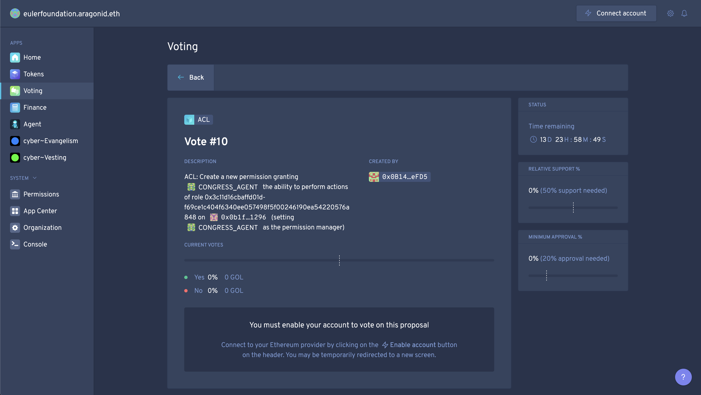

Transaction [details](https://etherscan.io/tx/0x8df438c38b179fbef7ab6d6ac518a2ee9358d106ac1d0577fa7d6ed33f89c452) of creating the proposal to install the `BURNER_ROLE` to the Auction application in the euler\~Foundation DAO.

Now, we can create the voting with the agent of the Congress and vote `yes` in the cyber~Congress DAO:

Command (cast tx):

```
dao act 0x3A1F860046249646E508C417a840755571bC4680 0x47cab484d85ff17c7849d0c198b5313db672f4ce "vote(uint256,bool,bool)" 9 true true  --environment aragon:mainnet --use-frame
```

Transaction [details](https://etherscan.io/tx/0xd8a01b819e78a26ff21a8a52dceb98b3e74f977cf63b15605b86a9c299c2ec0f) of creating the proposal in the cyber\~Congress DAO to vote on installing the `CREATOR_ROLE` to the Auction application in the euler\~Foundation DAO.

Command (cast tx):

```
dao act 0x3A1F860046249646E508C417a840755571bC4680 0x47cab484d85ff17c7849d0c198b5313db672f4ce "vote(uint256,bool,bool)" 10 true true  --environment aragon:mainnet --use-frame
```

Output:

```
  ⠦ Executing execute on 0x117d1F8CB4Bf6e74Bc5D667f15af7b810baCCCD6
  ✔ Executing execute on 0x117d1F8CB4Bf6e74Bc5D667f15af7b810baCCCD6

✔ Successfully executed: "Execute desired action as a token holder"
```

Transaction [details](https://etherscan.io/tx/0x444fc667e29f954286d5efe7d1d17cb6c9b8505e9ffe5c8c3871c015ecb0d77d) of creating the proposal in the cyber\~Congress DAO to vote on installing the` BURNER_ROLE` to the Auction application in the euler\~Foundation DAO.

The created proposals in the cyber~Congress DAO:
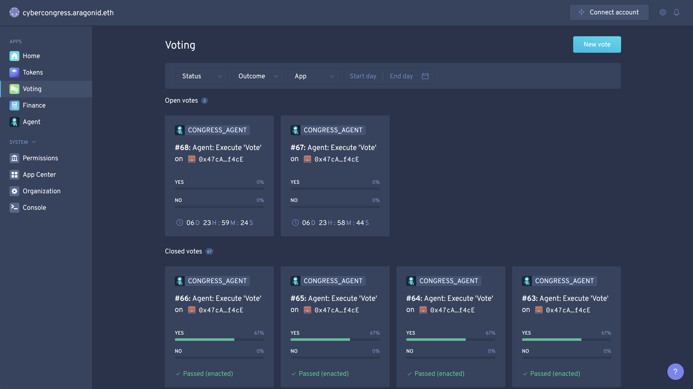

The passed proposal in the cyber~Congress DAO:


Vote #1 transaction [details](https://etherscan.io/tx/0x542faf0a605fe15da3ecbfe8ab75a67ad91b4a4206257ebe75a56574df00f36e) and Vote #2 transaction [details](https://etherscan.io/tx/0x4864894b262959e3a89d6c391d744915c002acb911053ca9a3cc6b810d922518).

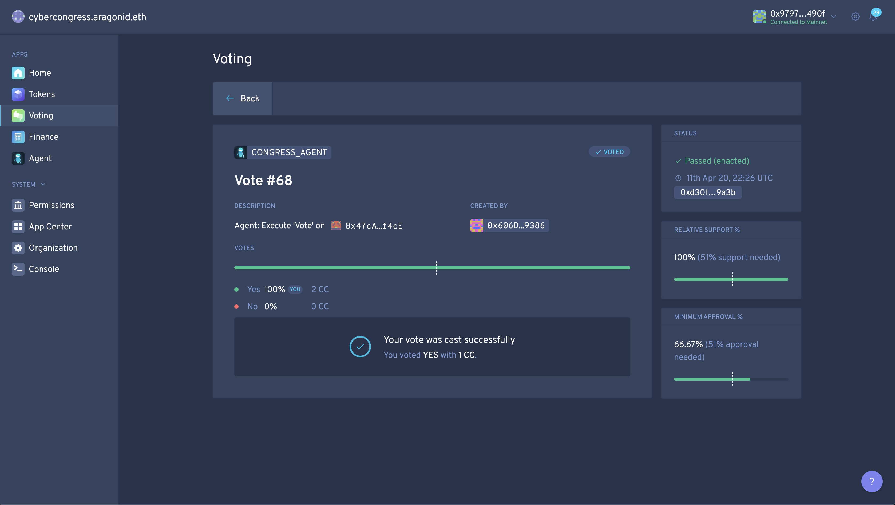

Vote #1 transaction [details](https://etherscan.io/tx/0x3273617c3368d3c919e7d01b3e36637be9083b70f6c05bd64cfaad2f35a1a509) and Vote #2 transaction [details](https://etherscan.io/tx/0xd301bc3833de8f4f187ffb1ef540307a411ef0035994e4932e480236f1ed9a3b).

The passed proposals and the Auction application installed in the euler\~Foundation DAO:

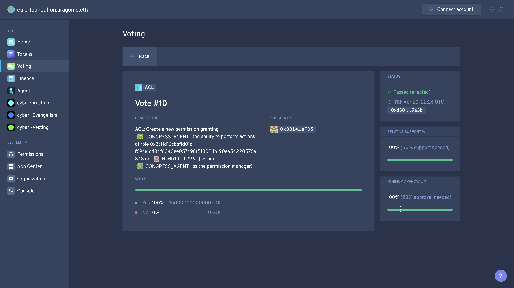

Permissions of the Auction in the Foundation DAO:
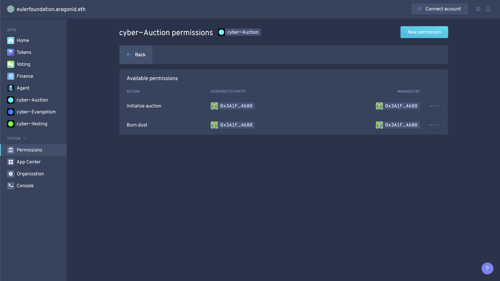

#### Grant permission for Burn rights as Token Manager
The auction should be able to burn tokens (dust) after the end. This role is assigned to the Congress Agent, but we need to grant permission as the Token Manager for the Auction.

Grant permission for Burn rights as Token Manager for the Auction application in the Foundation DAO:
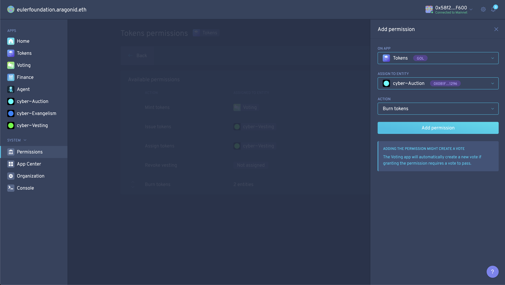

Transaction [details](https://etherscan.io/tx/0x9dcda75d339b17df545471d2a04c82ae6fc9c4a96ab14c072faad543a72400fd) of creating the proposal to assign burn permission as the Token Manager to the Auction application in the euler\~Foundation.

The created proposal to grant burn permission as the Token Manager to the Auction app in the Foundation DAO:


We need to create a proposal in the cyber~Congress DAO to vote `yes` on, following the proposal in the Foundation DAO:

Command (cast tx):

```
dao act 0x3A1F860046249646E508C417a840755571bC4680 0x47cab484d85ff17c7849d0c198b5313db672f4ce "vote(uint256,bool,bool)" 11 true true  --environment aragon:mainnet --use-frame
```

Output:

```
  ⠙ Executing execute on 0xaAe1456bDEDaa40E2ecf20777Fab7Ec2f676477f
  ✔ Executing execute on 0xaAe1456bDEDaa40E2ecf20777Fab7Ec2f676477f

✔ Successfully executed: "Execute desired action as a token holder"
```

Transaction [details](https://etherscan.io/tx/0x2343c4d1f3f6d79e1a821f3eb65ee2c69f2b54309f8e55d040490e3424ab11e5) of creating the proposal in the cyber~Congress DAO to vote on the proposal to assign burn permissions as Token Manager to the Auction Application in euler\~Foundation.

The created proposal in the cyber~Congress DAO:
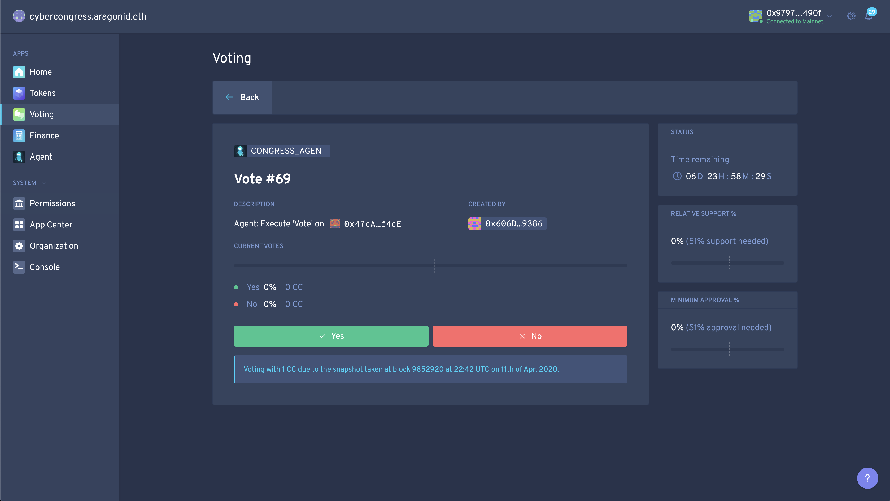

The proposal passed in the cyber~Congress DAO and forwarded to the Foundation DAO:
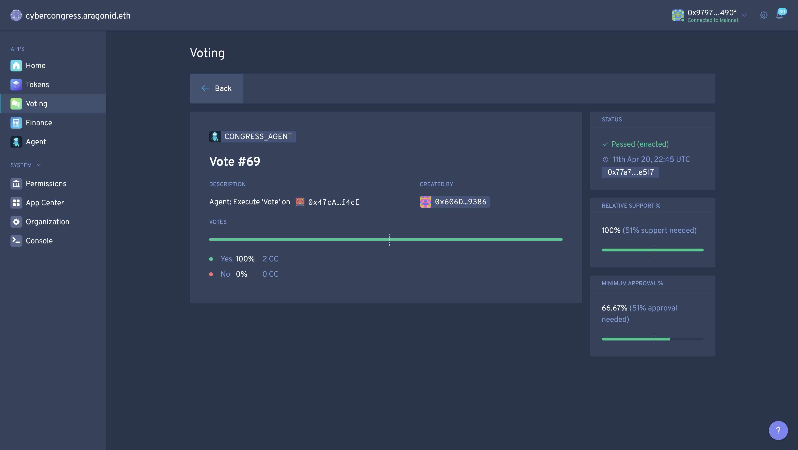

Vote #1 transaction [details](https://etherscan.io/tx/0xf8d51ddd7a4d51cbdfab227af518e2a252097e436c876e2b6b8df8d55d7dd026) and Vote #2 transaction [details](https://etherscan.io/tx/0x77a77614ea68b53fbd1fdbd6c461f2004939af842d80c70fc079f89e6b85e517).

The passed proposal in the Foundation DAO:
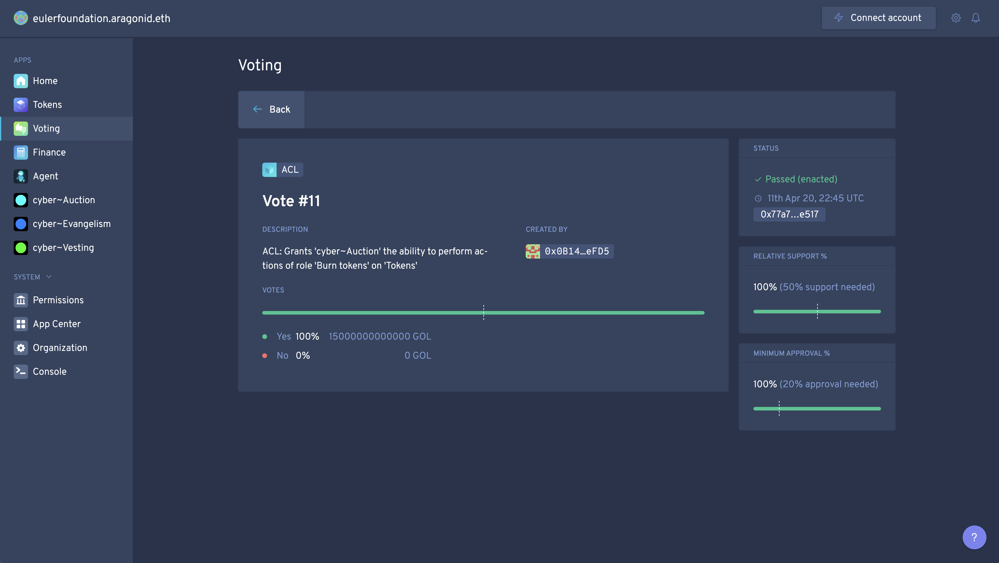

The auction has permissions to burn tokens as Token Manager in the Foundation DAO:
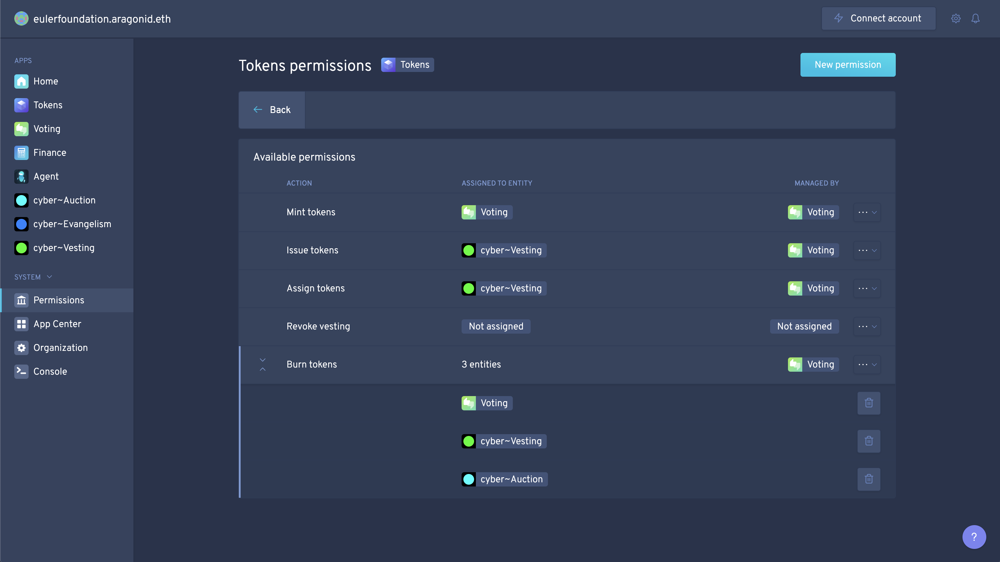

#### Set the congress agent as app manager in the Foundation DAO
We need to assign a manager role to the Foundations kernel app. This is because the governance threshold will not allow us to pass any proposals for a long time because of the long-term distribution process. There may be bugs in the contracts and it will not be possible for anyone to upgrade the applications.

We should allow the Congress to update the Auction or/and the Vesting applications in the Foundation DAO, in a case of an emergency. After the required amount of tokens (to pass the governance threshold) will be distributed, the Congress will create a proposal to remove this permission from itself and ask the community to vote on the proposal. 

We are aware that this is a point of failure for a decentralized setup, however, we do not wish to risk the possibility of having a contract failure which will lead to loss of users funds or the foundations' funds. 

Creating a proposal to add permissions to manage the app in Foundations kernel:
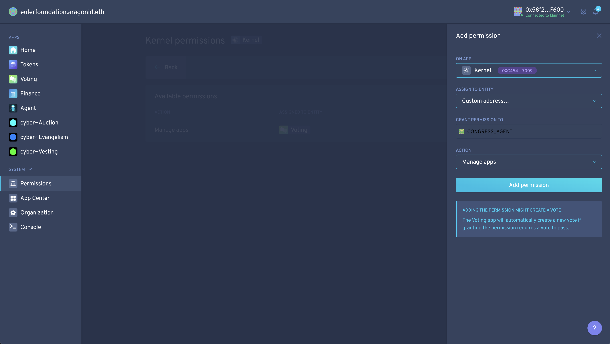

Transaction [details](https://etherscan.io/tx/0xcd4560363cbc803e9e434c1511f9126d1133ebeffe0ac9e72e8364a169efc400) of allowing the Congress Agent to manage the app in the euler\~Foundation DAO.

The created voting in the euler\~Foundation DAO:
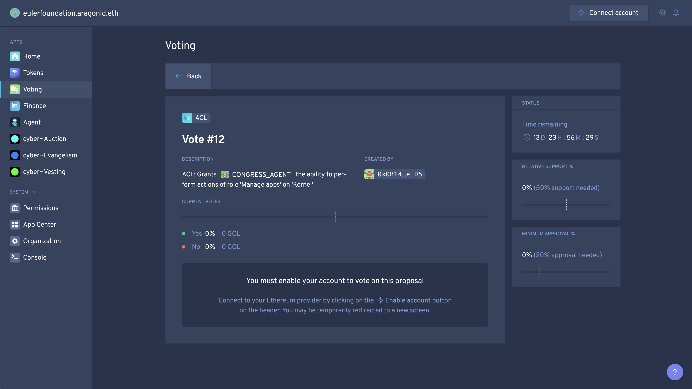

We need to create a proposal in the cyber~Congress DAO, that we will vote `yes` on, to set the Cogress Agent as the app manager in the Foundation DAO:

Command (cast tx):

```
dao act 0x3A1F860046249646E508C417a840755571bC4680 0x47cab484d85ff17c7849d0c198b5313db672f4ce "vote(uint256,bool,bool)" 12 true true  --environment aragon:mainnet --use-frame
```

Output:

```
  ⠧ Executing execute on 0x117d1F8CB4Bf6e74Bc5D667f15af7b810baCCCD6
  ✔ Executing execute on 0x117d1F8CB4Bf6e74Bc5D667f15af7b810baCCCD6

✔ Successfully executed: "Execute desired action as a token holder"
```

Transaction [details](https://etherscan.io/tx/0x7725061feb407dd00b86512b848eeb851e9744010758e66b47e55d118124c62b) of creating the proposal in the cyber~Congress DAO to vote on, granting app manager the permissions for Kernel in the euler\~Foundation DAO.

The created proposal in the cyber\~Congress DAO:
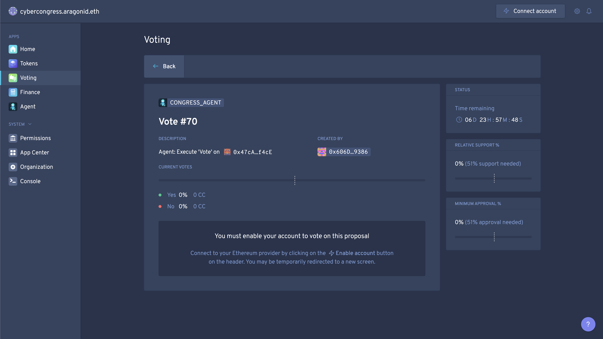

The passed proposal in the cyber\~Congress DAO:
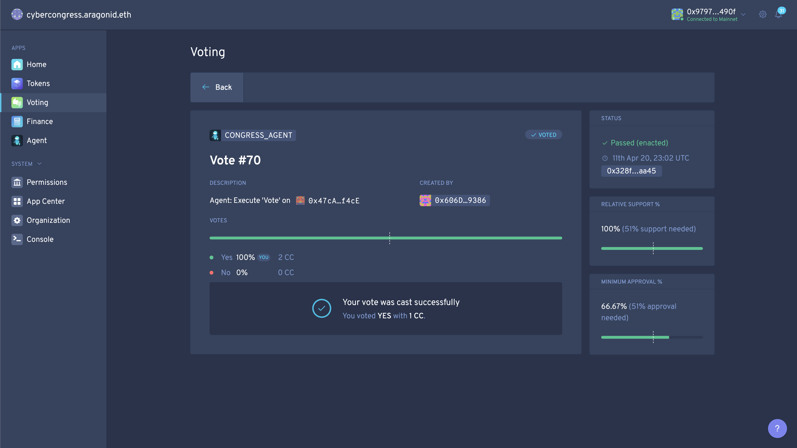

Vote #1 transaction [details](https://etherscan.io/tx/0x7bfe2d1e0f9f0cc642cc153d12fee7c67126ab1ce26e7b896675c69de7859f00) and Vote #2 transaction [details](https://etherscan.io/tx/0x328f54e066ffea1cb8f5df7110894c2d2fed5a217fe2bdf9120b42a2324caa45).

The passed proposal in the euler\~Foundation DAO:
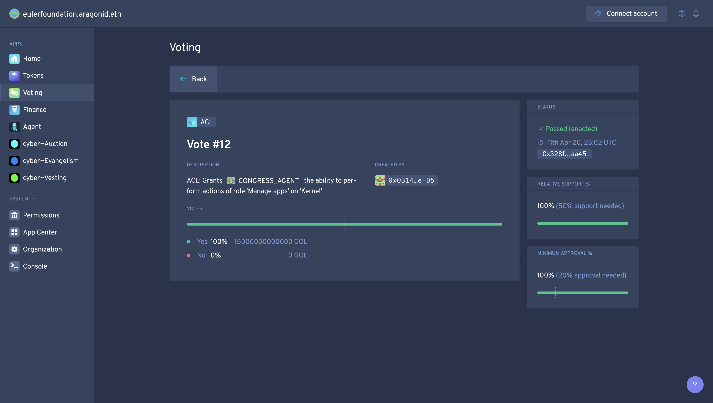

List of kernel permissions in the Foundation DAO with the Congress Agent as apps manager:
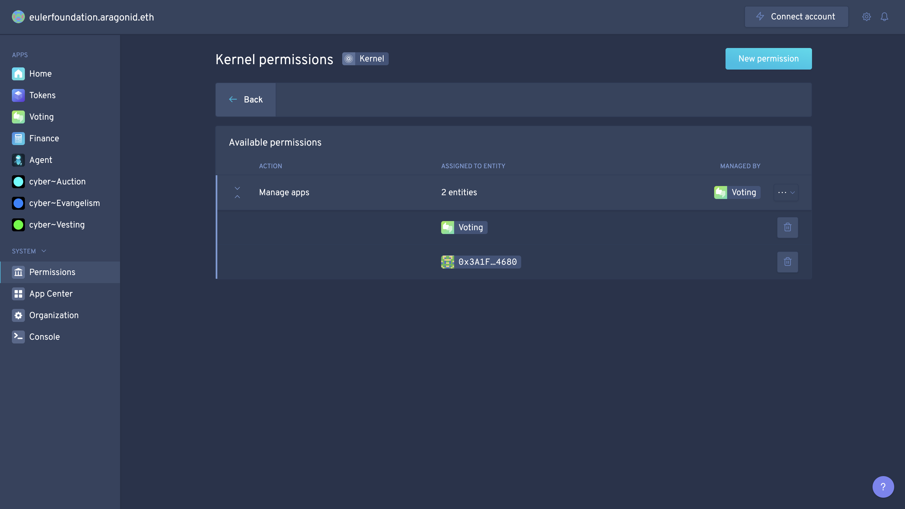

#### Burn service account token in the Foundation DAO
*Note:* The service account has successfully completed its mission for the Foundation DAO, applications setup and permission installation. Finalization of the Auction will be completed by the Congress itself, as the Congress Agent has the needed permissions (`CREATOR_ROLE` and `BURNER_ROLE`) for the Foundations Auction.

Remove tokens from the service account:
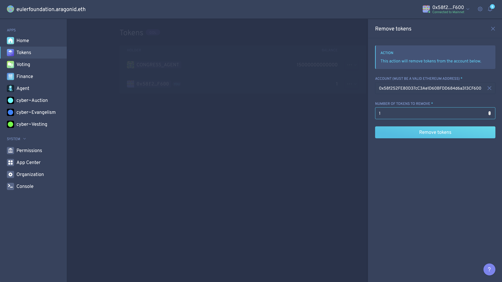

Transaction [details](https://etherscan.io/tx/0xc7f2f4aa3d06a846e34bc669508d69ca2f3a89acb259dc7e017d38c15cb78a84) of creating the proposal to remove 1 token from the service account in the euler\~Foundation DAO.

The created proposal to burn 1 token from the service account in the Foundation DAO:
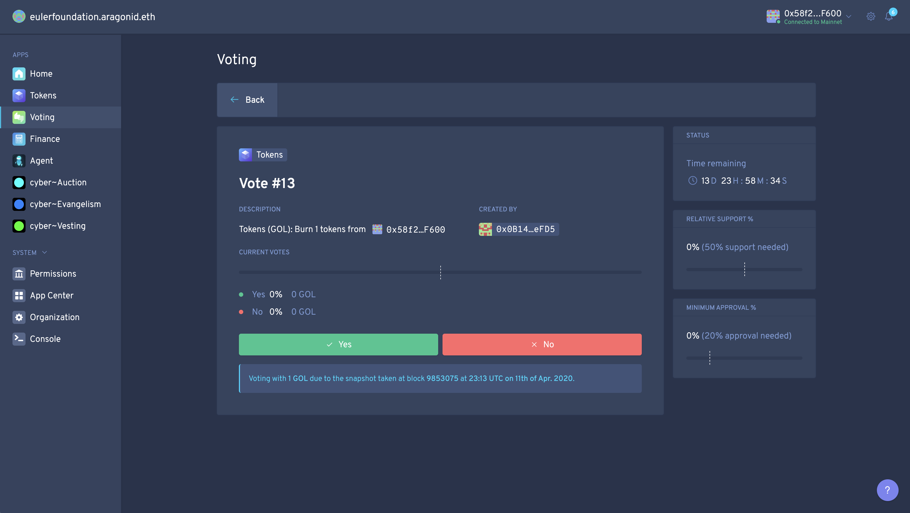

We need to create a proposal in the cyber~Congress DAO, that we will vote `yes` on, to burn 1 token from the service account in the Foundation DAO:

Command (cast tx):

```
dao act 0x3A1F860046249646E508C417a840755571bC4680 0x47cab484d85ff17c7849d0c198b5313db672f4ce "vote(uint256,bool,bool)" 13 true true  --environment aragon:mainnet --use-frame
```

Output:

```
  ⠧ Executing execute on 0x117d1F8CB4Bf6e74Bc5D667f15af7b810baCCCD6
  ✔ Executing execute on 0x117d1F8CB4Bf6e74Bc5D667f15af7b810baCCCD6

✔ Successfully executed: "Execute desired action as a token holder"
```

Transaction [details](https://etherscan.io/tx/0x14f0a38eb29974bf982f1c510f212ec5028536c9a25c3dff7696d53f75049032) of creating the proposal in the cyber~Congress DAO to vote on the proposal to remove 1 token from the service account in the euler\~Foundation DAO.

The created proposal in the cyber~Congress DAO:


The passsed proposal in the cyber~Congress DAO:
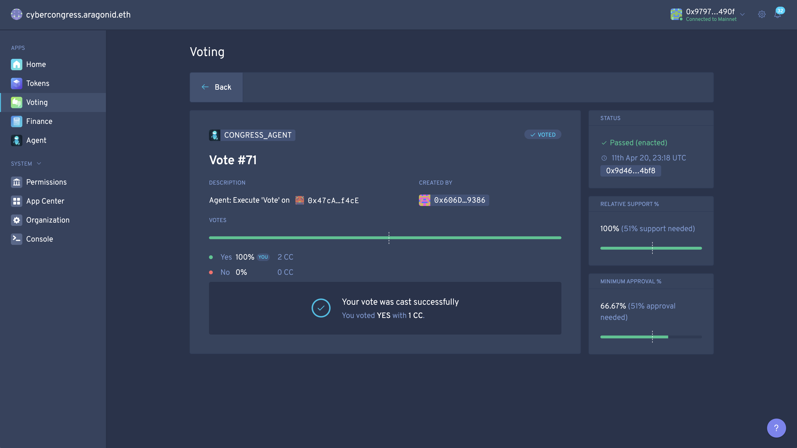

Vote #1 transaction [details](https://etherscan.io/tx/0x949f2fe5331a216d5fdcfc23b1005f34867045ed1cef2d799fc6e6c0214194b2) and Vote #2 transaction [details](https://etherscan.io/tx/0x9d46082d744a363dcae98227004a336982b796264b89b352f51114ebf3594bf8).

The passed proposal to burn 1 token from the service account in the Foundation DAO:
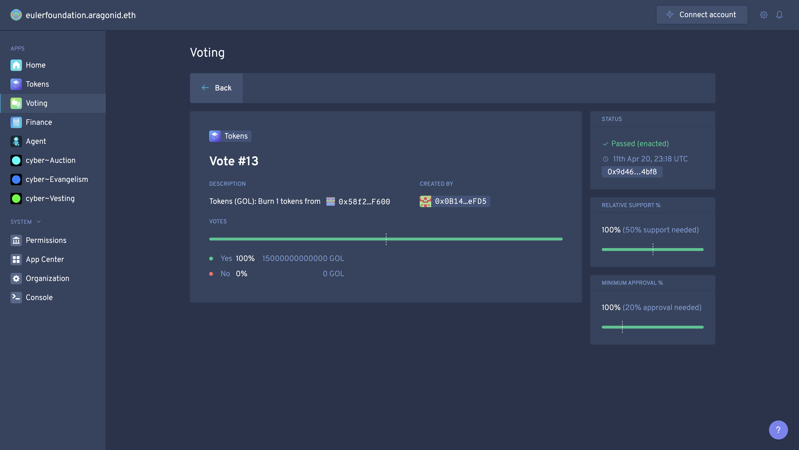

The supply of the Foundation DAO now follows the required distribution:
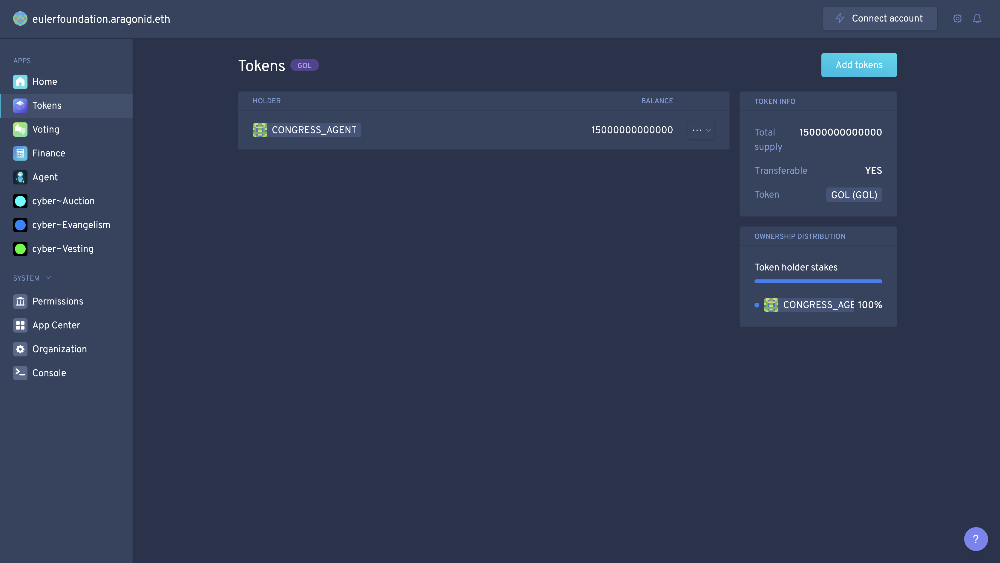

#### Transfer tokens from the Congress Agent to the Auction contract
We can transfer the needed amount of tokens to the Auction for further distribution.
 
7 TGOL will be transferred from the balance of the Congress Agent to Foundations Auction. The Congress Agent has permission to transfer their own token which we prepared beforehand in Congress.

You can get familiar with the distribution in details [here](https://github.com/cybercongress/congress/blob/master/ecosystem/Cyber%20Homestead%20doc.md#moneybag-section-subtitle-beep-beep-beep).

Command template:

```
dao act <agentCongress> <agentCongress> "transfer(address,address,uint256)" <tokenFoundationAddress> <auctionApplicationAddress> <amount> --environment aragon:<network>
```

Command (cast tx):

```
dao act 0x3a1f860046249646e508c417a840755571bc4680 0x3a1f860046249646e508c417a840755571bc4680 "transfer(address,address,uint256)" 0xF4ecdBa8ba4144Ff3a2d8792Cad9051431Aa4F64 0x0b1f54be915e77d9bf14268f94f8a26afab11296 7000000000000  --environment aragon:mainnet --use-frame
```

Output:

```
  ⠋ Executing execute on 0x117d1F8CB4Bf6e74Bc5D667f15af7b810baCCCD6
  ✔ Executing execute on 0x117d1F8CB4Bf6e74Bc5D667f15af7b810baCCCD6

✔ Successfully executed: "Execute desired action as a token holder"
```

Transaction [details](https://etherscan.io/tx/0x6fae2776c6e07c0df0e57001998cc34c8813d3d904bc72f0ba695f7ac97a8fb6) of creating the proposal to transfer cyber~Congress DAO Agent GOL tokens, to the Auction application in the euler\~Foundation DAO.

The created proposal to transfer 7 TGOL from the cyber\~Congress Agent to the Auction, in the cyber~Congress DAO:


The passed proposal to transfer a certain supply from the Congress Agent to the Auction, in the cyber~Congress DAO:
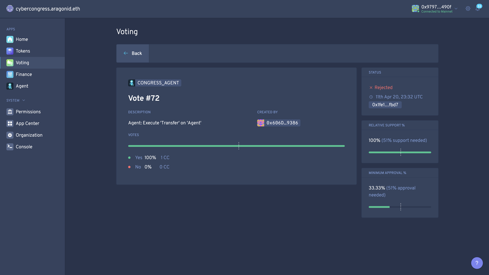

Vote #1 transaction [details](https://etherscan.io/tx/0x2f268d726cb2a9ba0ed06603aafb277e993b574cc0c92f941c8c825b2d6896ad) and Vote #2 transaction [details](https://etherscan.io/tx/0x1fe1deaf4bb700c44629dceae93da489f2bad15ea0b2ef8d255f4456ab2cfbd7).

The supply is transferred to the Auction in the Foundation DAO:
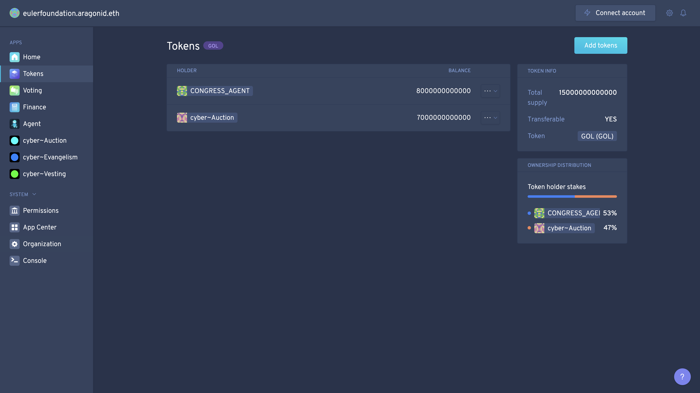

The distribution of the Foundations is now completed and the Auction has the supply for the required distribution. 

The Congress team, the initial donors and the inventors of Cyber may participate in the governance of the Foundation with the proportion of tokens which they have, following the numbers outlined in [Cybers whitepaper](https://ipfs.io/ipfs/QmceNpj6HfS81PcCaQXrFMQf7LR5FTLkdG9sbSRNy3UXoZ).

#### Load the Auction
The last step of the Auction setup. The supply has been already transferred and we may load the Auction with a given amount of Auction tokens, to be distributed during round zero (ETH part of Game of Thrones). There will be 200 (tera) TGOL24 allocated to that part of the auction. The remaining amount will be equally split between other rounds (20 rounds of 23 hours + 1 sec).

*Note:* The Congress Agent has the permission to perform this action directly as we’ve set him the `CREATOR_ROLE` for Foundations auction. 

Command template:

```
dao act <agentCongress> <auctionApplicationAddress> "load(uint256)" <amount> --environment aragon:rinkeby
```

Command (cast tx):

```
dao act 0x3a1f860046249646e508c417a840755571bc4680 0x0b1f54be915e77d9bf14268f94f8a26afab11296 "load(uint256)" 1000000000000 --environment aragon:mainnet --use-frame
```

Output:

```
  ⠇ Executing execute on 0x117d1F8CB4Bf6e74Bc5D667f15af7b810baCCCD6
  ✔ Executing execute on 0x117d1F8CB4Bf6e74Bc5D667f15af7b810baCCCD6

✔ Successfully executed: "Execute desired action as a token holder"
```

Transaction [details](https://etherscan.io/tx/0x326a6a89e33f21860330e7febf1d89547c150def3f1440705cf28a0c0623fd50) of the load of the auction by the cyber\~Congress Agent as the creator of the auction.

The created proposal to load the Foundations Auction in the cyber~Congress DAO:
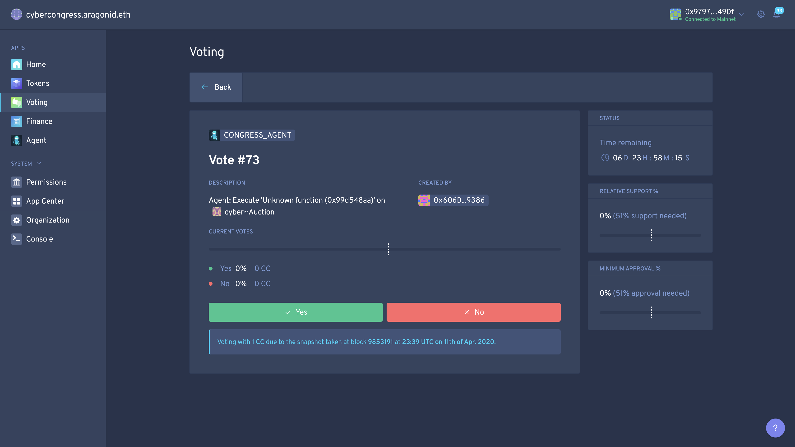

The passed proposal to load the Foundations Auction in the cyber~Congress DAO:
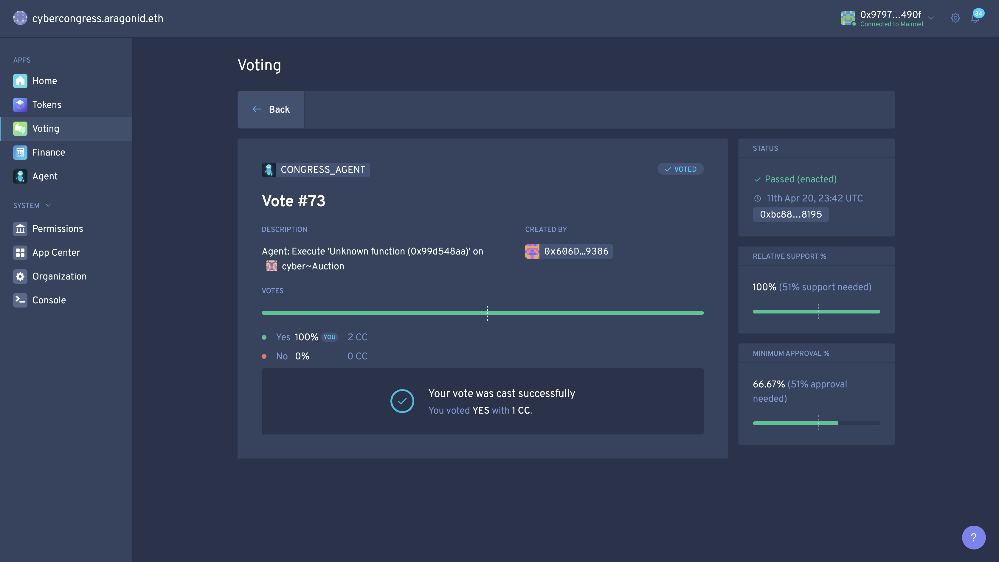

Vote #1 transaction [details](https://etherscan.io/tx/0x82bcb68fea33f98d65327c364261996d0d816144c1d7437f0bc78d82ca3c831e) and Vote #2 transaction [details](https://etherscan.io/tx/0xbc8834700ce38a69af34d478df6edb7a547eda8fa1360552e051a07c3ce88195).

#### Deploy and verify `AuctionUtils`
An extra step for the Auction. We will deploy an additional contract, which will provide a robust API to query the Auction data from the Auction Contract. 

After the deployment of the contract, we will add the `AuctionUtils` contract address to the Auction, which will provide access points to `AuctionUtils` from the Auction app. 

The [cyber.page appilication](https://cyber.page/) uses the `AuctionUtils` contract to provide statistics of the ongoing Auction (Aragon-based DApps use an event-driven state by design and don't need this). Data includes donated amounts, claimed events and so on. Which basically, let’s cyber.page act as an explorer.

Code:

```
contract AuctionUtils {
    Auction public sale;

    constructor(Auction _sale) public {
        sale = _sale;
    }

    function dailyTotals() external view returns (uint[50] memory result) {
        for (uint i = 0; i < 50; i++) {
            result[i] = sale.dailyTotals(i);
        }
    }

    function userBuys(address user) external view returns (uint[50] memory result) {
        for (uint i = 0; i < 50; i++) {
            result[i] = sale.userBuys(i, user);
        }
    }

    function userClaims(address user) external view returns (bool[50] memory result) {
        for (uint i = 0; i < 50; i++) {
            result[i] = sale.claimed(i, user);
        }
    }
}
```

We will use Remix IDE for the deployemnt of `Auction Utils`:
Compiled Auction Utils in Remix IDE:
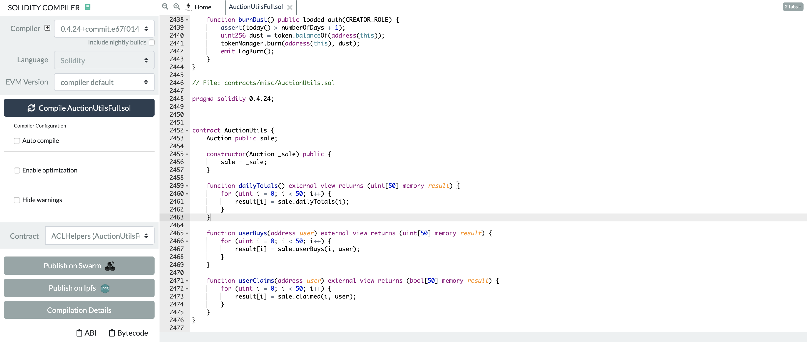

Deployment of `Auction Utils`:
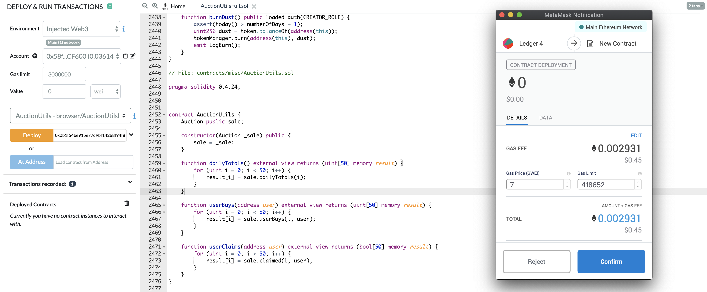

[Transaction details of AuctionUtils deployment](https://etherscan.io/tx/0xce7730e3fe98f4266a50457c742c181c9fe085342d273ccfc4df34be8e32679e)

`AuctionUtils` deployed with an initialized Auction address:
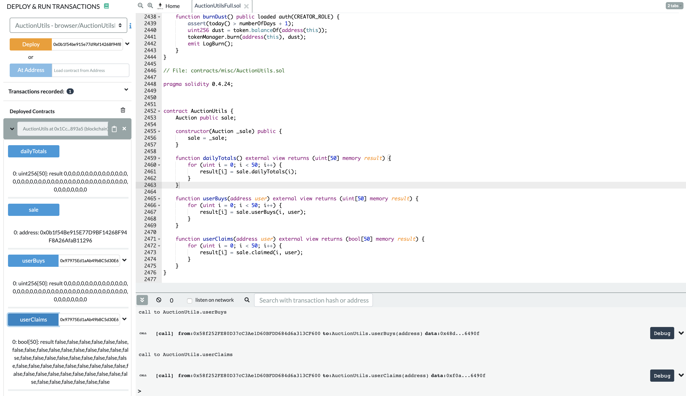

`AuctionUtils` contract: [0x1ccc8b1e7cb1999d370e1e277f021f054f0893a5](https://etherscan.io/address/0x1ccc8b1e7cb1999d370e1e277f021f054f0893a5)

Let's verify the contract. We will use a single file provided by truffle-flattener. Compiler v0.4.24+commit.e67f0147 without optimization.

Prepare the source code verification on Etherscan:
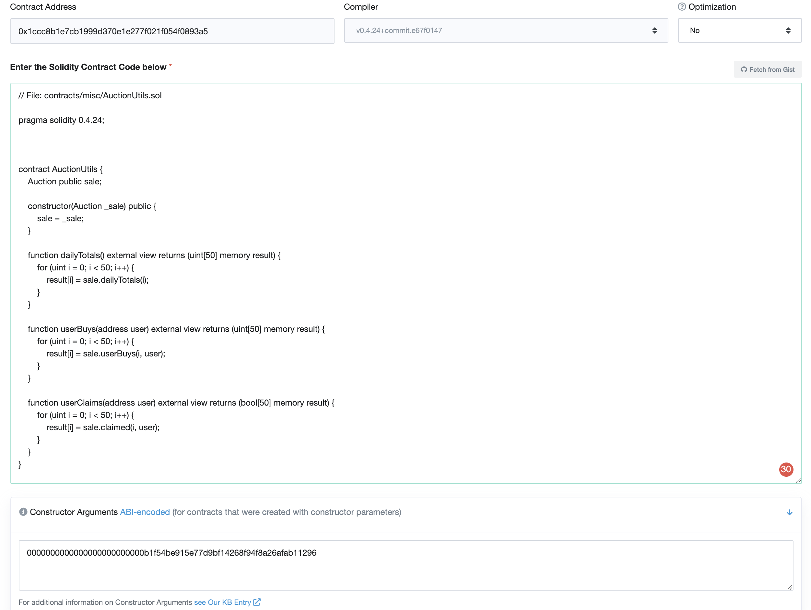

Verification on Etherscan has passed:
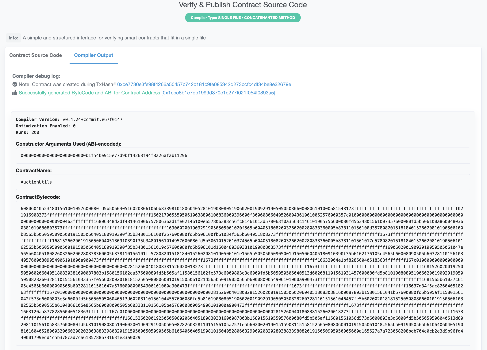

The verified contract:
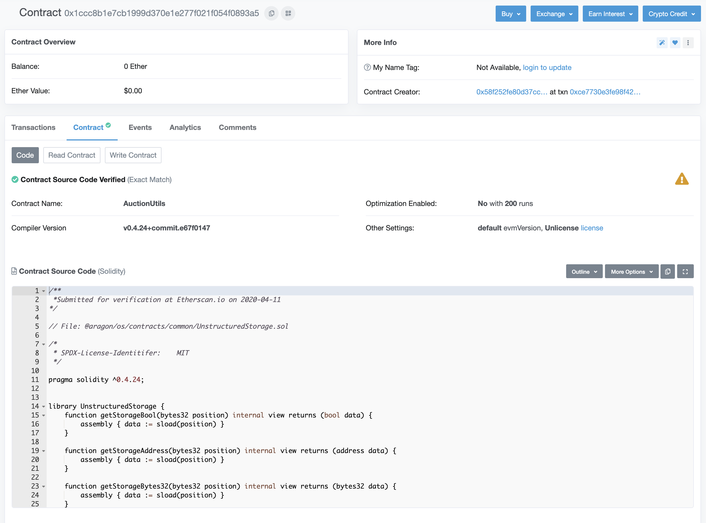


#### Add `AuctionUtils` address to the Auction
We should add `AuctionUtils` address to the Auction app. The Agent has direct access via the `CREATOR_ROLE` in the Foundations Auction. The proposal for the Agents action will be created from the cyber~Congress DAO.

Command template:

```
dao act <agentCongress> <auctionApplicationAddress> "addUtils(address)" <auctionUtilsAddress> --environment aragon:<network>
```

Command (cast tx):

```
dao act 0x3a1f860046249646e508c417a840755571bc4680 0x0b1f54be915e77d9bf14268f94f8a26afab11296 "addUtils(address)" 0x1ccc8b1e7cb1999d370e1e277f021f054f0893a5 --environment aragon:mainnet --use-frame
```

Output:

```
  ⠇ Executing execute on 0x117d1F8CB4Bf6e74Bc5D667f15af7b810baCCCD6
  ✔ Executing execute on 0x117d1F8CB4Bf6e74Bc5D667f15af7b810baCCCD6

✔ Successfully executed: "Execute desired action as a token holder"
```

Transaction [details](https://etherscan.io/tx/0x35046ab87ef5ad1156f8a5a5d27ce7ad90a5255726a54db86818eae3cac750a8) of creating the proposal in the cyber~Congress DAO for adding `AuctionUtils` address to the Auction app in the euler\~Foundation DAO.

The passed proposal for adding the `AuctionUtils` contract address to the Foundation Auction app from the cyber~Congress DAO:
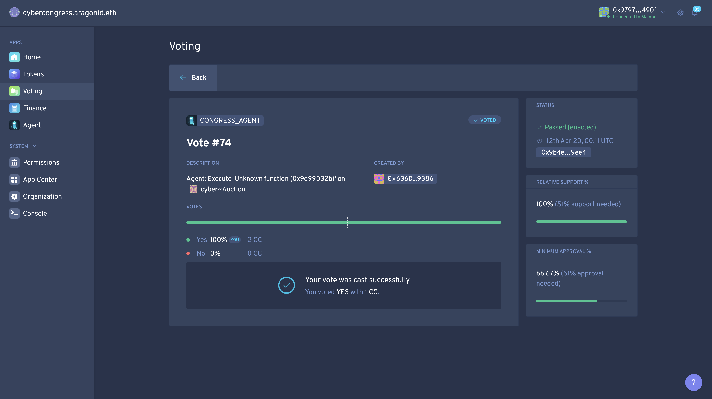

Vote #1 transaction [details](https://etherscan.io/tx/0x2c2bc4f93a5617740158a5232f68b8e9622f01fba1b2cb065e94f4451dc2b869) and Vote #2 transaction [details](https://etherscan.io/tx/0x9b4e5388cf13205b9079aeb25d72f1438b11957f549092ec4ba75a34eadf9ee4).

---------------------

### Distribute tokens
The Congress may finish the distribution process and transfer the tokens to the inventors and to the initial donors of Cyber. The remaining amount of the tokens belongs to the Congress itself, following the distribution outlined in Cybers whitepaper.

#### Inventors

| Address | Amount, GOL | Proposal | Vote #1 | Vote #2 (transfer) |
|---|---|---|---|---|
| 0x512f51AF284ff70077f8db08484D778C12bfEd4C | 800,000,000,000 | [transaction](https://etherscan.io/tx/0xdafe18f06839c18cb3b2fb45b8634744b85aa412685ae59bb8b400b68d67c2d5) | [transaction](https://etherscan.io/tx/0xd76ad7a7f445a7dc328fa32e64201e93f67f02dc51a10852ed32f58f4bf47fe0) | [transaction](https://etherscan.io/tx/0x835d37739c54022553ddb9c237b8c36b53e55a614186770974a7b44166fcfd90) |
| 0xe4B0e02E190A30C7dDA4cd68E9a6A281E883CbD7 | 800,000,000,000 | [transaction](https://etherscan.io/tx/0xbe902ab31e60c1b1ba66e767b9f9cd8253fb22672f1c9c4190197dfc7522bcaf) | [transaction](https://etherscan.io/tx/0x6a6d53ee360c7d317f35713439cf473ef10d4665c0ed2d30b1a525cb92358799) | [transaction](https://etherscan.io/tx/0x1e46383ec9440c2f950c55c2a69c129525c7164d79b3f7afa5e710234a882028) |

#### Initial donors

| Address | Amount, GOL | Proposal | Vote #1 | Vote #2 (transfer) |
|---|---|---|---|---|
| 0x7C4401aE98F12eF6de39aE24cf9fc51f80EBa16B | 24,800,000,000  | [transaction](https://etherscan.io/tx/0x6b5b7e8324a1848c0ab97e3d0241504545c6995c91a685b2738353bc6bd84a7a) | [transaction](https://etherscan.io/tx/0xb98e756c7a87d1fcfb8c523eb49029486f6a3df52d1508fc905ca87dd5f25031) | [transaction](https://etherscan.io/tx/0xcbb6b843d0597f86eb92b9cedd769b5b3c14725dd206421e3839235aaf70f000) |
| 0xB2e19dd996848818d972DD3a60A1B7FAfFB82330 | 800,000,000,000 | [transaction](https://etherscan.io/tx/0xd39969ef50591ef4a308f1d10a3a2bd691d7040bed6f54dfbd3a82285aba1c41) | [transaction](https://etherscan.io/tx/0x21303a1f042da9d0f8b7eee2a5295a7b5d69403d6bbf684287788e2d4596e891) | [transaction](https://etherscan.io/tx/0xa7cc1040c23a32288241d9ec13f0b971dd82748aa865353918bae21baada9c2c) |
| 0x6c97E04Ae8CCb83a4D3c22803A397389f9a81b9E | 800,000,000,000 | [transaction](https://etherscan.io/tx/0x099618ce7d8465c3fbda9b02266a35d2790c6197516426f28813383e95688437) | [transaction](https://etherscan.io/tx/0xf7e9997dbf6ae218481742bc51b0cd2ad68045150fe58724edfbc8de480a5f7d) | [transaction](https://etherscan.io/tx/0x8c1761d52cbc4becc8e551324d734b1571c70ac5dfe86e7e7d254ed4352812c6) |
| 0xecc3A64eb2529aBB3ba42Bb3d03ED24388fb7930 | 80,000,000,000  | [transaction](https://etherscan.io/tx/0x8cc90766152b1c10b9ffe2269e71c0975b0ea1b9b8283eff08a3148d5e9fe748) | [transaction](https://etherscan.io/tx/0x76d54cf1e7f34e3473f8c91269292f9d239c7fded579bc5319e5aa56740ca4ad) | [transaction](https://etherscan.io/tx/0xb4deb7cc7843654c6207871a30bccf2dbd93f910bbf78589272d259b12498fba) |
| 0x6C4A1FbD3490Fb25C1578271b021660c220389DD | 80,000,000,000  | [transaction](https://etherscan.io/tx/0xb5436e3a4ef7d5f71ab4bc9c16aec6b157e2eda81730f08084e9fa355af5bd51) | [transaction](https://etherscan.io/tx/0xcd784e4ca3771bc55150b81ffbf860eecca4505093b18b2f6874a61de1e9e2d5) | [transaction](https://etherscan.io/tx/0x26454a5999f2d4a93965f0b9a02c9fbac47ea499d0800a3b35054f4d45075863) |
| 0x3cf054438B6671039193253eA87873D42b6bF26c | 80,000,000,000  | [transaction](https://etherscan.io/tx/0x3e777a33f8ec6fc324da647ebde0708f7283820472935a0ff859662a399c8c60) | [transaction](https://etherscan.io/tx/0xe9f2dd567161b1e53807fa87d773a3c424ff0c8cc7110f7c7f47ed4f3e17438a) | [transaction](https://etherscan.io/tx/0x47df48a7f22a5952b367d41d4bd1d1d3c187cf5e9c03ce71f8f8ed5a5dd4e700) |
| 0x2850F1371FF98938f8461D9d0c91552b6F3e6C63 | 320,000,000,000 | [transaction](https://etherscan.io/tx/0x32d43a0d27a1ec4305e9f934b5edadfb0897bf0f5293bd3115f13697d453aa60) | [transaction](https://etherscan.io/tx/0x4df496cce52bada552a624fb57b860ee67ce1a14036e9a208c4b8c17374d5daa) | [transaction](https://etherscan.io/tx/0xfb1081427faa8b4e25825c7b1116d1fe94297135511b6618ed1126cf0c2df796) |
| 0x25d256790C88DC3edABfB06AE0134B220Ebf0fc9 | 320,000,000,000 | [transaction](https://etherscan.io/tx/0x71d9121e9a3277e47919fdad4e7fba8568398c0993a721d578f56ab868947674) | [transaction](https://etherscan.io/tx/0x416ac706bcee52fc17c3154581003109ad9250d37b5b9a6a66ef9a22534aea0c) | [transaction](https://etherscan.io/tx/0xb45807836c3ff5acf6a1c3fc95916e61ee57725bdbece89a6f82deae82723bd4) |
| 0x200ceaa470cC10d096b5B5f99683974e3e358656 | 84,000,000,000  | [transaction](https://etherscan.io/tx/0x332a50669043bb5177e97f97bca976cdb0a83f7ac8b8a36915ad2ab1a16ab982) | [transaction](https://etherscan.io/tx/0x68c6e574b5791d00d1c492c03f0f15abfb47d6e872aedf7dd077e461723d4bc9) | [transaction](https://etherscan.io/tx/0x0c48d264bc7da24fb984df5c0f59256385b26dddecfa33feed322f63e28911bd) |
| 0xAb626F94C10cFc51985dC2a599F31a5228c69099 | 320,000,000,000 | [transaction](https://etherscan.io/tx/0x1f7fcb3026afbea010d55d364eae74c58edc8e18311738c30cce245fd99d93a0) | [transaction](https://etherscan.io/tx/0x107ebf15eb6d527215ee136d0c376846c0fd86659ea10fb37176a21bab4b7d35) | [transaction](https://etherscan.io/tx/0x2f3fabb42c9c8471cea3154354d072548656df6ce967ad90d5a1409e43f13800) |
| 0xF9f5d5D4e36AF5868c9F635102BE2FbCf4A1Eed5 | 32,000,000,000  | [transaction](https://etherscan.io/tx/0x4d1e412a7d7540422bbdc9e5c173617a03820a7f6c286d41bcff32483fdceffa) | [transaction](https://etherscan.io/tx/0xd36e1cf6186478ac1318629cef097cbce4b33667839e7e87f91812381413953d) | [transaction](https://etherscan.io/tx/0x6c30d50838a6d1f4b4d8f80c7680716248223987617dfc6912fef16c1e51f7bb) |
| 0x6bc8895c1902DcAe5e2a36C88Ae9203637d26434 | 32,000,000,000  | [transaction](https://etherscan.io/tx/0x7fb72b1f3d43264950bb799050f7577f7df02c91a8aa62d394d20a3b0f8e8ef8) | [transaction](https://etherscan.io/tx/0xbfee9dd94e3c07c3c4755bf0a711dda6cd6dba161fc8bdc43196def7ca0a849b) | [transaction](https://etherscan.io/tx/0x8f05357cfa34e9c22b4681c5ebb9fed605b99b5189537d383b19b66a68eab7fa) |
| 0xf8E0B23b9e1B1e52c5Fc41099cd688F0Cc1B5f17 | 32,000,000,000  | [transaction](https://etherscan.io/tx/0x070851c016cd85b755656ebf2731ca3fd4e1845bdcfd89c9af71f35e7d9cad02) | [transaction](https://etherscan.io/tx/0x73a347e87f8c822cd8ff1fc7232278fff35441ae07b6f2516342aaa7b3c01906) | [transaction](https://etherscan.io/tx/0x51d3d0e9601a53c2b677e6d28d96d47ccbaab719c89eab403d0698b8768ec6af) |
| 0x00725D89a2A2FB3B21Fd1035B579cbCDE4a0991b | 32,000,000,000  | [transaction](https://etherscan.io/tx/0x476ffb92084f6965ddd942722c265be23d06f6e084426221d163979f252da632) | [transaction](https://etherscan.io/tx/0xda9402f173e2c027ac388ae46e60c8a10f59daebe4d3f57fc1fa0b9b7ef6438d) | [transaction](https://etherscan.io/tx/0xbc405079d0bf4c44c45437ee000fbda5e8f3c20408dffd2e541c955b11986ec8) |
| 0xe15bda166042192119bE37f5c1675b67183051d3 | 80,000,000,000  | [transaction](https://etherscan.io/tx/0x5c5b3bdb78e34e4468286f2033227717170b33bbcfd9e85267932730e81801fe) | [transaction](https://etherscan.io/tx/0x6c19256ce59f232777cba5f23d82436441ca43a472d09cc8b4ea37a3b50a40c2) | [transaction](https://etherscan.io/tx/0xda1181382a8a2648101d32db34e7f2133b184b0fc4eda9b940f4aee0fda155b2) |
| 0x63E65bC441334b27d2178f81F2d701e4e58c158a | 3,200,000,000   | [transaction](https://etherscan.io/tx/0x686098413e3f320da655be0e4ee89b4db8b25bb38a3d5b7eb28d76919d2881d4) | [transaction](https://etherscan.io/tx/0x3924781b5595a2891ea9b2dd90c20844b8e93aa35fc9bafeda053abb88b00a29) | [transaction](https://etherscan.io/tx/0xee82e2100fe45230725ecec19837a121dc47286fcf7adbe87335d4093803fbcb) |
| 0x7aDEb6c5aBE64E1E4Bb561e1144E5D80B6dC6dD6 | 80,000,000,000  | [transaction](https://etherscan.io/tx/0x7780c2dba7fac0f91ba7a9383d18c2c1d84c4271bed74b254b2fca31ba75ae86) | [transaction](https://etherscan.io/tx/0x10adb89050d977766853c43b4acaa5a8620f09d5cc15fc6e9342050e23945f19) | [transaction](https://etherscan.io/tx/0xb7876f17ca97d5c69bb4bb245164aa61257a13c42e976c1ed5bf42b18df42db3) |

---------------------

### Final state

#### euler\~Foundation DAO
1. The euler\~Foundation DAO is deployed by the agent of cyber\~Congress Aragon DAO 
2. The euler\~Foundation Aragon DAO name is eulerfoundation
3. Supply of GOL is 15000000000000 (15TGOL)
3. An installed and prepared cyber\~Evangelism Aragon application developed by cyber\~Congress
4. An installed and prepared cyber\~Auction Aragon application developed by cyber\~Congress
5. An installed and prepared cyber\~Vesting Aragon application developed by cyber\~Congress
6. The permission manager on issuing tokens as Token Manager is set to euler\~Foundations Voting application
7. The permission manager on assigning tokens as Token Manager is set to euler\~Foundations Voting application
8. The cyber\~Congress DAO Agent has permission to manage apps in Kernel in a case when applications will require upgrades due to crisis protocol

#### cyber\~Evangelism application
0. Deployed to cyberevangelism.open.aragonpm.eth, version 1.0.0. Upgrade access: 0x97975Ed1aAb49b8C5d30E6856DdFE20b4896490f and 0xD0Db9E03fDE19cb4C3ad1cF0f1faF86caf911058
1. The Evangelism application FOUNDER_ROLE is set to the cyber\~Congress DAO Agent. The role manager is the cyber\~Congress DAO Agent

#### cyber\~Vesting application  
0. Deployed to cybervesting.open.aragonpm.eth, version 1.0.0. Upgrade access: 0x97975Ed1aAb49b8C5d30E6856DdFE20b4896490f and 0xD0Db9E03fDE19cb4C3ad1cF0f1faF86caf911058
1. Vesting end period is set to 1592650849 - Saturday, June 20, 2020, 11:00:49 AM GMT
2. The cyber\~Vesting application PAUSE_ROLE is set to the cyber\~Congress DAO Agent. The role manager is the cyber\~Congress DAO Agent
3. The cyber\~Vesting application PROOF_ROLE is set to the cyber\~Congress Companion' Proofer external address. The role manager is the cyber\~Congress DAO Agent
4. The cyber\~Vesting application has permission to issue tokens as euler\~Foundations Token Manager
5. The cyber\~Vesting application has permission to assign tokens as euler\~Foundations Token Manager
6. The cyber\~Vesting application has permission to burn tokens as euler\~Foundations Token Manager
7. Patched to cybervesting.open.aragonpm.eth, version 1.0.1
8. cyber~\Companion will be shoutdowned at 1592650849 - vesting and claim end time.

#### cyber\~Auction application
0. Deployed to cyberauction.open.aragonpm.eth, version 1.0.0. Upgrade access: 0x97975Ed1aAb49b8C5d30E6856DdFE20b4896490f and 0xD0Db9E03fDE19cb4C3ad1cF0f1faF86caf911058
1. Round zero of the cyber\~Auction zero is set to 11586865600 - Tuesday, April 14, 2020, 12:00:00 PM GMT
2. Auction rounds start on 1587729600 - Friday, April 24, 2020, 12:00:00 PM
3. Amount of rounds is set to 49 + 1 (window zero)
4. The duration of a round is 23 hours + 1 sec
5. The collector of funds is the euler\~Foundation DAO Agent
6. The cyber\~Auction application has permission to burn tokens as euler\~Foundations Token Manager
7. The cyber\~Auction application CREATOR_ROLE is set to the cyber\~Congress DAO Agent. The manager of the role is the cyber\~Congress DAO Agent
7. The cyber\~Auction application BURNER_ROLE is set to the cyber\~Congress DAO Agent. The manager of the  is the cyber\~Congress DAO Agent
8. The Auction will end at 1591786849 - Wednesday, June 10, 2020, 11:00:49 AM
9. All remained (not claimed + dust) tokens on cyber\~Auction will be burned after 7 days after the auction end

#### Statistics
1. euler\~Foundation setup: 72 transaction - 20,712,079 gas burned
9678786
2. euler\~Foundation distribution: 57 transaction - 15,865,890 gas burned
3. open.aragonpm: 10 transactions - 9,730,267 gas burned

Total: 139 transaction and 46,308,236 gas burned

#### open.aragonpm
| Application | Package | Contract Address | IPFS hash |
|---|---|---|---|
| cyber\~Evangelism | cyberevangelism.open.aragonpm.eth@v1.0.0 | [0x983dEa8751424De1cD9482e1012eAd2821525E73](https://etherscan.io/address/0x983dEa8751424De1cD9482e1012eAd2821525E73) | QmPWQ9akBrcMJUD8XFvkeDh7UzayC6cSdKUCtwbMdmoC1s |
| cyber\~Vesting | cybervesting.open.aragonpm.eth@v1.0.1 | [0xEF324F84F6bC310E40f75E8bC8E1a0f4627FC720](https://etherscan.io/address/0xEF324F84F6bC310E40f75E8bC8E1a0f4627FC720) | QmNoCX13gHZvs9qHfHdT8AVtJF4Drs7VMnkyhGKacWQNp9 |
| cyber\~Auction  | cyberauction.open.aragonpm.eth@v1.0.0 | [0x72E939335D38048a61cd7DcE5e957B16B7EC7a74](https://etherscan.io/address/0x72E939335D38048a61cd7DcE5e957B16B7EC7a74) | QmZ2pdpBzzLiYXB9cktW6FnUaQUHLAcXkenMnX5nYAPJuo |

#### Final thoughts
Aragon is an amazing project with endless features for the creation of DAOs and their operations

#### Transaction list

##### euler~Foundation transactions
| Id | Transaction | Gas | Description |
|---|---|---|---|
| 1 | [transaction](https://etherscan.io/tx/0xb2708c8ce9050081ab2303d660fac4b9b7ce961eb2a73a56f309e0158881a5ba) | 413,957 | Proposal for GOL token deployment in cyber\~Congress DAO |
| 2 | [transaction](https://etherscan.io/tx/0x10a71dbd401008e5da1eb71ae19b3d496731ffc592222c3df332682b29fb0b3c) | 622,008 | Proposal for euler\~Foundation deployment in cyber\~Congress DAO |
| 3 | [transaction](https://etherscan.io/tx/0xe97866d789f9fd37807d6e015c685dda67be14de7a58b7319149bacca655213e) | 109,447 | Vote #1 for GOL token deployment in cyber\~Congress DAO |
| 4 | [transaction](https://etherscan.io/tx/0x5e990fa43ea5d4e82fcf6f3445abb3efcc3903a3700e894d6a2edad51b9c15ce) | 1,872,542 | Vote #2 for GOL token deployment in cyber\~Congress DAO, GOL token deployed |
| 5 | [transaction](https://etherscan.io/tx/0x51df53cff1450142cce58ea996b965fd059c7b2f5afb49d70c1f2d50b9ea6347) | 109,447 | Vote #1 for euler\~Foundation deploymemnt in cyber\~Congress DAO |
| 6 | [transaction](https://etherscan.io/tx/0x9a74a16ba4b12a344c43a22cbe73c753683b72820945f87219d791bee6c077ce) | 5,540,209 | Vote #2 for euler\~Foundation deploymemnt in cyber\~Congress DAO, euler\~Foundation DAO deployed |
| 7 | [transaction](https://etherscan.io/tx/0x38d8f7528df483df272b51f8165c2a5d4f712af6613437080ada9d84d6f4b55c) | 384,979 | Proposal to install cyber\~Evangelism application to euler\~Foundation in euler\~Foundation DAO |
| 8 | [transaction](https://etherscan.io/tx/0xb3a1a31e0deee3202b62f620d4caf4366a59fff3bf7afc71937644c7dbc2f662) | 370,908 | Proposal in cyber\~Congress DAO to vote on the proposal to install the cyber\~Evangelism application for euler\~Foundation DAO |
| 9 | [transaction](https://etherscan.io/tx/0xac3001eaf48be6706394a46ebb945b123fe49f5c30eb6d15c36bcd52ec3c0750) | 109,447 | Vote #1 for cyber\~Evangelism installation in cyber\~Congress DAO |
| 10 | [transaction](https://etherscan.io/tx/0x9601b7970f8f2bf24e3243a5661eeca7744bb56c00424cf7ff602739b97c076a) | 1,128,104 | Vote #2 for cyber\~Evangelism installation in euler\~Foundation DAO from cyber\~Congress DAO, application installed |
| 11 | [transaction](https://etherscan.io/tx/0x8081014ed5c7c3b2cc76b532017a38a812b7f34bb0f227c441c68fd478418ce0) | 327,127 | Proposal in euler\~Foundation DAO to assign FOUNDER_ROLE to cyber\~Evangelism application in euler\~Foundation to cyber\~Congress DAO Agent (and role manager to cyber\~Congress DAO Agent) |
| 12 | [transaction](https://etherscan.io/tx/0x625b579bc657cdc232fd079dbcec632d3b92eace67514f3744a20cecdbf32cb1) | 390,120 | Proposal in cyber\~Congress DAO to vote on assign FOUNDER_ROLE on cyber\~Evangelism application in euler\~Foundation DAO (and role manager to cyber\~Congress DAO Agent)  |
| 13 | [transaction](https://etherscan.io/tx/0x542d57a72c24c54b663ceff66045d8d87eb6db1ae4fe926628e42946bba21880) | 178,044 | Vote #1 in cyber\~Congress DAO for initating FOUNDER_ROLE |
| 14 | [transaction](https://etherscan.io/tx/0x53adfe0acddbe7745d592dec121a837681906860888bfa19c8ae4adb5526362f) | 391,464 | Vote #1 in cyber\~Congress DAO to initalize FOUNDER_ROLE, role applied |
| 15 | [transaction](https://etherscan.io/tx/0xbe5a64296d7a3b8f1f039a0809df8263b51b8a7c62e5f2001e9e8553428ca7a7) | 390,768 | Proposal in euler\~Foundation DAO to install cyber\~Vesting application in euler\~Foundation |
| 16 | [transaction](https://etherscan.io/tx/0xb357de4d61514bf0e1a22c077b321bb2dfd7d6948e9f68948a67cd4cbdde2cb0) | 390,120 | Proposal in cyber\~Congress DAO to vote on installing cyber\~Vesting application in euler\~Foundation DAO |
| 17 | [transaction](https://etherscan.io/tx/0x3cf2bd68d0d1a2e79ba2ad464b258a095a81eb9f11c2199d0ab591161ca1057e) | 109,447 | Vote #1 in cyber\~Congress DAO for cyber\~Vesting install |
| 18 | [transaction](https://etherscan.io/tx/0x5533c392491c9bc0ed2d7ecc90b9104f89f6059b9e8b3bfeebd49d23f89d599f) | 1,130,072 | Vote #2 in cyber\~Congress DAO for cyber\~Vesting install, application installed |
| 19 | [transaction](https://etherscan.io/tx/0xef5aa27d0e1249eaaf555292df35c6a1697bff7a6d66a9b14bfe1c303fe4b085) | 327,127 | Proposal in euler\~Foundation DAO to assign PAUSE_ROLE to cyber\~Vesting application to cyber\~Congress DAO Agent in euler\~Foundation DAO (and role manager to cyber\~Congress DAO Agent)  |
| 20 | [transaction](https://etherscan.io/tx/0xf14543dbb21ebad7680caea0146188cdcf7f58301c46e86b5533b7589c74c63b) | 327,139 | Proposal in euler\~Foundation DAO to assign PROOF_ROLE on cyber\~Vesting application to external Companion Proofer account in euler\~Foundation DAO (and role manager to cyber\~Congress DAO Agent) |
| 21 | [transaction](https://etherscan.io/tx/0xd9187609f1c56fb432752665e1a0ffc70499582fcbd7aab6490f60e6816e7ad0) | 390,120 | Proposal in cyber\~Congress DAO to vote on proposal to assign the PAUSE_ROLE to cyber\~Vesting application in euler\~Foundation DAO |
| 22 | [transaction](https://etherscan.io/tx/0x7bc1e658dd4810ee2eef8349363a9853d23fe5c9db091573a0e2d9beb20fc3c2) | 390,120 | Proposal in cyber\~Congress DAO to vote on proposal to assign PROOF_ROLE to cyber\~Vesting application in euler\~Foundation DAO |
| 23 | [transaction](https://etherscan.io/tx/0xe9d2443154523200643f33ed2744eff8097c2f8a082a318e64141e8fe484f52d) | 109,447 | Vote #1 in cyber\~Congress DAO to assign PAUSE_ROLE |
| 24 | [transaction](https://etherscan.io/tx/0x7bd934f94876c93ba24b733daaaa8cef6df226eb219c47be495543e12747ab9a) | 391,464 | Vote #2 in cyber\~Congress DAO to assign PAUSE_ROLE, role applied |
| 25 | [transaction](https://etherscan.io/tx/0x4682c60699a5eb6129ce326bf58f78286fd2d9e105deb7669d9c1516f2908244) | 109,447 | Vote #1 in cyber\~Congress DAO to assign PROOF_ROLE |
| 26 | [transaction](https://etherscan.io/tx/0x63751a5ebb5feab2d125e6ccb1b352206a48e7343405bd39d3105f27f8edd2d4) | 391,464 | Vote #2 in cyber\~Congress DAO to assign PROOF_ROLE, role appliced |
| 27 | [transaction](https://etherscan.io/tx/0xe6f56461c3a18f456242db3a4d8bb29ba4b732183c0c7617d97f2bacd703437a) | 327,151 | Proposal in euler\~Foundation to grant Issue permission on Token Manager to cyber\~Vesting application |
| 28 | [transaction](https://etherscan.io/tx/0x5c821278156b41a55029fc95896db7670b31d7f92c2386338394c7ff92e7b1c5) | 327,151 | Proposal in euler\~Foundation to grant Assign permission as Token Manager to cyber\~Vesting application |
| 29 | [transaction](https://etherscan.io/tx/0x2ca183cb9413c5cffee40d10005243c92d197dc2d0cd1f0da63e4e18ed00f99e) | 306,195 | Proposal in euler\~Foundation to grant Burn permission as Token Manager to cyber\~Vesting application |
| 30 | [transaction](https://etherscan.io/tx/0x96e7866d1380694a48a820e14f0c9774ba9913d9e44389d7fd5126137dc32a97) | 390,120 | Proposal in cyber\~Congress to vote on grant Issue permission as Token Manager to cyber\~Vesting application in euler\~Foundation |
| 31 | [transaction](https://etherscan.io/tx/0x7a722efe4710ee953f7868774166a4aaf631194f48e1bc1266c6d5530c311da1) | 390,120 | Proposal in cyber\~Congress to vote on grant Assign permission as Token Manager to cyber\~Vesting application in euler\~Foundation |
| 32 | [transaction](https://etherscan.io/tx/0x55969023e3914d8c9a715a5fd51ca3bc58c740ef9eadbcc39d91f4d940389518) | 390,120 | Proposal in cyber\~Congress to vote on grant Burn permission as Token Manager to cyber\~Vesting application in euler\~Foundation |
| 33 | [transaction](https://etherscan.io/tx/0x480a235cca844530cb8ef6cc34dfc51266f2e52026a6b04f3491214dce2be829) | 109,447 | Vote #1 in cyber\~Congress DAO for issuance permission |
| 34 | [transaction](https://etherscan.io/tx/0x3a815c4f0cb91dc6b59943fa78d0b7b8c4750cbef2c6166097c5e836b3f72706) | 391,464 | Vote #2 in cyber\~Congress DAO for issuance permission, permission granted |
| 35 | [transaction](https://etherscan.io/tx/0x223cbe7c0d75d061e88dff5ce8f0ae9747e59ed3922d3c7eda23111c31e71917) | 109,447 | Vote #1 in cyber\~Congress DAO to assign permission |
| 36 | [transaction](https://etherscan.io/tx/0xeb057716a14216a642cba588d333e1fb72e5730f1255367ca0d1021d753ff25d) | 391,464 | Vote #2 in cyber\~Congress DAO to assign permission, permission granted |
| 37 | [transaction](https://etherscan.io/tx/0xfed3cf6adc11b0d6e525b5d0fcda9628cd46c8326f311a0f4c841d39ccd84ec5) | 109,447 | Vote #1 in cyber\~Congress DAO for burn permission |
| 38 | [transaction](https://etherscan.io/tx/0x502b67642c8e173a5649bc0108bba8cbccfb6de935143bc60a5d3b8b629ceec8) | 342,781 | Vote #2 in cyber\~Congress DAO for burn permission, permission granted |
| 39 | [transaction](https://etherscan.io/tx/0xc53ffb4d42aee02f4554c01888fe1d18d390970e9d02937e6d4713b2ce407d1b) | 474,166 | Proposal in euler\~Foundation DAO on installing cyber\~Auction application to euler\~Foundation DAO |
| 40 | [transaction](https://etherscan.io/tx/0xbe859e2d33fa2eda6cf60e98f876d6e5daf62471fbf363d8f0307c71f752462b) | 390,120 | Proposal in cyber\~Congress DAO to vote on installing cyber\~Auction application in euler\~Foundation DAO |
| 41 | [transaction](https://etherscan.io/tx/0x38267871ebb764534458a2247be66390722c30604fad8a8ecd0744e6c5645409) | 109,447 | Vote #1 in cyber\~Congress DAO for cyber\~Auction install |
| 42 | [transaction](https://etherscan.io/tx/0xa202e891b2dac5418a76604cc8af52745651c15867def1b76672f6008db3c414) | 803,859 | Vote #2 in cyber\~Congress DAO for cyber\~Auction install, application installed |
| 43 | [transaction](https://etherscan.io/tx/0x130c930e5d259266fddf9d412b88a36933f0178fb8d86e5f43afc062bf559413) | 327,127 | Proposal in euler\~Foundation DAO to install CREATOR_ROLE to cyber\~Auction application in euler\~Foundation DAO (and role manager to cyber\~Congress DAO Agent)  |
| 44 | [transaction](https://etherscan.io/tx/0x8df438c38b179fbef7ab6d6ac518a2ee9358d106ac1d0577fa7d6ed33f89c452) | 327,115 | Proposal in euler\~Foundation DAO to install BURNER_ROLE on cyber\~Auction application in euler\~Foundation DAO (and role manager to cyber\~Congress DAO Agent)  |
| 45 | [transaction](https://etherscan.io/tx/0xd8a01b819e78a26ff21a8a52dceb98b3e74f977cf63b15605b86a9c299c2ec0f) | 390,120 | Proposal in cyber\~Congress to vote on installing CREATOR_ROLE on cyber\~Auction application in euler\~Foundation DAO |
| 46 | [transaction](https://etherscan.io/tx/0x444fc667e29f954286d5efe7d1d17cb6c9b8505e9ffe5c8c3871c015ecb0d77d) | 390,120 | Proposal in cyber\~Congress to vote on installing BURNER_ROLE on cyber\~Auction application in euler\~Foundation DAO |
| 47 | [transaction](https://etherscan.io/tx/0x542faf0a605fe15da3ecbfe8ab75a67ad91b4a4206257ebe75a56574df00f36e) | 109,447 | Vote #1 in cyber\~Congress DAO to assign CREATOR_ROLE |
| 48 | [transaction](https://etherscan.io/tx/0x4864894b262959e3a89d6c391d744915c002acb911053ca9a3cc6b810d922518) | 391,464 | Vote #2 in cyber\~Congress DAO to assign the CREATOR_ROLE, role applied |
| 49 | [transaction](https://etherscan.io/tx/0x3273617c3368d3c919e7d01b3e36637be9083b70f6c05bd64cfaad2f35a1a509) | 109,447 | Vote #1 in cyber\~Congress DAO to assign the BURNER_ROLE |
| 50 | [transaction](https://etherscan.io/tx/0xd301bc3833de8f4f187ffb1ef540307a411ef0035994e4932e480236f1ed9a3b) | 391,464 | Vote #2 in cyber\~Congress DAO to assign the BURNER_ROLE, role appliced |
| 51 | [transaction](https://etherscan.io/tx/0x9dcda75d339b17df545471d2a04c82ae6fc9c4a96ab14c072faad543a72400fd) | 306,195 | Proposal in euler\~Foundation DAO to grant burner permission as Token Manager to cyber\~Auction application in euler\~Foundation DAO |
| 52 | [transaction](https://etherscan.io/tx/0x2343c4d1f3f6d79e1a821f3eb65ee2c69f2b54309f8e55d040490e3424ab11e5) | 390,120 | Proposal in cyber\~Congress DAO to vote to grant burner permission as Token Manager to cyber\~Auction application in euler\~Foundation DAO |
| 53 | [transaction](https://etherscan.io/tx/0xf8d51ddd7a4d51cbdfab227af518e2a252097e436c876e2b6b8df8d55d7dd026) | 109,447 | Vote #1 in cyber\~Congress DAO for burn permission |
| 54 | [transaction](https://etherscan.io/tx/0x77a77614ea68b53fbd1fdbd6c461f2004939af842d80c70fc079f89e6b85e517) | 342,781 | Vote #2 in cyber\~Congress DAO for burn permission, permission granted |
| 55 | [transaction](https://etherscan.io/tx/0xcd4560363cbc803e9e434c1511f9126d1133ebeffe0ac9e72e8364a169efc400) | 306,171 | Proposal in euler\~Foundation DAO to grant apps manager permission on Kernel to cyber\~Congress DAO Agent in euler\~Foundation DAO |
| 56 | [transaction](https://etherscan.io/tx/0x7725061feb407dd00b86512b848eeb851e9744010758e66b47e55d118124c62b) | 390,120 | Proposal in cyber\~Congress DAO to vote on granting apps manager permission on Kernel to cyber\~Congress DAO AGent in euler\~Foundation DAO |
| 57 | [transaction](https://etherscan.io/tx/0x7bfe2d1e0f9f0cc642cc153d12fee7c67126ab1ce26e7b896675c69de7859f00) | 109,447 | Vote #1 in cyber\~Congress DAO for apps manager permission |
| 58 | [transaction](https://etherscan.io/tx/0x328f54e066ffea1cb8f5df7110894c2d2fed5a217fe2bdf9120b42a2324caa45) | 342,781 | Vote #2 in cyber\~Congress DAO for apps manager, permission granted |
| 59 | [transaction](https://etherscan.io/tx/0xc7f2f4aa3d06a846e34bc669508d69ca2f3a89acb259dc7e017d38c15cb78a84) | 284,879 | Proposal in euler\~Foundation DAO on burning 1 token from service account in euler\~Foundation DAO |
| 60 | [transaction](https://etherscan.io/tx/0x14f0a38eb29974bf982f1c510f212ec5028536c9a25c3dff7696d53f75049032) | 390,120 | Proposal in cyber\~Congress DAO on voting on proposal on burning 1 token from service account in euler\~Foundation DAO |
| 61 | [transaction](https://etherscan.io/tx/0x949f2fe5331a216d5fdcfc23b1005f34867045ed1cef2d799fc6e6c0214194b2) | 109,447 | Vote #1 in cyber\~Congress DAO to burn token from service account |
| 62 | [transaction](https://etherscan.io/tx/0x9d46082d744a363dcae98227004a336982b796264b89b352f51114ebf3594bf8) | 423,310 | Vote #2 in cyber\~Congress DAO to burn token from service account, token burned |
| 63 | [transaction](https://etherscan.io/tx/0x6fae2776c6e07c0df0e57001998cc34c8813d3d904bc72f0ba695f7ac97a8fb6) | 390,612 | Proposal in cyber\~Congress DAO to transfer cyber\~Congress DAO Agent 7TGOL tokens to cyber\~Auction application in euler\~Foundation DAO |
| 64 | [transaction](https://etherscan.io/tx/0x2f268d726cb2a9ba0ed06603aafb277e993b574cc0c92f941c8c825b2d6896ad) | 109,447 | Vote #1 in cyber\~Congress DAO for tokens transfer to cyber\~Auction |
| 65 | [transaction](https://etherscan.io/tx/0x1fe1deaf4bb700c44629dceae93da489f2bad15ea0b2ef8d255f4456ab2cfbd7) | 339,571 | Vote #2 in cyber\~Congress DAO for tokens transfer to cyber\~Auction, tokens transffered |
| 66 | [transaction](https://etherscan.io/tx/0x326a6a89e33f21860330e7febf1d89547c150def3f1440705cf28a0c0623fd50) | 348,676 | Proposal in cyber\~Congress DAO to load cyber\~Auction application in euler\~Foundation DAO |
| 67 | [transaction](https://etherscan.io/tx/0x82bcb68fea33f98d65327c364261996d0d816144c1d7437f0bc78d82ca3c831e) | 109,447 | Vote #1 in cyber\~Congress DAO for loading cyber\~Auction |
| 68 | [transaction](https://etherscan.io/tx/0xbc8834700ce38a69af34d478df6edb7a547eda8fa1360552e051a07c3ce88195) | 268,213 | Vote #2 in cyber\~Congress DAO for loading cyber\~Auction, cyber\~Auction loaded |
| 69 | [transaction](https://etherscan.io/tx/0xce7730e3fe98f4266a50457c742c181c9fe085342d273ccfc4df34be8e32679e) | 418,652 | Deployed AuctionUtils |
| 70 | [transaction](https://etherscan.io/tx/0x35046ab87ef5ad1156f8a5a5d27ce7ad90a5255726a54db86818eae3cac750a8) | 348,868 | Proposal in cyber\~Congress DAO to add AuctionUtils to cyber\~Auction application in euler\~Foundation DAO |
| 71 | [transaction](https://etherscan.io/tx/0x2c2bc4f93a5617740158a5232f68b8e9622f01fba1b2cb065e94f4451dc2b869) | 109,447 | Vote #1 in cyber\~Congress DAO for add AuctionUtils |
| 72 | [transaction](https://etherscan.io/tx/0x9b4e5388cf13205b9079aeb25d72f1438b11957f549092ec4ba75a34eadf9ee4) | 231,914 | Vote #2 in cyber\~Congress DAO for add AuctionUtils, AuctionUtils added |

##### open.aragonpm transactions
| Package | Transaction | Description |
|---|---|---|
| cyberevangelism.open.aragonpm.eth | [transaction](https://etherscan.io/tx/0x673b7317d2b6b1ddf449bb72ef91c5caee711fa865d6d7c53fa779e3402690a8) | package deployed |
| cyberevangelism.open.aragonpm.eth@v1.0.0 | [transaction](https://etherscan.io/tx/0x03377a1d10df315f75de20215c3a981be4cc8cad21b0cdbe67ff5bc77d536458) | package published, granted upgrade access  [0x97975ed1aab49b8c5d30e6856ddfe20b4896490f](https://etherscan.io/address/0x97975ed1aab49b8c5d30e6856ddfe20b4896490f)
| cyberevangelism.open.aragonpm.eth@v1.0.0 | [transaction](https://etherscan.io/tx/0xec39a35413ee766e626ac930f5311c260490b8a06e5e0c3aefa971fdb3504f99) | granted upgrade access [0xD0Db9E03fDE19cb4C3ad1cF0f1faF86caf911058](https://etherscan.io/address/0xD0Db9E03fDE19cb4C3ad1cF0f1faF86caf911058)
| cybervesting.open.aragonpm.eth | [transaction](https://etherscan.io/tx/0xafea462de0b094022ed2a58428a46ad6a3b9a1c498d196b70c6e0c8ba078a2d7) | package deployed |
| cybervesting.open.aragonpm.eth@v1.0.0 | [transaction](https://etherscan.io/tx/0x6603fb53ca663af3c47e623dba9c45ce03cb3b4f4bd60dbd392de21e47112e6a) | package published, granted upgrade access  [0x97975ed1aab49b8c5d30e6856ddfe20b4896490f](https://etherscan.io/address/0x97975ed1aab49b8c5d30e6856ddfe20b4896490f)
| cybervesting.open.aragonpm.eth@v1.0.1 | [transaction](https://etherscan.io/tx/0x4fa0af51739f0f66424ebd2dc5e9e6c066d3b047ed941f833d9bde3bc1ad9a6b) | package upgrade patch published
| cybervesting.open.aragonpm.eth@v1.0.0 | [transaction](https://etherscan.io/tx/0xc21d6151459fb9440693813e43b6681fcbe14775791d944f96166c1360828354) | granted upgrade access [0xD0Db9E03fDE19cb4C3ad1cF0f1faF86caf911058](https://etherscan.io/address/0xD0Db9E03fDE19cb4C3ad1cF0f1faF86caf911058)
| cyberauction.open.aragonpm.eth | [transaction](https://etherscan.io/tx/0xa1057efb6c78c0fff0a5d20aac9eb779ec70528f9f16c0819105fb781e1479bd) | package deployed |
| cyberauction.open.aragonpm.eth@v1.0.0 | [transaction](https://etherscan.io/tx/0x70d065d834117e871b15b4e27504989d7e090178202f7e62176fdade5622cc98) | package published, granted upgrade access  [0x97975ed1aab49b8c5d30e6856ddfe20b4896490f](https://etherscan.io/address/0x97975ed1aab49b8c5d30e6856ddfe20b4896490f)
| cyberauction.open.aragonpm.eth@v1.0.0 | [transaction](https://etherscan.io/tx/0xe70e6b3a084ec3d0ba9d4602df9ec2cd701ddee3366aa5820d8a81befec6d03f) | granted upgrade access [0xD0Db9E03fDE19cb4C3ad1cF0f1faF86caf911058](https://etherscan.io/address/0xD0Db9E03fDE19cb4C3ad1cF0f1faF86caf911058)
